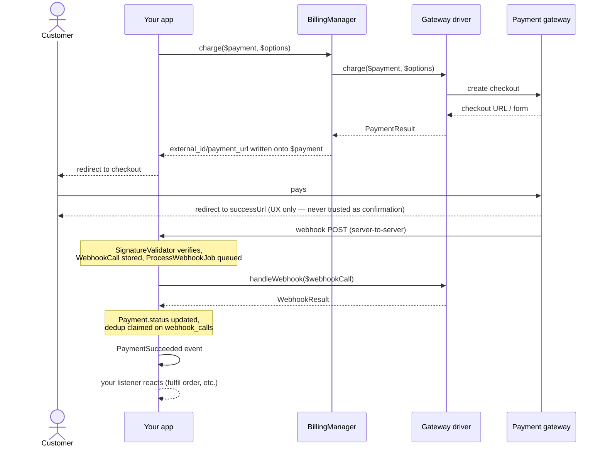

# Laravel Billing

[](https://packagist.org/packages/fomvasss/laravel-billing)
[](https://packagist.org/packages/fomvasss/laravel-billing)
[](https://packagist.org/packages/fomvasss/laravel-billing)

Universal billing/payments package for Laravel: pluggable payment gateways, one-time payments and subscriptions with trials, usage-based pricing, webhook processing.

[Українська документація](README.uk.md)

Built-in gateways: **LiqPay**, **WayForPay**, **Monobank Acquiring**, **Stripe**, **Hutko**. Add your own with a single `Billing::extend()` call — no core changes required.

## Requirements

- PHP ^8.3
- Laravel ^12 | ^13

## Installation

```bash
composer require fomvasss/laravel-billing
```

Publish this package's own migrations — in groups, so you only get the tables you actually use. `billing-migrations-core` (the `payments` and `webhook_calls` tables) is the only one everyone needs:

```bash
php artisan vendor:publish --tag=billing-migrations-core
php artisan vendor:publish --tag=billing-migrations-subscriptions    # only if you use Plan/Price/Subscription
php artisan vendor:publish --tag=billing-migrations-payment-methods  # only if you use saved cards/tokens
php artisan migrate
```

Re-running a `vendor:publish` command is safe — files are copied under fixed names, so an already-published migration is skipped, not duplicated.

Publish the config file if you need to change defaults (return URLs, debug logging, grace period, etc.):

```bash
php artisan vendor:publish --tag=billing-config
```

## Quickstart — the `fake` gateway

No bank account needed to try the full flow locally. `fake` is registered automatically in `local`/`testing` environments:

```php
use Fomvasss\Billing\BillingManager;
use Fomvasss\Billing\Models\Payment;

$payment = Payment::create([
    'status' => 'pending',
    'type' => 'charge',
    'gateway' => 'fake',
    'amount' => 10000, // minor units — 100.00
    'currency_code' => 'UAH',
    'payable_type' => Order::class,
    'payable_id' => $order->id,
    'billable_type' => $order->user::class,
    'billable_id' => $order->user->id,
]);

$result = app(BillingManager::class)->charge($payment);

return redirect($result->url); // a local page with "Paid"/"Rejected" buttons
```

Clicking a button POSTs straight to the real, registered webhook endpoint — the same signature-check → `ProcessWebhookJob` → event pipeline a real gateway would go through, not a shortcut.

## Configuring a real gateway

```php
// config/billing.php
'gateways' => [
    'monobank' => [
        'token' => env('MONOBANK_TOKEN'),
    ],
    'liqpay' => [
        'public_key' => env('LIQPAY_PUBLIC_KEY'),
        'private_key' => env('LIQPAY_PRIVATE_KEY'),
    ],
],
```

Which keys go under `config('billing.gateways.{gateway}')` — every driver has a static `credentialFields()` describing exactly that, callable straight on the class, no instance/credentials needed:

```php
use Fomvasss\Billing\Gateways\Monobank\MonobankGateway;

MonobankGateway::credentialFields();
// [
//     ['name' => 'token', 'type' => 'text', 'secret' => true, 'help' => 'X-Token з кабінету мерчанта...'],
//     ['name' => 'link_ttl_minutes', 'type' => 'number', 'secret' => false, 'help' => 'TTL посилання на оплату, хв...'],
// ]
```

`name` is the config key (`config('billing.gateways.monobank.token')`), `secret` marks it as sensitive (mask it in a settings UI), `help` explains where to get the value. Same data for every registered gateway at once, without importing each driver class:

```php
use Fomvasss\Billing\Facades\Billing;

Billing::gateways(); // ['monobank' => ['label' => 'Monobank Acquiring', 'currencies' => [...], 'credential_fields' => [...], 'webhook_url' => '...', 'capabilities' => [...]], ...]
Billing::gateway('monobank'); // just that one gateway's entry, or null if not registered
```

`webhook_url` in that array is the exact callback URL to paste into each gateway's own dashboard.

Dynamic per-tenant credentials (instead of one static config array) — bind your own resolver:

```php
$this->app->bind(\Fomvasss\Billing\Contracts\CredentialResolverContract::class, MyCredentialResolver::class);
```

## `Payable` and `Billable`

`payable` is what's being paid for (an `Order`, a `Subscription` renewal cycle); `billable` is who's paying. Both are polymorphic — any Eloquent model works with `payable`, but a `billable` model needs a `tenantId()` method (used for dynamic per-tenant credential resolution):

```php
use Fomvasss\Billing\Concerns\Billable as BillableConcern;
use Fomvasss\Billing\Contracts\Billable;

class Organization extends Model implements Billable
{
    use BillableConcern; // default tenantId(): null — override below if you need multi-tenancy

    public function tenantId(): ?string
    {
        return (string) $this->id;
    }
}
```

## Charging

```php
$result = app(BillingManager::class)->charge($payment, new ChargeOptions(
    description: 'Order #1042',
    customerEmail: $order->user->email,
    successUrl: route('order.thanks', $order),
));

return redirect($payment->payment_url);
```

`charge()` writes `external_id`/`payment_url`/`payment_url_expires_at` back onto `$payment` — safe to call again on the same `Payment` once the link expires (each driver decides its own TTL). `payment_url` is always a plain, redirectable link, no matter which gateway: even LiqPay, whose checkout page only accepts a client-submitted form, gets one — the form is cached and served through a package-owned page that submits it for you.

If you need the raw driver result instead (building your own API response for a SPA, say): `$result->url` is set for every gateway except LiqPay, which sets `$result->form` (`['action' => ..., 'fields' => [...]]`) instead — POST those fields to that action yourself.

### Manual/offline payments

No driver is required for cash or bank-transfer payments — just create the row directly:

```php
Payment::create([
    'status' => 'paid',
    'type' => 'charge',
    'gateway' => null, // or a free-text label like 'cash' — not registered via extend()
    'amount' => 10000,
    'currency_code' => 'UAH',
    'payable_type' => Order::class,
    'payable_id' => $order->id,
    'billable_type' => $order->user::class,
    'billable_id' => $order->user->id,
]);
```

`paid_at` is stamped automatically the moment `status` becomes `paid`.

## Flow



Two independent paths, on purpose: the browser redirect (top half) is UX only, the webhook (bottom half) is the only thing that ever changes `Payment.status` — details below.

## Webhooks

One route (`POST /billing/webhooks/{gateway}`) handles every gateway, resolved at request time through `BillingManager`'s own registry — nothing to configure by hand. Incoming webhooks are signature-verified, stored (`billing_webhook_calls`), queued (`ProcessWebhookJob`), and turned into one of these events:

| Event | Fires when |
|---|---|
| `PaymentSucceeded` / `PaymentFailed` / `PaymentRefunded` | A `Payment`'s status resolves to a terminal state |
| `SubscriptionCreated` / `SubscriptionRenewed` / `SubscriptionPaymentFailed` / `SubscriptionCancelled` / `TrialWillEnd` | Gateway-driven subscription state changes (native-subscription gateways only) |
| `SubscriptionPaused` / `SubscriptionResumed` | Local-only, via `$subscription->pause()`/`resume()` — never gateway-driven |
| `PaymentMethodAttached` / `PaymentMethodDetached` | A saved card/token is attached or removed |
| `UsageLimitReached` | `Subscription::reportUsage()` crosses `price.included_units` |

Listen for them the usual way:

```php
Event::listen(PaymentSucceeded::class, function (PaymentSucceeded $event) {
    $event->payment->payable; // your Order, Subscription, etc.
});
```

### Customizing the webhook route

Both the path and the middleware stack are config-driven — `{gateway}` must stay somewhere in the path (`WebhookController` resolves the driver from that segment), everything else is yours:

```php
// config/billing.php
'webhook' => [
    'path' => 'webhook/billing/{gateway}', // your own prefix convention instead of the default billing/webhooks/{gateway}
    'middleware' => ['throttle:60,1'], // empty by default — webhook endpoints deliberately skip the `web` group (no CSRF, no session)
],
```

The route name (`billing.webhook`) never changes, so `AbstractGateway::webhookUrl()` and the `webhook_url` field in `Billing::gateways()` keep resolving correctly regardless of the configured path — nothing else to update when you change it.

### Writing your own gateway

Four required methods (`PaymentGatewayContract`), everything else opt-in:

```php
use Fomvasss\Billing\Gateways\AbstractGateway; // optional — shared debug log + webhookUrl()/successUrl()/failUrl() helpers
use Fomvasss\Billing\Contracts\RefundsPayments;
use Fomvasss\Billing\Webhooks\BillingWebhookCall;

class MyGateway extends AbstractGateway implements RefundsPayments
{
    public function charge(Payment $payment, ChargeOptions $options = new ChargeOptions()): PaymentResult { /* ... */ }
    public function handleWebhook(BillingWebhookCall $webhookCall): WebhookResult { /* ... */ }
    public static function label(): string { return 'My Gateway'; }
    public static function credentialFields(): array { return [/* ['name' => ..., 'type' => ..., 'secret' => bool, 'help' => ...] */]; }
    public static function supportedCurrencies(): array { return ['UAH']; }

    public function refund(Payment $payment, ?Money $amount = null): PaymentResult { /* ... */ }
}
```

```php
// in your ServiceProvider::boot() — your own project or a satellite package (fomvasss/laravel-billing-mygateway)
use Fomvasss\Billing\Facades\Billing;

Billing::extend('mygateway', MyGateway::class)
    ->registerWebhook('mygateway', MyGatewaySignatureValidator::class);
```

`registerWebhook()` is the one call that wires the incoming webhook route for this gateway — every gateway shares a single `POST /billing/webhooks/{gateway}` route, resolved through this registry, so there's no per-gateway config file to touch. Pass a third argument if your gateway needs a specific acknowledgment body instead of a bare `200` (WayForPay does — see `WayForPayWebhookResponder` for a worked example).

## Subscriptions

```php
$plan = Plan::create(['code' => 'pro', 'name' => 'Pro']);

$price = $plan->prices()->create([
    'gateway' => 'stripe',
    'currency_code' => 'USD',
    'amount' => 2900, // $29.00
    'pricing_type' => 'flat',
    'interval' => 'month',
    'interval_count' => 1,
    'trial_days' => 14,
]);

$subscription = Subscription::create([
    'status' => 'trialing',
    'gateway' => 'stripe',
    'price_id' => $price->id,
    'billable_type' => $organization::class,
    'billable_id' => $organization->id,
    'trial_ends_at' => now()->addDays(14),
]);
```

### Pricing types

- `flat` — fixed amount, `qty`/`current_usage` ignored.
- `licensed` — `amount × subscription.qty` (seats/licenses).
- `metered` — `amount × subscription.current_usage` (pay-as-you-go).

### Usage & quotas

`included_units`/`current_usage` are orthogonal to `pricing_type` — a `flat` price can still carry a quota (e.g. "4,000 AI tokens included per month, fixed price either way"):

```php
$subscription->reportUsage(quantity: 1500, idempotencyKey: "ai-run:{$run->id}");
$subscription->remainingUsage(); // null if the price has no quota at all
```

`UsageLimitReached` fires once when cumulative usage crosses `included_units` — react to it however fits (block further use, notify, or charge an overage via `TokenizesPaymentMethod::chargePaymentMethod()`).

### Pause / resume / cancel

```php
$subscription->pause();   // local only — no gateway call, no event to the bank
$subscription->resume();
$subscription->cancel();               // at period end (default)
$subscription->cancel(atPeriodEnd: false); // immediately
$subscription->swapPlan($newPrice);
```

### Recurring charges, reconciliation, trial expiry

Three artisan commands, off by default (`billing.schedule.enabled`, since they touch money and subscription state):

```php
// config/billing.php
'schedule' => ['enabled' => true],
```

```bash
php artisan billing:process-recurring-charges   # hourly — charges due subscriptions via a saved PaymentMethod
php artisan billing:reconcile-pending-payments  # hourly — fallback for a missed webhook or gateway `expired` status
php artisan billing:expire-trials               # daily  — trialing + trial_ends_at passed → ended
```

`process-recurring-charges` only *initiates* a charge — the outcome (success/failure) arrives through the normal webhook pipeline and is handled automatically (period advances, or the grace/dunning cycle via `grace_ends_at`/`recurring_attempts`/`max_recurring_attempts` kicks in, up to `SubscriptionCancelled`).

### Tokenization / saved cards

`process-recurring-charges` (and any off-session charge you trigger yourself) works for every built-in gateway — all 5 implement `TokenizesPaymentMethod`.

Three mechanisms, same end result — a `PaymentMethod` row you can hand to `chargeWithMethod()`:

| Gateway | Mechanism | Deliveries |
|---|---|---|
| Stripe | synchronous, frontend SDK | — |
| Monobank | async, `saveCard: true` opts in | 2 (card token in a separate webhook delivery) |
| LiqPay | async, `saveCard: true` opts in | 1 (rides along with the payment status) |
| WayForPay, Hutko | async, no opt-in — token comes back automatically | 1 (rides along with the payment status) |

**Stripe** — a synchronous frontend-SDK token:

```php
// 1. Create (or reuse) a Stripe customer, hand its id to your frontend to collect a card via
//    Stripe.js/Elements + a SetupIntent — standard Stripe flow, outside this package.
$customerId = Billing::driver('stripe')->createCustomer($user);

// 2. Frontend confirms the SetupIntent, gets back a PaymentMethod id (pm_...) — POST it to your
//    own endpoint, then attach it:
$method = Billing::driver('stripe')->attachPaymentMethod($user, ['payment_method_id' => $pmId]);

// 3. From then on, `billing:process-recurring-charges` (or your own code) can charge it directly:
Billing::chargeWithMethod($payment, $method);
```

`attachPaymentMethod()`/`detachPaymentMethod()` dispatch `PaymentMethodAttached`/`PaymentMethodDetached` themselves, synchronously — no webhook round-trip for those two.

**Monobank** — the token isn't available synchronously at all: pass `saveCard: true` on the *first* charge, and the resulting card token arrives later through the normal webhook pipeline, as its own delivery (`walletData.status: created`) — `handleWebhook()` catches it and attaches the `PaymentMethod` automatically, no extra call needed:

```php
Billing::charge($payment, new ChargeOptions(saveCard: true));
// ... customer pays, webhook arrives, handleWebhook() persists the PaymentMethod and fires
// PaymentMethodAttached on its own — nothing else to call.
```

`Billing::driver('monobank')->attachPaymentMethod($user, ['card_token' => $token])` exists too, for the uncommon case of a token already known some other way (verifies it against `GET /wallet` before persisting).

**LiqPay, WayForPay, Hutko** — the same webhook-driven idea as Monobank, but *one* delivery instead of two: the card token rides along in the very same callback as the payment status, not a separate one.

```php
// LiqPay: recurringbytoken opts in, card_token arrives in the same server_url callback.
Billing::charge($payment, new ChargeOptions(saveCard: true));

// WayForPay/Hutko: no opt-in flag at all — the token comes back automatically on any approved
// card payment. handleWebhook() persists it whenever present, no charge()-side change needed.
Billing::charge($payment, new ChargeOptions());
```

`attachPaymentMethod($billable, ['card_token' => $token])` / `['rec_token' => $token]` / `['rectoken' => $token]` exist for all three, for a token already known some other way — none of these gateways exposes a lookup endpoint to verify it against first (unlike Monobank's `GET /wallet`), so these trust the caller. None exposes a token-revocation endpoint either — `detachPaymentMethod()` for all three is local-only (deletes the `PaymentMethod` row, nothing to call on the gateway's side).

Either way, `chargePaymentMethod()` only *initiates* the charge, same as `charge()`: the outcome still arrives through the usual webhook pipeline for every gateway.

## Recipes

Everything above is the building blocks; here's how they combine for a few real scenarios.

### 1. Store checkout with fiscal receipt items

`Order` implements `HasReceiptItems` — `charge()` picks it up automatically (no need to pass `receiptItems` yourself), and Monobank/LiqPay/WayForPay use it to fiscalize the basket on their side:

```php
class Order extends Model implements Payable, HasReceiptItems
{
    public function receiptItems(): array
    {
        return $this->items->map(fn (OrderItem $item) => [
            'name' => $item->product->name,
            'qty' => $item->qty,
            'unitAmount' => $item->unit_price, // minor units
            'sku' => $item->product->sku,
        ])->all();
    }
}
```

```php
$payment = Payment::create([
    'status' => 'pending',
    'type' => 'charge',
    'gateway' => 'monobank',
    'amount' => $order->total, // minor units
    'currency_code' => 'UAH',
    'payable_type' => Order::class,
    'payable_id' => $order->id,
    'billable_type' => $order->user::class,
    'billable_id' => $order->user->id,
]);

Billing::charge($payment, new ChargeOptions(
    description: "Order #{$order->number}",
    customerEmail: $order->user->email,
));

return redirect($payment->payment_url);
```

```php
Event::listen(PaymentSucceeded::class, function (PaymentSucceeded $event) {
    if ($event->payment->payable instanceof Order) {
        $event->payment->payable->markAsPaid();
    }
});
```

### 2. Subscribe to a 15 GB plan — and how the auto-renewal actually works

```php
$plan = Plan::create(['code' => 'storage-15gb', 'name' => '15 GB storage']);

$price = $plan->prices()->create([
    'gateway' => 'stripe',
    'currency_code' => 'USD',
    'amount' => 500, // $5.00/month
    'pricing_type' => 'flat',
    'interval' => 'month',
    'interval_count' => 1,
]);

$subscription = Subscription::create([
    'status' => 'active',
    'gateway' => 'stripe',
    'price_id' => $price->id,
    'billable_type' => $organization::class,
    'billable_id' => $organization->id,
    'current_period_ends_at' => now()->addMonth(),
]);
```

The first charge tokenizes the card (`saveCard: true`, see "Tokenization" above) — everything after that is automatic, **but only if you turn it on**:

1. `config('billing.schedule.enabled', true)` (or your own cron entry calling the same command) — off by default, since it touches money.
2. Once enabled, `billing:process-recurring-charges` runs hourly, finds subscriptions where `current_period_ends_at <= now()`, and charges the saved `PaymentMethod` via `chargePaymentMethod()`. This only *initiates* the charge.
3. The outcome resolves later through the normal webhook pipeline → `PaymentSucceeded`/`PaymentFailed` → the package's own listener advances `current_period_ends_at` by another month on success, or starts the grace/dunning cycle on failure (`grace_ends_at`, `recurring_attempts`, up to `max_recurring_attempts` → `SubscriptionCancelled`).

You don't write any of step 3 yourself — it's already wired up. You only need step 1 and a saved `PaymentMethod`.

### 3. One-off purchase of extra 5 GB (not part of the subscription cycle)

Not a subscription line item — the package has no "wallet"/addon-balance concept on purpose (see below), so this is just a regular one-off `Payment` your own listener turns into a quota bump:

```php
$payment = Payment::create([
    'status' => 'pending',
    'type' => 'charge',
    'gateway' => 'stripe',
    'amount' => 200, // $2.00
    'currency_code' => 'USD',
    'payable_type' => $organization::class,
    'payable_id' => $organization->id,
    'billable_type' => $organization::class,
    'billable_id' => $organization->id,
]);

Billing::chargeWithMethod($payment, $organization->defaultPaymentMethod); // or Billing::charge() for a redirect checkout
```

```php
Event::listen(PaymentSucceeded::class, function (PaymentSucceeded $event) {
    if ($event->payment->payable instanceof Organization) {
        $event->payment->payable->increment('extra_storage_gb', 5);
    }
});
```

### 4. Free trial period

No gateway call, no `PaymentMethod` needed — just a `Subscription` row:

```php
$subscription = Subscription::create([
    'status' => 'trialing',
    'gateway' => 'stripe',
    'price_id' => $price->id,
    'billable_type' => $organization::class,
    'billable_id' => $organization->id,
    'trial_ends_at' => now()->addDays(14),
]);
```

`TrialWillEnd` fires so you can prompt for a card before the trial ends. If nobody converts, `billing:expire-trials` (daily) finds `trialing` subscriptions past `trial_ends_at` and moves them to `ended`. Converting mid-trial or right at the end is the same call either way — a `chargeWithMethod()` against this subscription's `Payment` flips it straight to `active` on `PaymentSucceeded` (the listener doesn't care that it started as `trialing`), no separate "convert trial" method to call.

### 5. Several independent subscriptions on the same customer at once

`Subscription::$billable_id` isn't unique — one `Organization` can have as many concurrent, independently-billed subscriptions as it needs (a base plan, an AI add-on, a per-channel add-on, ...), each with its own gateway/status/renewal cycle:

```php
foreach (['base' => 'stripe', 'ai-addon' => 'stripe', 'channel-viber' => 'wayforpay'] as $planCode => $gateway) {
    Subscription::create([
        'status' => 'active',
        'gateway' => $gateway,
        'price_id' => Plan::where('code', $planCode)->firstOrFail()->prices()->firstOrFail()->id,
        'billable_type' => $organization::class,
        'billable_id' => $organization->id,
        'current_period_ends_at' => now()->addMonth(),
    ]);
}
```

Cancelling or lapsing one doesn't touch the others — each row is its own independent lifecycle.

## Currency conversion

If a `Price`'s currency isn't accepted by the chosen gateway, `BillingManager::resolveChargeAmount()` tries, in order: (1) the price's own currency, if accepted; (2) a sibling `Price` of the same `Plan`+gateway in an accepted currency; (3) a bound `CurrencyConverterContract`; (4) throws `BillingException`. Bind a converter (e.g. an adapter over [`fomvasss/laravel-currency`](https://github.com/fomvasss/laravel-currency), not a hard dependency of this package):

```php
$this->app->bind(\Fomvasss\Billing\Contracts\CurrencyConverterContract::class, MyCurrencyConverter::class);
```

## Testing

Use the `fake` gateway (see Quickstart) in your own app's feature tests — it runs the exact same pipeline a real gateway would, so there's nothing package-specific to mock.

## License

MIT
