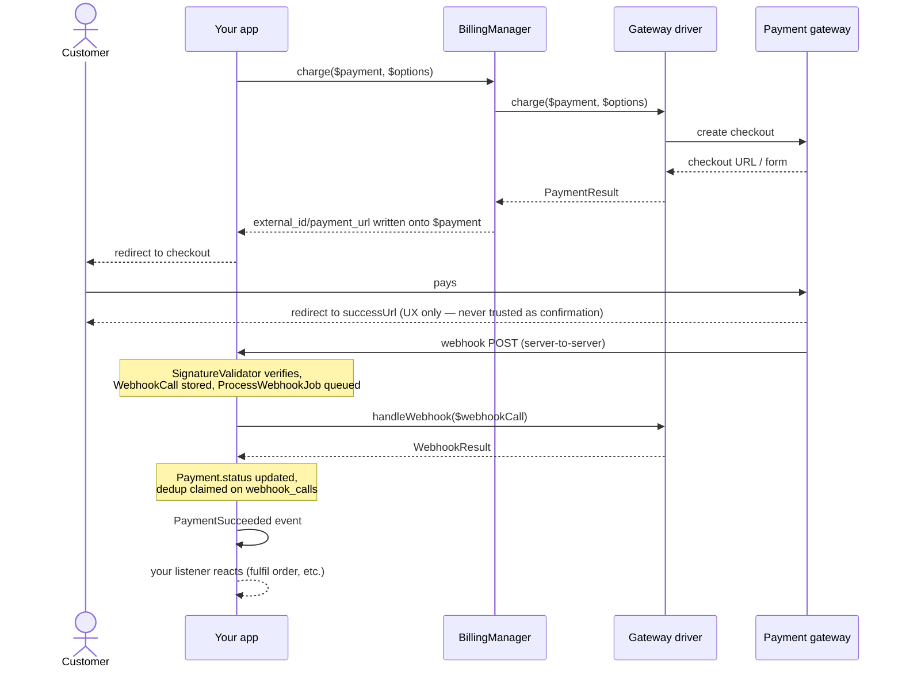

# Laravel Billing

[](https://packagist.org/packages/fomvasss/laravel-billing)
[](https://packagist.org/packages/fomvasss/laravel-billing)
[](https://packagist.org/packages/fomvasss/laravel-billing)

Universal billing/payments package for Laravel: pluggable payment gateways, one-time payments and subscriptions with trials, usage-based pricing, webhook processing.

[Українська документація](README.uk.md)

Built-in gateways: **LiqPay**, **WayForPay**, **Monobank Acquiring**, **Stripe**, **Hutko**. Add your own with a single `Billing::extend()` call — no core changes required.

## Requirements

- PHP ^8.3
- Laravel ^12 | ^13

## Installation

```bash
composer require fomvasss/laravel-billing
```

Publish this package's own migrations — in groups, so you only get the tables you actually use. `billing-migrations-core` (the `payments` and `webhook_calls` tables) is the only one everyone needs:

```bash
php artisan vendor:publish --tag=billing-migrations-core
php artisan vendor:publish --tag=billing-migrations-subscriptions    # only if you use Plan/Price/Subscription
php artisan vendor:publish --tag=billing-migrations-payment-methods  # only if you use saved cards/tokens
php artisan migrate
```

Re-running a `vendor:publish` command is safe — files are copied under fixed names, so an already-published migration is skipped, not duplicated.

Publish the config file if you need to change defaults (return URLs, debug logging, grace period, etc.):

```bash
php artisan vendor:publish --tag=billing-config
```

## Quickstart — the `fake` gateway

No bank account needed to try the full flow locally. `fake` is registered automatically in `local`/`testing` environments:

```php
use Fomvasss\Billing\BillingManager;
use Fomvasss\Billing\Models\Payment;

$payment = Payment::create([
    'status' => 'pending',
    'type' => 'charge',
    'gateway' => 'fake',
    'amount' => 10000, // minor units — 100.00
    'currency_code' => 'UAH',
    'payable_type' => Order::class,
    'payable_id' => $order->id,
    'billable_type' => $order->user::class,
    'billable_id' => $order->user->id,
]);

$result = app(BillingManager::class)->charge($payment);

return redirect($result->url); // a local page with "Paid"/"Rejected" buttons
```

Clicking a button POSTs straight to the real, registered webhook endpoint — the same signature-check → `ProcessWebhookJob` → event pipeline a real gateway would go through, not a shortcut.

## Configuring a real gateway

The published config already stubs all five built-in gateways — just fill in the `.env` values for the ones you use:

```dotenv
MONOBANK_TOKEN=

LIQPAY_PUBLIC_KEY=
LIQPAY_PRIVATE_KEY=

WAYFORPAY_MERCHANT_ACCOUNT=
WAYFORPAY_MERCHANT_DOMAIN=
WAYFORPAY_SECRET_KEY=

STRIPE_SECRET_KEY=
STRIPE_WEBHOOK_SECRET=

HUTKO_MERCHANT_ID=
HUTKO_SECRET_KEY=
```

Leave the rest alone — an unset gateway stays unconfigured and only ever errors if something actually tries to charge through it.

Same list at runtime, if you're building a settings UI rather than reading a file — every driver has a static `credentialFields()`, callable straight on the class, no instance/credentials needed:

```php
use Fomvasss\Billing\Gateways\Monobank\MonobankGateway;

MonobankGateway::credentialFields();
// [
//     ['name' => 'token', 'type' => 'text', 'secret' => true, 'help' => 'X-Token з кабінету мерчанта...'],
//     ['name' => 'link_ttl_minutes', 'type' => 'number', 'secret' => false, 'help' => 'TTL посилання на оплату, хв...'],
// ]
```

`name` is the config key (`config('billing.gateways.monobank.token')`), `secret` marks it as sensitive (mask it in a settings UI), `help` explains where to get the value. Same data for every registered gateway at once, without importing each driver class:

```php
use Fomvasss\Billing\Facades\Billing;

Billing::gateways(); // ['monobank' => ['label' => 'Monobank Acquiring', 'currencies' => [...], 'credential_fields' => [...], 'webhook_url' => '...', 'capabilities' => [...]], ...]
Billing::gateway('monobank'); // just that one gateway's entry, or null if not registered
```

`webhook_url` in that array is the exact callback URL to paste into each gateway's own dashboard.

Dynamic per-tenant credentials (instead of one static config array) — bind your own resolver:

```php
$this->app->bind(\Fomvasss\Billing\Contracts\CredentialResolverContract::class, MyCredentialResolver::class);
```

## `Payable` and `Billable`

`payable` is what's being paid for (an `Order`, a `Subscription` renewal cycle); `billable` is who's paying. Both are polymorphic — any Eloquent model works with `payable`, but a `billable` model needs a `tenantId()` method (used for dynamic per-tenant credential resolution):

```php
use Fomvasss\Billing\Concerns\Billable as BillableConcern;
use Fomvasss\Billing\Contracts\Billable;

class Organization extends Model implements Billable
{
    use BillableConcern; // default tenantId(): null — override below if you need multi-tenancy

    public function tenantId(): ?string
    {
        return (string) $this->id;
    }
}
```

## Charging

```php
$result = app(BillingManager::class)->charge($payment, new ChargeOptions(
    description: 'Order #1042',
    customerEmail: $order->user->email,
    successUrl: route('order.thanks', $order),
));

return redirect($payment->payment_url);
```

`charge()` writes `external_id`/`payment_url`/`payment_url_expires_at` back onto `$payment` — safe to call again on the same `Payment` once the link expires (each driver decides its own TTL). `payment_url` is always a plain, redirectable link, no matter which gateway: even LiqPay, whose checkout page only accepts a client-submitted form, gets one — the form is cached and served through a package-owned page that submits it for you.

If you need the raw driver result instead (building your own API response for a SPA, say): `$result->url` is set for every gateway except LiqPay, which sets `$result->form` (`['action' => ..., 'fields' => [...]]`) instead — POST those fields to that action yourself.

### Manual/offline payments

No driver is required for cash or bank-transfer payments — just create the row directly:

```php
Payment::create([
    'status' => 'paid',
    'type' => 'charge',
    'gateway' => null, // or a free-text label like 'cash' — not registered via extend()
    'amount' => 10000,
    'currency_code' => 'UAH',
    'payable_type' => Order::class,
    'payable_id' => $order->id,
    'billable_type' => $order->user::class,
    'billable_id' => $order->user->id,
]);
```

`paid_at` is stamped automatically the moment `status` becomes `paid`.

## Flow



Two independent paths, on purpose: the browser redirect (top half) is UX only, the webhook (bottom half) is the only thing that ever changes `Payment.status` — details below.

## Webhooks

One route (`POST /billing/webhooks/{gateway}`) handles every gateway, resolved at request time through `BillingManager`'s own registry — nothing to configure by hand. Incoming webhooks are signature-verified, stored (`billing_webhook_calls`), queued (`ProcessWebhookJob`), and turned into one of these events:

| Event | Fires when |
|---|---|
| `PaymentSucceeded` / `PaymentFailed` / `PaymentRefunded` | A `Payment`'s status resolves to a terminal state |
| `SubscriptionCreated` / `SubscriptionRenewed` / `SubscriptionPaymentFailed` / `SubscriptionCancelled` / `TrialWillEnd` | Gateway-driven subscription state changes (native-subscription gateways only) |
| `SubscriptionPaused` / `SubscriptionResumed` | Local-only, via `$subscription->pause()`/`resume()` — never gateway-driven |
| `PaymentMethodAttached` / `PaymentMethodDetached` | A saved card/token is attached or removed |
| `UsageLimitReached` | `Subscription::reportUsage()` crosses `price.included_units` |

Listen for them the usual way:

```php
Event::listen(PaymentSucceeded::class, function (PaymentSucceeded $event) {
    $event->payment->payable; // your Order, Subscription, etc.
});
```

### Customizing the webhook route

Both the path and the middleware stack are config-driven — `{gateway}` must stay somewhere in the path (`WebhookController` resolves the driver from that segment), everything else is yours:

```php
// config/billing.php
'webhook' => [
    'path' => 'webhook/billing/{gateway}', // your own prefix convention instead of the default billing/webhooks/{gateway}
    'middleware' => ['throttle:60,1'], // empty by default — webhook endpoints deliberately skip the `web` group (no CSRF, no session)
],
```

The route name (`billing.webhook`) never changes, so `AbstractGateway::webhookUrl()` and the `webhook_url` field in `Billing::gateways()` keep resolving correctly regardless of the configured path — nothing else to update when you change it.

### Writing your own gateway

Four required methods (`PaymentGatewayContract`), everything else opt-in, and one call to register it:

```php
// in your ServiceProvider::boot() — your own project or a satellite package (fomvasss/laravel-billing-mygateway)
use Fomvasss\Billing\Facades\Billing;

Billing::extend('mygateway', MyGateway::class)
    ->registerWebhook('mygateway', MyGatewaySignatureValidator::class);
```

No route to declare and no config file to touch — every gateway shares the single `POST /billing/webhooks/{gateway}` route, resolved through this registry at request time.

**→ [Full guide: writing a gateway](docs/writing-a-gateway.md)** — the contract method by method, signature validation, the three tokenization shapes, custom webhook acknowledgments, testing without merchant credentials, and the verification pitfalls that cost us real bugs.

## Subscriptions

```php
$plan = Plan::create(['code' => 'pro', 'name' => 'Pro']);

$price = $plan->prices()->create([
    'gateway' => 'stripe',
    'currency_code' => 'USD',
    'amount' => 2900, // $29.00
    'pricing_type' => 'flat',
    'interval' => 'month',
    'interval_count' => 1,
    'trial_days' => 14,
]);

$subscription = Subscription::create([
    'status' => 'trialing',
    'gateway' => 'stripe',
    'price_id' => $price->id,
    'billable_type' => $organization::class,
    'billable_id' => $organization->id,
    'trial_ends_at' => now()->addDays(14),
]);
```

### Pricing types

- `flat` — fixed amount, `qty`/`current_usage` ignored.
- `licensed` — `amount × subscription.qty` (seats/licenses).
- `metered` — `amount × subscription.current_usage` (pay-as-you-go).

### Usage & quotas

`included_units`/`current_usage` are orthogonal to `pricing_type` — a `flat` price can still carry a quota (e.g. "4,000 AI tokens included per month, fixed price either way"):

```php
$subscription->reportUsage(quantity: 1500, idempotencyKey: "ai-run:{$run->id}");
$subscription->remainingUsage(); // null if the price has no quota at all
```

`UsageLimitReached` fires once when cumulative usage crosses `included_units` — react to it however fits (block further use, notify, or charge an overage via `TokenizesPaymentMethod::chargePaymentMethod()`).

### Pause / resume / cancel

```php
$subscription->pause();   // local only — no gateway call, no event to the bank
$subscription->resume();
$subscription->cancel();               // at period end (default)
$subscription->cancel(atPeriodEnd: false); // immediately
$subscription->swapPlan($newPrice);
```

### Recurring charges, reconciliation, trial expiry

Three artisan commands, off by default (`billing.schedule.enabled`, since they touch money and subscription state):

```php
// config/billing.php
'schedule' => ['enabled' => true],
```

| Command | Runs | What it does |
|---|---|---|
| `billing:process-recurring-charges` | hourly | Finds subscriptions where `current_period_ends_at <= now()` and charges the saved `PaymentMethod` via `chargePaymentMethod()`. Only *initiates* the charge — the outcome arrives later through the normal webhook pipeline, handled automatically (period advances on `PaymentSucceeded`, or the grace/dunning cycle via `grace_ends_at`/`recurring_attempts`/`max_recurring_attempts` kicks in on `PaymentFailed`, up to `SubscriptionCancelled`). |
| `billing:reconcile-pending-payments` | every 15 min | Fallback for a `Payment` stuck `pending` because a webhook was lost, or a gateway `expired` status that never gets its own webhook. Only looks at payments older than `config('billing.reconcile_after_minutes')` (default 60 min) — that cutoff already delays how soon a stuck payment qualifies, which is why this runs more often than the other two, not hourly like them. |
| `billing:expire-trials` | daily | `trialing` subscriptions whose `trial_ends_at` has passed → `ended`. Doesn't touch anything else — converting a trial to paid is a normal `chargeWithMethod()` call, same as any renewal (see "Free trial period" in Recipes). |

None of this fires on its own — `Schedule::command()`/`->hourly()` etc. just register with Laravel's own scheduler, which still needs the standard system cron entry running `php artisan schedule:run` every minute (the usual Laravel deployment requirement, nothing package-specific).

### Tokenization / saved cards

All 5 built-in gateways implement `TokenizesPaymentMethod` — attach a card once, then `chargeWithMethod()` it any time after (renewals, overage charges, upgrades, ...).

**Stripe** needs an explicit attach step, driven by your frontend:

```php
$customerId = Billing::driver('stripe')->createCustomer($user);

// frontend collects a card via Stripe.js/Elements against that customer id, confirms a
// SetupIntent, gets back a PaymentMethod id (pm_...) — POST it to your own endpoint
$method = Billing::driver('stripe')->attachPaymentMethod($user, ['payment_method_id' => $pmId]);

Billing::chargeWithMethod($payment, $method);
```

**Monobank, LiqPay, WayForPay, Hutko** attach themselves — no separate step, the `PaymentMethod` just shows up once the customer pays:

```php
// Monobank/LiqPay need the flag to save the card; WayForPay/Hutko save it regardless (flag is a no-op there)
Billing::charge($payment, new ChargeOptions(saveCard: true));
// ... customer pays, the PaymentMethod attaches on its own and PaymentMethodAttached fires — nothing else to call
```

Already have a token from somewhere else? `attachPaymentMethod($billable, [...])` takes it directly — the array key differs per gateway: `payment_method_id` (Stripe), `card_token` (Monobank/LiqPay), `rec_token` (WayForPay), `rectoken` (Hutko). `detachPaymentMethod($method)` removes the saved card — only Monobank also revokes it at the bank, the other three just stop using it locally.

Either way, `chargeWithMethod()`/`chargePaymentMethod()` only *initiate* the charge — the outcome always arrives through the normal webhook pipeline, same as `charge()`.

## Recipes

Everything above is the building blocks; here's how they combine for a few real scenarios.

### 1. Store checkout with fiscal receipt items

`Order` implements `HasReceiptItems` — `charge()` picks it up automatically, no need to pass `receiptItems` yourself:

```php
class Order extends Model implements Payable, HasReceiptItems
{
    public function receiptItems(): array
    {
        return $this->items->map(fn (OrderItem $item) => [
            'name' => $item->product->name,
            'qty' => $item->qty,
            'unitAmount' => $item->unit_price, // minor units
            'sku' => $item->product->sku,
        ])->all();
    }
}
```

What each gateway does with it differs — **Monobank** (`basketOrder`), **WayForPay** (`productName[]`/`productPrice[]`/`productCount[]`) and **Stripe** (`line_items`) send the basket as-is. **LiqPay** fiscalizes through `rro_info`, whose line items reference goods registered in your LiqPay account by their catalog id — a value this neutral shape has no field for, so pass it explicitly via `ChargeOptions::$raw` (see below). **Hutko** has no fiscalization API at all, so the items are simply unused there.

```php
$payment = Payment::create([
    'status' => 'pending',
    'type' => 'charge',
    'gateway' => 'monobank',
    'amount' => $order->total, // minor units
    'currency_code' => 'UAH',
    'payable_type' => Order::class,
    'payable_id' => $order->id,
    'billable_type' => $order->user::class,
    'billable_id' => $order->user->id,
]);

Billing::charge($payment, new ChargeOptions(
    description: "Order #{$order->number}",
    customerEmail: $order->user->email,
));

return redirect($payment->payment_url);
```

```php
Event::listen(PaymentSucceeded::class, function (PaymentSucceeded $event) {
    if ($event->payment->payable instanceof Order) {
        $event->payment->payable->markAsPaid();
    }
});
```

Anything a gateway supports that has no neutral equivalent goes through `ChargeOptions::$raw` — merged into the request as-is, read only by whichever driver you're charging through, ignored by the rest:

```php
Billing::charge($payment, new ChargeOptions(
    description: "Order #{$order->number}",
    raw: [
        // LiqPay fiscalization — ids come from your LiqPay account (SCR → Kasa → Goods)
        'rro_info' => [
            'items' => $order->items->map(fn ($item) => [
                'id' => $item->product->liqpay_goods_id,
                'amount' => $item->qty,
                'price' => $item->unit_price / 100,
                'cost' => $item->total / 100,
            ])->all(),
            'delivery_emails' => [$order->user->email],
        ],
    ],
));
```

`$raw` is merged *under* the driver's own fields, so it can add what the driver doesn't set but never override the amount or the merchant reference the webhook matches on.

### 2. Subscribe to a 15 GB plan — and how the auto-renewal actually works

```php
$plan = Plan::create(['code' => 'storage-15gb', 'name' => '15 GB storage']);

$price = $plan->prices()->create([
    'gateway' => 'stripe',
    'currency_code' => 'USD',
    'amount' => 500, // $5.00/month
    'pricing_type' => 'flat',
    'interval' => 'month',
    'interval_count' => 1,
]);

$subscription = Subscription::create([
    'status' => 'active',
    'gateway' => 'stripe',
    'price_id' => $price->id,
    'billable_type' => $organization::class,
    'billable_id' => $organization->id,
    'current_period_ends_at' => now()->addMonth(),
]);
```

The first charge tokenizes the card (`saveCard: true`, see "Tokenization" above). Auto-renewal itself is `billing:process-recurring-charges` — off by default, so turn on the schedule (`config('billing.schedule.enabled', true)`, see the table above for what it does and when it runs); everything past that (advancing the period, dunning on failure) is already wired up, nothing else to write.

You don't write any of step 3 yourself — it's already wired up. You only need step 1 and a saved `PaymentMethod`.

### 3. One-off purchase of extra 5 GB (not part of the subscription cycle)

Not a subscription line item — the package has no "wallet"/addon-balance concept on purpose (see below), so this is just a regular one-off `Payment`. The part that's easy to get wrong: a `Payment` alone only tells you who paid and how much, not *what for* — two different add-ons could even cost the same. Two ways to fix that, pick based on how many one-off purchase types you'll ever have pointing at the same customer:

**`Payment::$meta`** — a plain `json` column, opaque to the package (same idea as `Plan::$meta`), the simplest option when there's only one kind of one-off purchase:

```php
$payment = Payment::create([
    'status' => 'pending',
    'type' => 'charge',
    'gateway' => 'stripe',
    'amount' => 200, // $2.00 for 5 GB
    'currency_code' => 'USD',
    'payable_type' => $organization::class,
    'payable_id' => $organization->id,
    'billable_type' => $organization::class,
    'billable_id' => $organization->id,
    'meta' => ['product' => 'storage_addon', 'gb' => 5],
]);

Billing::chargeWithMethod($payment, $organization->defaultPaymentMethod); // or Billing::charge() for a redirect checkout
```

```php
Event::listen(PaymentSucceeded::class, function (PaymentSucceeded $event) {
    if (($event->payment->meta['product'] ?? null) === 'storage_addon') {
        $event->payment->payable->increment('extra_storage_gb', $event->payment->meta['gb']);
    }
});
```

**A dedicated `payable`** — worth it once you have several *different* one-off purchase types pointing at the same customer (storage add-ons, seat top-ups, ...) and want `instanceof` instead of string keys in `meta` to tell them apart. Same idea as `Order` in recipe #1:

```php
class StorageAddonPurchase extends Model implements Payable
{
    protected $fillable = ['organization_id', 'gb'];

    public function organization(): BelongsTo
    {
        return $this->belongsTo(Organization::class);
    }
}
```

```php
$addon = StorageAddonPurchase::create(['organization_id' => $organization->id, 'gb' => 5]);

Payment::create([
    // ... same fields as above, except:
    'payable_type' => StorageAddonPurchase::class,
    'payable_id' => $addon->id,
]);
```

```php
Event::listen(PaymentSucceeded::class, function (PaymentSucceeded $event) {
    if ($event->payment->payable instanceof StorageAddonPurchase) {
        $event->payment->payable->organization->increment('extra_storage_gb', $event->payment->payable->gb);
    }
});
```

Either way: sell a 10 GB or 20 GB add-on later at a different price — same listener, no new branch, since the quantity lives on `meta`/the `payable` model, not guessed from the payment amount.

### 4. Free trial period

No gateway call, no `PaymentMethod` needed — just a `Subscription` row:

```php
$subscription = Subscription::create([
    'status' => 'trialing',
    'gateway' => 'stripe',
    'price_id' => $price->id,
    'billable_type' => $organization::class,
    'billable_id' => $organization->id,
    'trial_ends_at' => now()->addDays(14),
]);
```

`TrialWillEnd` fires so you can prompt for a card before the trial ends. If nobody converts, `billing:expire-trials` (daily) finds `trialing` subscriptions past `trial_ends_at` and moves them to `ended`. Converting mid-trial or right at the end is the same call either way — a `chargeWithMethod()` against this subscription's `Payment` flips it straight to `active` on `PaymentSucceeded` (the listener doesn't care that it started as `trialing`), no separate "convert trial" method to call.

### 5. Several independent subscriptions on the same customer at once

`Subscription::$billable_id` isn't unique — one `Organization` can have as many concurrent, independently-billed subscriptions as it needs (a base plan, an AI add-on, a per-channel add-on, ...), each with its own gateway/status/renewal cycle:

```php
foreach (['base' => 'stripe', 'ai-addon' => 'stripe', 'channel-viber' => 'wayforpay'] as $planCode => $gateway) {
    Subscription::create([
        'status' => 'active',
        'gateway' => $gateway,
        'price_id' => Plan::where('code', $planCode)->firstOrFail()->prices()->firstOrFail()->id,
        'billable_type' => $organization::class,
        'billable_id' => $organization->id,
        'current_period_ends_at' => now()->addMonth(),
    ]);
}
```

Cancelling or lapsing one doesn't touch the others — each row is its own independent lifecycle.

## Model helpers

Things you'd otherwise write yourself in every consumer:

```php
// Subscription
$subscription->isActive();     // entitled to the service right now — trialing, active,
                               // or past_due but still inside the dunning grace window
$subscription->onTrial();      // trialing and trial_ends_at hasn't passed
$subscription->onGracePeriod();// a renewal failed but retries are still running
$subscription->isCanceled();
$subscription->isCancelling(); // cancel() was called for period end — still running until then

Subscription::active()->get();               // trialing + active
Subscription::forBillable($organization)->get();
```

```php
// Payment
$payment->isPaid();
$payment->isPending();
$payment->isFailed();
$payment->isRefund();               // this row is a refund (type=refund), not a charge
$payment->refundedAmount();         // total refunded against this charge, minor units
$payment->hasActivePaymentUrl();    // checkout link still usable — no need to charge() again

Payment::paid()->get();
Payment::pending()->get();
Payment::forBillable($organization)->latest()->get();
```

`isActive()` is the one to reach for in a gate/middleware — it deliberately keeps access on during the dunning grace window, so a customer isn't locked out mid-retry over a card that failed once.

## Currency conversion

If a `Price`'s currency isn't accepted by the chosen gateway, `BillingManager::resolveChargeAmount()` tries, in order: (1) the price's own currency, if accepted; (2) a sibling `Price` of the same `Plan`+gateway in an accepted currency; (3) a bound `CurrencyConverterContract`; (4) throws `BillingException`. Bind a converter (e.g. an adapter over [`fomvasss/laravel-currency`](https://github.com/fomvasss/laravel-currency), not a hard dependency of this package):

```php
$this->app->bind(\Fomvasss\Billing\Contracts\CurrencyConverterContract::class, MyCurrencyConverter::class);
```

## Testing

Use the `fake` gateway (see Quickstart) in your own app's feature tests — it runs the exact same pipeline a real gateway would, so there's nothing package-specific to mock.

## License

MIT
