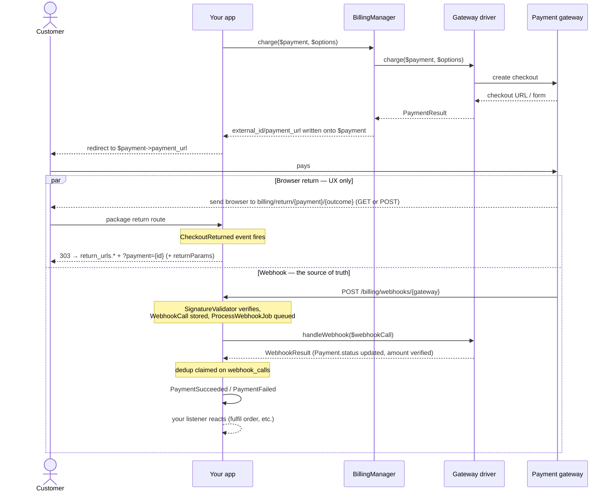
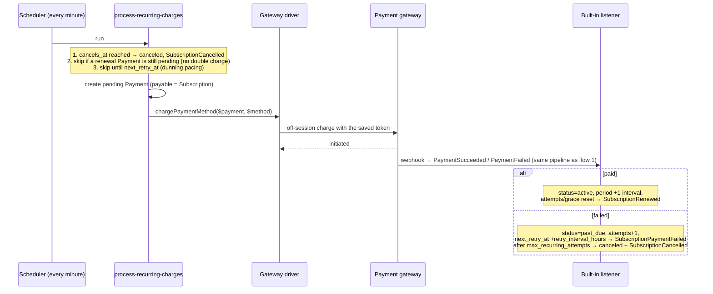
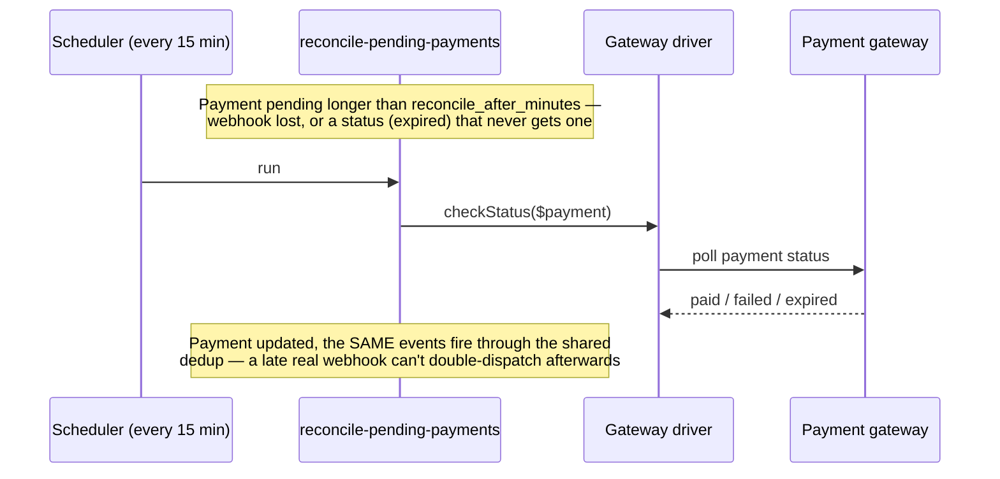
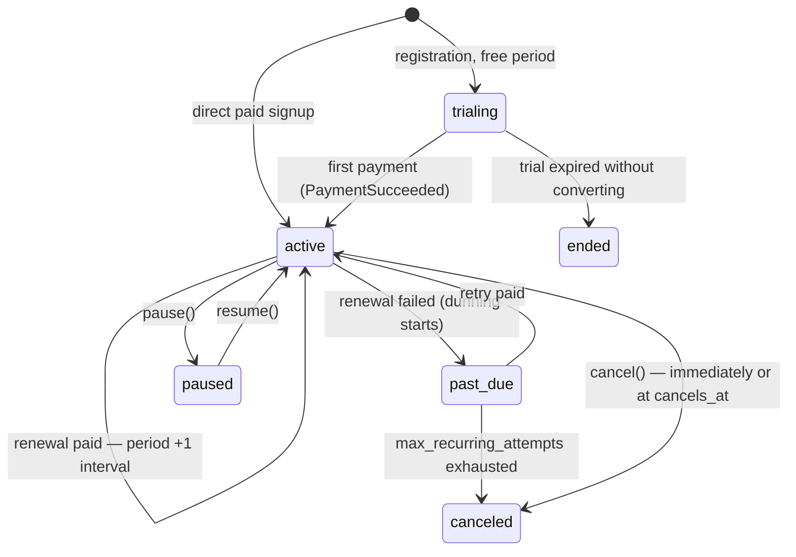

# Laravel Billing

[](https://packagist.org/packages/fomvasss/laravel-billing)
[](https://packagist.org/packages/fomvasss/laravel-billing)
[](https://packagist.org/packages/fomvasss/laravel-billing)

Universal billing/payments package for Laravel: pluggable payment gateways, one-time payments and subscriptions with trials, usage-based pricing, webhook processing.

[Українська документація](README.uk.md)

Built-in gateways: **LiqPay**, **WayForPay**, **Monobank Acquiring**, **Stripe**, **Hutko**. Add your own with a single `Billing::extend()` call — no core changes required.

## Requirements

- PHP ^8.3
- Laravel ^12 | ^13
- Database: MySQL/MariaDB, PostgreSQL or SQLite — no raw SQL anywhere, and the test suite runs against both SQLite and PostgreSQL
- Octane/long-running workers (Swoole, RoadRunner, FrankenPHP): supported — the package keeps no per-request state in memory. The singleton `BillingManager` only holds class-name registries written at boot; every `driver()` call builds a fresh instance and resolves credentials (including per-tenant ones) at call time, and all caching goes through the `Cache` store, never in-process statics. Just follow the documented pattern: register custom gateways in a `ServiceProvider::boot()`, not mid-request

## Installation

```bash
composer require fomvasss/laravel-billing
```

Publish this package's own migrations — in groups, so you only get the tables you actually use. `billing-migrations-core` (the `payments` and `webhook_calls` tables) is the only one everyone needs:

```bash
php artisan vendor:publish --tag=billing-migrations-core
php artisan vendor:publish --tag=billing-migrations-subscriptions    # only if you use Plan/Price/Subscription
php artisan vendor:publish --tag=billing-migrations-payment-methods  # only if you use saved cards/tokens
php artisan migrate
```

Re-running a `vendor:publish` command is safe — files are copied under fixed names, so an already-published migration is skipped, not duplicated.

Publish the config file if you need to change defaults (return URLs, debug logging, grace period, etc.):

```bash
php artisan vendor:publish --tag=billing-config
```

## Quickstart — the `fake` gateway

No bank account needed to try the full flow locally. `fake` is registered automatically in `local`/`testing` environments:

```php
use Fomvasss\Billing\BillingManager;
use Fomvasss\Billing\Enums\{PaymentStatus, PaymentType};
use Fomvasss\Billing\Models\Payment;

$payment = Payment::create([
    'status' => PaymentStatus::Pending,
    'type' => PaymentType::Charge,
    'gateway' => 'fake',
    'amount' => 10000, // minor units — 100.00
    'currency' => 'UAH',
    'payable_type' => Order::class,
    'payable_id' => $order->id,
    'billable_type' => $order->user::class,
    'billable_id' => $order->user->id,
]);

$result = app(BillingManager::class)->charge($payment);

return redirect($result->url); // a local page with "Paid"/"Rejected" buttons
```

Clicking a button POSTs straight to the real, registered webhook endpoint — the same signature-check → `ProcessWebhookJob` → event pipeline a real gateway would go through, not a shortcut.

## Configuring a real gateway

The published config already stubs all five built-in gateways — just fill in the `.env` values for the ones you use:

```dotenv
MONOBANK_TOKEN=

LIQPAY_PUBLIC_KEY=
LIQPAY_PRIVATE_KEY=

WAYFORPAY_MERCHANT_ACCOUNT=
WAYFORPAY_MERCHANT_DOMAIN=
WAYFORPAY_SECRET_KEY=

STRIPE_SECRET_KEY=
STRIPE_WEBHOOK_SECRET=

HUTKO_MERCHANT_ID=
HUTKO_SECRET_KEY=
```

Leave the rest alone — an unset gateway stays unconfigured and only ever errors if something actually tries to charge through it.

Driver-level debug logging (`AbstractGateway::log()`, via the default log channel) is off by default — `BILLING_DEBUG=true` for dev/staging while wiring up a gateway; never leave it on in production, since a driver may log raw request/response data including tokens.

Same list at runtime, if you're building a settings UI rather than reading a file — every driver has a static `credentialFields()`, callable straight on the class, no instance/credentials needed:

```php
use Fomvasss\Billing\Gateways\Monobank\MonobankGateway;

MonobankGateway::credentialFields();
// [
//     ['name' => 'token', 'type' => 'text', 'secret' => true, 'help' => 'X-Token з кабінету мерчанта...'],
//     ['name' => 'link_ttl_minutes', 'type' => 'number', 'secret' => false, 'help' => 'TTL посилання на оплату, хв...'],
// ]
```

`name` is the config key (`config('billing.gateways.monobank.token')`), `secret` marks it as sensitive (mask it in a settings UI), `help` explains where to get the value. Same data for every registered gateway at once, without importing each driver class:

```php
use Fomvasss\Billing\Facades\Billing;

Billing::gateways(); // ['monobank' => ['label' => 'Monobank Acquiring', 'currencies' => [...], 'credential_fields' => [...], 'webhook_url' => '...', 'webhook_requires_dashboard_setup' => false, 'capabilities' => [...]], ...]
Billing::gateway('monobank'); // just that one gateway's entry, or null if not registered
```

`webhook_url` is that gateway's exact callback URL, and `webhook_requires_dashboard_setup` tells a settings UI whether to show it with a "paste this into the gateway's dashboard" hint — most gateways don't need any manual setup at all (see "Setting up webhooks" below).

**Test the connection** — a live, side-effect-free probe of credentials + API reachability, for a settings-UI "test connection" button or a monitoring cron (non-zero exit when anything is down):

```php
Billing::health('monobank'); // GatewayHealth { ok: true, message: 'My Shop LLC', latencyMs: 179.2 }
```
```bash
php artisan billing:health            # table of all health-capable gateways, exit 1 if any is down
php artisan billing:health monobank   # a single one
```

All built-in gateways support it (`capabilities.health` in `gateways()`). It validates *credentials and reachability right now* — never a guarantee about the next charge.

Dynamic per-tenant credentials (instead of one static config array) — bind your own resolver:

```php
$this->app->bind(\Fomvasss\Billing\Contracts\CredentialResolverContract::class, MyCredentialResolver::class);
```

## `Payable` and `Billable`

`payable` is what's being paid for (an `Order`, a `Subscription` renewal cycle); `billable` is who's paying. Both are polymorphic — any Eloquent model works with `payable`, but a `billable` model needs a `tenantId()` method (used for dynamic per-tenant credential resolution):

```php
use Fomvasss\Billing\Concerns\Billable as BillableConcern;
use Fomvasss\Billing\Contracts\Billable;

class Organization extends Model implements Billable
{
    use BillableConcern; // default tenantId(): null — override below if you need multi-tenancy

    public function tenantId(): ?string
    {
        return (string) $this->id;
    }
}
```

The trait also gives the model the consumer-side accessors, so you rarely need the package models' `forBillable()` scopes directly:

```php
$organization->payments;                     // morphMany — chain scopes: ->payments()->paid()
$organization->subscriptions;
$organization->paymentMethods;

$organization->defaultPaymentMethod;         // the saved card renewals charge (per gateway — see below)
$organization->defaultPaymentMethodFor('monobank');

$organization->activeSubscription();         // same "entitled right now" definition as isActive()
$organization->activeSubscription('pro');    // narrowed by Plan code
$organization->hasActiveSubscription('pro'); // the gate/middleware one-liner
```

One nuance: `is_default` is tracked per gateway, so a customer with cards on two gateways has two defaults — `defaultPaymentMethod` (the property) returns one of them, `defaultPaymentMethodFor()` is the precise pick.

## Charging

```php
$result = app(BillingManager::class)->charge($payment, new ChargeOptions(
    description: 'Order #1042',
    customerEmail: $order->user->email,
    successUrl: route('order.thanks', $order),
));

return redirect($payment->payment_url);
```

`charge()` writes `external_id`/`payment_url`/`payment_url_expires_at` back onto `$payment` — safe to call again on the same `Payment` once the link expires (each driver decides its own TTL, via its `link_ttl_minutes` config key — e.g. `MONOBANK_LINK_TTL_MINUTES`, default 60 min, 1440 for WayForPay/Hutko). `payment_url` is always a plain, redirectable link, no matter which gateway: even LiqPay, whose checkout page only accepts a client-submitted form, gets one — the form is cached and served through a package-owned page that submits it for you.

If you need the raw driver result instead (building your own API response for a SPA, say): `$result->url` is set for every gateway except LiqPay, which sets `$result->form` (`['action' => ..., 'fields' => [...]]`) instead — POST those fields to that action yourself.

### Return pages

Where the customer's browser lands after checkout. Configure your final pages once — plain app routes or a frontend/SPA URL on another origin:

```php
// config/billing.php
'return_urls' => [
    'success' => 'https://app.example.com/checkout/success',
    'failed' => 'https://app.example.com/checkout/failed',
],
```

The gateway itself is pointed at the package's own return route, which then 303-redirects to your page with `?payment={id}` appended — so the page knows which payment to look up. That intermediate hop exists for two practical reasons: WayForPay and Hutko return the customer via an auto-submitted **POST** (the package route accepts it without any CSRF exceptions on your side, and the 303 turns it into a plain GET on your page), and a SPA frontend can't be a POST target at all.

Need more than the payment id on the final URL — an order number, say? `ChargeOptions::$returnParams` travels through the hop and lands on your page as query params:

```php
Billing::charge($payment, new ChargeOptions(
    returnParams: ['order' => $order->number],
));
// → https://app.example.com/checkout/success?order=1042&payment={id}
```

Display hints only — like everything else on this page, never trust them as payment state.

It also fires `CheckoutReturned($payment, $outcome, $data)` — an analytics/UX hook only. The browser coming back proves nothing (and may never happen): read the payment state from your DB (`$payment->isPaid()`), show "processing" while the webhook hasn't landed yet, and never fulfil an order from this event.

One more reason the success page must check the DB: `success`/`failed` name the return **slot**, not the verdict — and only Stripe actually has two slots (`success_url`/`cancel_url`). Monobank, LiqPay, WayForPay and Hutko have a single return URL, so their customers come back through the `success` slot **whatever happened** — a declined card lands on your success page too. Show the real state (`isPaid()`/`isFailed()`/pending) there, or a declined customer reads "thank you for your purchase".

A per-charge `ChargeOptions(successUrl: ..., failUrl: ...)` bypasses the whole mechanism — the URL (with any query params of your own, e.g. an order number) goes to the gateway as-is. If you do that with WayForPay/Hutko, remember their POST-style return is now yours to handle.

### Permanent payment link

`route('billing.pay', $payment)` is the URL safe to put in an email or invoice — unlike `payment_url`, it never goes stale:

- pending with a live checkout link → redirects straight to the gateway;
- expired, `failed` or `canceled` → a **fresh** checkout is issued via `charge()` on the fly, then redirected to (the old gateway-side invoice is simply left to expire);
- already `paid` → lands on your `return_urls.success` page with `?payment={id}`.

Every visit fires `PaymentLinkOpened($payment)` — an analytics/sales signal ("opened the invoice twice, never paid"), nothing more. Re-issuing uses default `ChargeOptions` (receipt items still auto-fill from a `HasReceiptItems` payable); per-charge extras from the original call (`saveCard`, `raw`, ...) are not remembered.

Re-issues are serialized per payment with a cache lock: this URL is public and unauthenticated by design, so it does get opened concurrently (a double click, a mail client prefetching links), and two re-issues would leave two live invoices on the gateway for one row. The second visitor re-reads the link the first one stored rather than issuing its own. As with refunds, this wants a shared cache store to hold across processes.

### Manual/offline payments

No driver is required for cash or bank-transfer payments — just create the row directly:

```php
Payment::create([
    'status' => PaymentStatus::Paid,
    'type' => PaymentType::Charge,
    'gateway' => null, // or a free-text label like 'cash' — not registered via extend()
    'amount' => 10000,
    'currency' => 'UAH',
    'payable_type' => Order::class,
    'payable_id' => $order->id,
    'billable_type' => $order->user::class,
    'billable_id' => $order->user->id,
]);
```

`paid_at` is stamped automatically the moment `status` becomes `paid`.

### Payment numbers

A UUID is a terrible thing to read over the phone — `payments.number` is the human-facing reference for receipts, emails and support ("payment PAY-2026-000123"), unique-indexed, with `Payment::findByNumber()`. The package never generates it, because numbering schemes are project-specific (global sequence, per-order suffix, yearly reset, per-tenant) — assign yours once, in a hook:

```php
// AppServiceProvider::boot()
Payment::creating(function (Payment $payment) {
    $payment->number ??= 'PAY-' . now()->format('Y') . '-' . str_pad((string) PaymentSequence::next(), 6, '0', STR_PAD_LEFT);
});
```

### Gateway fee and net amount

`amount` is always **what the customer paid** — refund caps, webhook amount verification and reconciliation all depend on that, so nothing ever rewrites it. What the merchant actually receives lives next to it:

- `payments.fee` — the gateway's commission, minor units, same currency as `amount`. Drivers parse it from the payment callback where the gateway reports it: Monobank (`paymentInfo.fee`), LiqPay (`receiver_commission`), WayForPay (`fee`), Hutko (`fee`). Stripe doesn't include the fee in its webhook (it lives on the balance transaction, a separate API object) — `fee` stays `null` there.
- `$payment->netAmount()` — `amount - fee`, or `null` while the fee is unknown. Derived, never stored.

`null` genuinely means "unknown": the package never guesses a commission, while a reported `0` records as "known, zero". If you'd rather book your **own** commission policy (a flat percent you've agreed to absorb, different rates for foreign cards) — the column is yours to write, and `PaymentSucceeded` fires after the driver has already filled whatever the bank reported:

```php
// Fill only where the gateway stayed silent — or overwrite unconditionally, your call
Event::listen(function (PaymentSucceeded $event) {
    $payment = $event->payment;

    if ($payment->fee === null) {
        $percent = match ($payment->gateway) {
            'stripe' => 2.9,
            default => 1.3,
        };

        $payment->update(['fee' => (int) round($payment->amount * $percent / 100)]);
    }
});
```

### Refunds

`Billing::refund()` is the entry point — it makes the gateway call *and* records what happened: a child `Payment` row (`type=refund`, linked via `parent_payment_id`) plus a `PaymentRefunded` event carrying that row. Full refund by default, partial via `Money`; cumulative refunds can never exceed the original charge:

```php
use Fomvasss\Billing\Support\Money;

$refund = Billing::refund($payment);                          // the unrefunded remainder, in full
$refund = Billing::refund($payment, new Money(2500, 'UAH'));  // partial

$payment->refundedAmount(); // minor units, sums all paid refund rows
```

A refund row is only ever written for money that is actually on its way back: a gateway that refuses the refund throws a `BillingException` (all three answer a refusal with HTTP 200 and a status field, so this isn't something `->throw()` would catch), and `refundedAmount()` counts soft-deleted rows too — hiding a refund row must not re-open room to refund the same amount twice.

Concurrent calls are serialized with a cache lock (`billing:refund:{id}`): the remainder is read, checked and written by three separate statements, so two calls racing on the same payment would otherwise both pass the check against the same stale total. The second caller gets a `BillingException` rather than sending money. **This needs a shared cache store** (redis/memcached/database) — with the `array`/`file` driver the lock only covers one process.

Supported where the gateway has a refund API: Monobank, LiqPay, Stripe (`RefundsPayments` — check `Billing::gateways()[$name]['capabilities']['refunds']`). WayForPay/Hutko refunds happen in the bank's own dashboard; record them as a manual refund row if you need them in your books.

## Flow

Three flows cover everything the package does with money. (The machinery behind them — registries, the exact webhook pipeline order, dedup mechanics, who writes which columns — is in **[docs/architecture.md](docs/architecture.md)**.) In all of them the same rule holds: **the webhook (or its polling fallback) is the only thing that ever changes `Payment.status`** — anything the browser does is UX.

### 1. One-off checkout (customer present, redirect)



The two halves of the `par` block are independent and unordered — the webhook often lands before the customer's browser is even back. The return page should read the payment state from the DB and show "processing" until the webhook arrives.

### 2. Recurring charge (no customer present, saved card)

What `billing:process-recurring-charges` does every minute — also exactly what happens when you call `chargeWithMethod()` yourself (overage, trial conversion with a saved card):



### 3. Lost webhook (reconciliation fallback)



Gateways without a status endpoint skip the poll: a TTL-expired pending payment is marked `canceled` as a dead checkout.

## Webhooks

One route (`POST /billing/webhooks/{gateway}`) handles every gateway, resolved at request time through `BillingManager`'s own registry — nothing to configure by hand. Incoming webhooks are signature-verified, stored (`billing_webhook_calls`), queued (`ProcessWebhookJob`), and turned into one of these events:

| Event | Fires when |
|---|---|
| `PaymentSucceeded` / `PaymentFailed` | A `Payment`'s status resolves to a terminal state |
| `PaymentRefunded` | `Billing::refund()` created a refund row (see "Refunds") |
| `PaymentCanceled` | The charge will never complete — the gateway voided/expired it, or reconciliation wrote off a checkout nobody finished. Not the same as `PaymentFailed`: no card was ever refused, so it's usually not worth emailing about |
| `SubscriptionRenewed` / `SubscriptionPaymentFailed` / `SubscriptionCancelled` | The outcome of a renewal charge, handled by the package's own listener (period advanced / dunning / cancelled after `max_recurring_attempts` or at `cancels_at`) |
| `SubscriptionAccessSuspended` | Only when `grace_access` resolves `false` — fires once, the moment a failed renewal cuts `isActive()` to `false` immediately instead of granting the grace window |
| `SubscriptionCreated` | Native-subscription gateways only — no built-in driver dispatches it yet |
| `TrialWillEnd` | From `billing:expire-trials`, at each `trial_ending_notices` interval before `trial_ends_at` (default `['3 days']`; e.g. `['7 days', '3 days', '1 day']` for yearly plans, `['1 hour', '15 minutes']` for hourly rentals) — once per subscription per notice, `$event->notice` says which one fired |
| `SubscriptionPaused` / `SubscriptionResumed` | Local-only, via `$subscription->pause()`/`resume()` — never gateway-driven |
| `CheckoutReturned` | The customer's browser came back from checkout (see "Return pages") — UX/analytics only, never proof of payment |
| `PaymentLinkOpened` | Someone opened the permanent pay link (`billing.pay`, see "Permanent payment link") — analytics only |
| `PaymentMethodAttached` / `PaymentMethodDetached` | A saved card/token is attached or removed |
| `UsageLimitReached` | `Subscription::reportUsage()` crosses `price.included_units` |

Listen for them the usual way:

```php
Event::listen(PaymentSucceeded::class, function (PaymentSucceeded $event) {
    $event->payment->payable; // your Order, Subscription, etc.
});
```

### Setting up webhooks in the gateway dashboards

Every gateway's callback URL is `https://your-domain/billing/webhooks/{gateway}` — ready-made in `Billing::gateways()[$name]['webhook_url']`. The catch: **for most gateways there's nothing to configure** — the driver passes the URL in every charge request. `webhook_requires_dashboard_setup` in `Billing::gateways()` carries the same answer at runtime, per gateway:

| Gateway | How it gets the URL | Dashboard setup |
|---|---|---|
| Monobank | `webHookUrl` in every invoice request | none |
| LiqPay | `server_url` in every payment | none |
| WayForPay | `serviceUrl` in every Purchase/Charge | none |
| Hutko | `server_callback_url` in every request | none |
| **Stripe** | Pre-registered endpoints only (Dashboard **or** one API call) | **required** |

Stripe — the package can register the endpoint for you:

```bash
php artisan billing:stripe-register-webhook          # creates the endpoint, prints STRIPE_WEBHOOK_SECRET
php artisan billing:stripe-register-webhook --fresh  # domain/tunnel changed — delete & re-create (new secret)
```

The secret is shown **only at creation** (Stripe never returns it again) — paste it into `.env` right away. Equivalent manual ways, if you prefer:

- **Dashboard**: Developers → Webhooks → Add endpoint with `https://your-domain/billing/webhooks/stripe`, subscribe to `checkout.session.completed`, `checkout.session.expired`, `payment_intent.succeeded`, `payment_intent.payment_failed`, copy the **Signing secret** (`whsec_...`).
- **One API call** — no Dashboard visit at all, the signing secret comes back in the response:

```bash
curl https://api.stripe.com/v1/webhook_endpoints -u "sk_test_...:" \
  -d url="https://your-domain/billing/webhooks/stripe" \
  -d "enabled_events[]=checkout.session.completed" -d "enabled_events[]=checkout.session.expired" \
  -d "enabled_events[]=payment_intent.succeeded" -d "enabled_events[]=payment_intent.payment_failed"
# → response contains "secret": "whsec_..."
```

Either way the secret goes into `STRIPE_WEBHOOK_SECRET` — without it the validator rejects everything (fail-closed). Note the registered URL is fixed on Stripe's side: changing your domain/tunnel means re-creating the endpoint.

Applies to all of them: `APP_URL` must be your real public URL (`route()` builds the callback from it), the path must be reachable over HTTPS without basic auth/IP blocks (CSRF is already not an issue — the route lives outside the `web` group), and on a local machine a bank can't reach you at all — use a tunnel (ngrok/expose) or just the `fake` gateway, which runs the same pipeline. Every accepted webhook leaves a row in `billing_webhook_calls`; a 403 in the logs means a signature/secret problem.

### What the pipeline guarantees

- **Signature validators fail closed.** All five webhook routes exist even for gateways you never configured — a route whose gateway has no secret set responds 403 to everything instead of "verifying" against an empty key.
- **A paid callback must match the payment's amount and currency.** A signed callback whose sum differs (classic case: a stale checkout link paid after the order's amount was edited and `charge()` re-issued) does *not* mark the payment paid — it's logged as a warning and left `pending` for manual review. Status polling applies the same check, so reconciliation can't quietly accept an hour later what the webhook just refused.
- **A paid payment is never reverted by a webhook.** Gateway deliveries are neither ordered nor unique — an earlier decline can arrive after the success it lost the race to, and a stale link's `expired` can arrive after `billing.pay` re-issued the checkout and the customer paid it. Once a `Payment` is `paid`, any callback (or status poll) claiming otherwise is ignored and logged as a warning; the row keeps its `paid_at`, its `external_id` and its refundability. Re-issuing works in the other direction: a `failed`/`canceled` payment can still become `paid`.
- **Events are deduplicated per outcome, not per reference.** A re-delivered "paid" callback never fires `PaymentSucceeded` twice — but "declined, then the customer retries the same checkout and pays" dispatches both `PaymentFailed` and `PaymentSucceeded`, even on gateways that reuse one reference across attempts. The reconciliation command shares the same dedup, so a poll racing a late webhook can't double-dispatch either.
- **Nothing that moves money is ever retried at the transport level.** Laravel's HTTP retry fires on a timeout too, and a timeout says nothing about whether the bank already debited the card — so off-session charges and refunds are sent exactly once on every built-in driver. Stripe is the exception that proves it: it gets an `Idempotency-Key`, which is what makes a retry there safe.
- **A callback for a payment the package doesn't know** (another integration on the same merchant account, rows predating the install) is ignored — no failed jobs.
- **Stored webhook calls are pruned** after `config('billing.webhook.prune_after_days')` (default 30) by a daily `model:prune` run, registered together with the other scheduled commands.

### Horizon / Queue

Incoming webhooks are processed by one queued job (`ProcessWebhookJob`). By default it runs on the app's default connection/queue; give it a dedicated queue so a busy default queue can't delay marking payments paid:

```env
BILLING_QUEUE_CONNECTION=redis
BILLING_QUEUE=billing
```

Example Horizon supervisor — the job is short (the only gateway API call it can make is Stripe's saved-card lookup), so a couple of processes with a short timeout are enough:

```php
'supervisor-billing' => [
    'connection' => 'redis',
    'queue' => ['billing'],
    'balance' => 'simple',
    'minProcesses' => 1,
    'maxProcesses' => 4,
    'tries' => 3,
    'timeout' => 60,
],
```

If you set `BILLING_QUEUE`, make sure *some* worker/supervisor actually consumes that queue — otherwise webhooks are stored but never processed.

The job carries its own `$tries = 3` with a `10s / 60s / 300s` backoff — a deadlock or a blipped Redis between marking a payment paid and firing `PaymentSucceeded` must not end as a paid row whose order was never fulfilled, and many apps run their workers at `--tries=1`. What this means for your listeners:

- **The dedup claim and your listeners commit together.** They run inside one transaction, so a listener that throws rolls its own writes *and* the claim back, and the retry re-dispatches the event cleanly. Their DB work doesn't have to be idempotent for that path.
- **Non-DB side effects still do.** An email sent or an external API called before the throw isn't rolled back, and the retry runs the listener again — guard those with your own idempotency key.
- **A queued listener needs `after_commit`.** Set `'after_commit' => true` on the queue connection (or `ShouldQueue` + `$afterCommit` on the listener), or a worker can pick the listener job up before the transaction it was dispatched in commits.
- **Exceptions are recorded.** After the last retry, the failure is written to `billing_webhook_calls.exception` alongside the raw payload.

### Customizing the webhook route

Both the path and the middleware stack are config-driven — `{gateway}` must stay somewhere in the path (`WebhookController` resolves the driver from that segment), everything else is yours:

```php
// config/billing.php
'webhook' => [
    'path' => 'webhook/billing/{gateway}', // your own prefix convention instead of the default billing/webhooks/{gateway}
    'middleware' => ['throttle:60,1'], // empty by default — webhook endpoints deliberately skip the `web` group (no CSRF, no session)
],
```

The route name (`billing.webhook`) never changes, so `AbstractGateway::webhookUrl()` and the `webhook_url` field in `Billing::gateways()` keep resolving correctly regardless of the configured path — nothing else to update when you change it.

### Writing your own gateway

Four required methods (`PaymentGatewayContract`), everything else opt-in, and one call to register it:

```php
// in your ServiceProvider::boot() — your own project or a satellite package (fomvasss/laravel-billing-mygateway)
use Fomvasss\Billing\Facades\Billing;

Billing::extend('mygateway', MyGateway::class)
    ->registerWebhook('mygateway', MyGatewaySignatureValidator::class);
```

No route to declare and no config file to touch — every gateway shares the single `POST /billing/webhooks/{gateway}` route, resolved through this registry at request time.

**→ [Full guide: writing a gateway](docs/writing-a-gateway.md)** — the contract method by method, signature validation, the three tokenization shapes, custom webhook acknowledgments, testing without merchant credentials, and the verification pitfalls that cost us real bugs.

## Subscriptions

```php
$plan = Plan::create(['code' => 'pro', 'name' => 'Pro']);

$price = $plan->prices()->create([
    'gateway' => 'stripe',
    'currency' => 'USD',
    'amount' => 2900, // $29.00
    'pricing_type' => PricingType::Flat,
    'interval' => Interval::Month,
    'interval_count' => 1,
    'trial_days' => 14,
]);

$subscription = Subscription::create([
    'status' => SubscriptionStatus::Trialing,
    'gateway' => 'stripe',
    'price_id' => $price->id,
    'billable_type' => $organization::class,
    'billable_id' => $organization->id,
    // trial_ends_at comes from the price's trial_days — pass it explicitly to override.
]);
```

### Pricing types

- `flat` — fixed amount, `qty`/`current_usage` ignored.
- `licensed` — `amount × subscription.qty` (seats/licenses).
- `metered` — `amount × subscription.current_usage` (pay-as-you-go).

### Usage & quotas

`included_units`/`current_usage` are orthogonal to `pricing_type` — a `flat` price can still carry a quota (e.g. "4,000 AI tokens included per month, fixed price either way"):

```php
$subscription->reportUsage(quantity: 1500, idempotencyKey: "ai-run:{$run->id}");
$subscription->remainingUsage(); // null if the price has no quota at all
```

`UsageLimitReached` fires once when cumulative usage crosses `included_units` — react to it however fits (block further use, notify, or charge an overage via `TokenizesPaymentMethod::chargePaymentMethod()`).

On a successful renewal, `current_usage` resets to 0 whenever the price has a quota (`included_units` set) or is `metered` — a fresh paid period means a fresh allowance, nothing to reset yourself. Quota-less `flat`/`licensed` usage is left untouched: there it's just a counter your app owns.

### Pause / resume / cancel

```php
$subscription->pause();                    // local only — no gateway call, no event to the bank
$subscription->pause(now()->addWeek());    // auto-resumes via billing:expire-pauses
$subscription->resume();                   // manual resume, any time, ends a pause early
$subscription->cancel();               // at period end (default)
$subscription->cancel(atPeriodEnd: false); // immediately
$subscription->swapPlan($newPrice);
```

A pause with no `$until` is indefinite — only an explicit `resume()` ends it. `isActive()` is `false` while `paused`, same as `canceled`/`ended`.

`cancel()` at period end only stamps `cancels_at` — the actual status flip (and the guarantee the customer is *not* charged for another period) happens in `billing:process-recurring-charges` when that moment passes. In other words: period-end cancellation requires the schedule to be enabled, same as auto-renewal itself.

### Recurring charges, reconciliation, trial expiry

Three artisan commands, off by default (`billing.schedule.enabled`, since they touch money and subscription state):

```php
// config/billing.php
'schedule' => ['enabled' => true],
```

| Command | Runs | What it does |
|---|---|---|
| `billing:process-recurring-charges` | every minute | First finalizes subscriptions whose `cancels_at` has passed (status → `canceled`, `SubscriptionCancelled` fires) so a period-end cancellation is never billed again. Then finds subscriptions where `current_period_ends_at <= now()` and charges the saved `PaymentMethod` via `chargePaymentMethod()` — unless an earlier renewal `Payment` is still `pending` (webhook not yet resolved), which blocks a second charge for the same period. Only *initiates* the charge — the outcome arrives later through the normal webhook pipeline, handled automatically: the period advances on `PaymentSucceeded`; on `PaymentFailed` the subscription goes `past_due` and is retried every `retry_interval_hours` (default 24 — spaced out, *not* every scheduler run) until `max_recurring_attempts` is reached, then `SubscriptionCancelled`. With the defaults that's 3 attempts a day apart across the 3-day grace window (`grace_period_days`). **No saved card to charge** (never tokenized, or detached since the last renewal) gets the identical grace/retry treatment via `Subscription::recordRenewalFailure()` — it doesn't stall in `active` waiting for a card that never arrives. So does an attempt that never reached the gateway at all (timeout, gateway 5xx): the `Payment` is written off as `failed` rather than left `pending` where it would block this subscription's renewals for good — if the charge did land at the bank after all, its webhook still arrives long before the next retry and flips the row to `paid`. **A renewal that owes nothing** — a metered period with no usage, a licensed one down to zero seats — advances the period directly instead of attempting a zero debit every gateway rejects. |
| `billing:reconcile-pending-payments` | every 15 min | Fallback for a `Payment` stuck `pending` because a webhook was lost, or a gateway `expired` status that never gets its own webhook. Only looks at payments older than `config('billing.reconcile_after_minutes')` (default 60 min) — that cutoff already delays how soon a stuck payment qualifies, which is why this runs more often than the other two, not hourly like them. A failure on one payment is reported and skipped, never blocks the rest. |
| `billing:expire-trials` | daily | Dispatches `TrialWillEnd` at each configured `trial_ending_notices` interval (once per subscription per notice; when several become due at once only the closest fires), then moves `trialing` subscriptions past `trial_ends_at` to `ended`. Converting a trial to paid is a normal `chargeWithMethod()` call, same as any renewal (see "Free trial period" in Recipes). |
| `billing:expire-pauses` | hourly | Resumes `paused` subscriptions whose `pause_ends_at` (set via `pause($until)`) has passed — hourly rather than daily since a paused subscription has no access (`isActive()` false) and no money is at stake. Indefinite pauses (`pause_ends_at` null) are untouched. |
| `model:prune` (BillingWebhookCall) | daily | Deletes stored webhook calls older than `webhook.prune_after_days` (default 30). |

None of this fires on its own — `Schedule::command()`/`->hourly()` etc. just register with Laravel's own scheduler, which still needs the standard system cron entry running `php artisan schedule:run` every minute (the usual Laravel deployment requirement, nothing package-specific).

**Want a different cadence?** The built-in schedule is just a sane default — disable it and register the commands yourself at any frequency; they're idempotent by design (pending-renewal guard, `next_retry_at`, webhook-shared dedup), and the built-in entries already run `withoutOverlapping()`:

```php
// config/billing.php: 'schedule' => ['enabled' => false]

// e.g. slow the charging down to a nightly batch, speed reconciliation up:
Schedule::command('billing:process-recurring-charges')->dailyAt('03:00')->withoutOverlapping();
Schedule::command('billing:reconcile-pending-payments')->everyFiveMinutes()->withoutOverlapping();
Schedule::command('billing:expire-trials')->daily();
Schedule::command('billing:expire-pauses')->hourly();
```

Keep `withoutOverlapping()` on the money-touching commands, and add `onOneServer()` if the scheduler runs on several servers.

### Who runs the renewal: package-managed vs provider-managed

Everything above describes **package-managed** subscriptions — the package's scheduler charges the saved card, paces the dunning, expires the trials. That's the only mode the built-in drivers produce, because none of the Ukrainian gateways host subscriptions natively.

Some gateways *can* own the whole lifecycle themselves (Stripe Billing is the canonical example): a driver implementing `SubscriptionGatewayContract` creates the subscription on the provider's side, and from then on the provider renews, retries and converts trials, reporting back through webhooks the driver maps to the normal subscription events. Such a subscription carries the provider's reference in `subscriptions.external_id` — and that column is the ownership marker, not just "some id": `Subscription::isProviderManaged()` reads it, and every scheduled command (`process-recurring-charges`, cancellation finalizing, `expire-trials`, trial notices) skips provider-managed rows entirely, so the package never charges, cancels or notifies in a race with the provider.

The split is **per subscription, not per gateway** — deliberately, since a gateway like Stripe supports both models at once: the same merchant can run B2C plans through Stripe Billing (proration and invoices for free) and custom B2B deals package-managed on the very same driver. Rule of thumb: `external_id` on a subscription must only ever be written by a `SubscriptionGatewayContract` driver — set it by hand and you're telling the package "hands off, the provider drives this one".

### Statuses and history

A `Subscription` is **one row for its whole life** — the first payment flips a `trialing` row to `active`, renewals move `current_period_ends_at` forward, dunning takes it through `past_due` and back; a new row only appears if the customer signs up again after `canceled`/`ended`.



| Status | Meaning |
|---|---|
| `trialing` | Free period, no card needed — still counts as active for access checks |
| `active` | Paid and current |
| `past_due` | A renewal failed; retried every `retry_interval_hours` while inside the grace window — `isActive()` stays true until `grace_ends_at` |
| `paused` | Local pause via `pause()`/`resume()` — never gateway-driven |
| `canceled` | Cancelled (immediately, at period end, or by dunning exhausting `max_recurring_attempts`) |
| `ended` | Trial expired without converting |

**Renewing vs re-subscribing** — the package doesn't decide this, *which row the payment points to* does. A `Payment` with `payable` = an existing subscription row is a renewal/reactivation: the built-in listener flips whatever status it finds (`trialing`, `past_due`, even `canceled`) to `active` and advances the period. `canceled`/`ended` rows are never touched automatically — no auto-charges against them — so "coming back" is always your code's move, and the rule of thumb is: within the grace window (`past_due`) pay against the **same row**; after `canceled`/`ended` create a **new row**. Two reasons: history stays clean (the old row remains a finished episode), and a period-anchor gotcha — the listener advances the period from `current_period_ends_at`, which on a long-dead row is months in the past, so a payment against it would produce a "new" period that has already ended (fixable by nulling `current_period_ends_at` first, but a fresh row simply doesn't have the problem).

What's recorded out of the box: every charge is an immutable `Payment` row (the full financial history, forever), raw webhooks live in `billing_webhook_calls` (pruned after `prune_after_days`), and the subscription row itself keeps the key timestamps (`trial_ends_at`, `cancels_at`, `pause_ends_at`, `grace_ends_at`, `recurring_attempts`). What's **not** recorded: a status-transition log — `status` is overwritten in place.

If you want that chronology, every transition already fires an event — one listener in your app writes the journal (`SubscriptionLog` below is your own model, or point the same listener at `spatie/laravel-activitylog`):

```php
use Fomvasss\Billing\Events\{SubscriptionRenewed, SubscriptionPaymentFailed,
    SubscriptionCancelled, SubscriptionPaused, SubscriptionResumed, TrialWillEnd};

class LogSubscriptionTransition
{
    public function handle(SubscriptionRenewed|SubscriptionPaymentFailed|SubscriptionCancelled|SubscriptionPaused|SubscriptionResumed|TrialWillEnd $event): void
    {
        SubscriptionLog::create([
            'subscription_id' => $event->subscription->id,
            'status' => $event->subscription->status->value,
            'event' => class_basename($event), // SubscriptionRenewed, TrialWillEnd, ...
        ]);
    }
}

// AppServiceProvider::boot()
Event::listen([
    SubscriptionRenewed::class,
    SubscriptionPaymentFailed::class,
    SubscriptionCancelled::class,
    SubscriptionPaused::class,
    SubscriptionResumed::class,
    TrialWillEnd::class,
], LogSubscriptionTransition::class);
```

### Tokenization / saved cards

All 5 built-in gateways implement `TokenizesPaymentMethod` — attach a card once, then `chargeWithMethod()` it any time after (renewals, overage charges, upgrades, ...).

**The main path — every gateway, no frontend code:** the card is saved as a side effect of the first real charge, and the `PaymentMethod` just shows up once the customer pays:

```php
// Monobank/LiqPay/Hutko/Stripe need the flag; only WayForPay saves the card regardless
Billing::charge($payment, new ChargeOptions(saveCard: true));
// ... customer pays, the PaymentMethod attaches on its own and PaymentMethodAttached fires — nothing else to call
```

On Stripe this works through the hosted Checkout (`setup_future_usage`, a per-billable Stripe customer is created/reused automatically) — no Stripe.js involved.

**Stripe extra: saving a card *without* charging** (the one thing the UA gateways can't do) — a SetupIntent driven by your frontend:

```php
$customerId = Billing::driver('stripe')->createCustomer($user);

// frontend collects a card via Stripe.js/Elements against that customer id, confirms a
// SetupIntent, gets back a PaymentMethod id (pm_...) — POST it to your own endpoint
$method = Billing::driver('stripe')->attachPaymentMethod($user, ['payment_method_id' => $pmId]);

Billing::chargeWithMethod($payment, $method);
```

Already have a token from somewhere else? `attachPaymentMethod($billable, [...])` takes it directly — the array key differs per gateway: `payment_method_id` (Stripe), `card_token` (Monobank/LiqPay), `rec_token` (WayForPay), `rectoken` (Hutko). `detachPaymentMethod($method)` removes the saved card — Monobank and Stripe also revoke it at the provider, LiqPay/WayForPay/Hutko just stop using it locally (none of them documents a revocation endpoint for a standalone token).

Either way, `chargeWithMethod()`/`chargePaymentMethod()` only *initiate* the charge — the outcome always arrives through the normal webhook pipeline, same as `charge()`.

## Recipes

Everything above is the building blocks; here's how they combine for a few real scenarios. Wider, end-to-end system designs (a SaaS with a token wallet, a store with expenses, hourly rentals, a tariff storefront) live in **[docs/use-cases.md](docs/use-cases.md)**.

### 1. Store checkout with fiscal receipt items

`Order` implements `HasReceiptItems` — `charge()` picks it up automatically, no need to pass `receiptItems` yourself:

```php
class Order extends Model implements Payable, HasReceiptItems
{
    public function receiptItems(): array
    {
        return $this->items->map(fn (OrderItem $item) => [
            'name' => $item->product->name,
            'qty' => $item->qty,
            'unitAmount' => $item->unit_price, // minor units
            'sku' => $item->product->sku,
        ])->all();
    }
}
```

What each gateway does with it differs — **Monobank** (`basketOrder`), **WayForPay** (`productName[]`/`productPrice[]`/`productCount[]`), **Stripe** (`line_items`) and **Hutko** (`reservation_data`, its programmable-RRO fiscal basket) all take it as-is. The exception is **LiqPay**: its `rro_info` line items reference goods registered in your LiqPay account by their catalog id — a value this neutral shape has no field for — so pass that one explicitly via `ChargeOptions::$raw` (see below).

The same auto-fill applies to `chargeWithMethod()` — an off-session charge (overage, a top-up, the postpaid-ride charge in use-case #7) is fiscalized exactly like a redirect checkout, as long as `$payment->payable` implements `HasReceiptItems`. The one place this doesn't reach is `billing:process-recurring-charges`: a subscription renewal's payable is always the package's own `Subscription` row, which deliberately does **not** implement `HasReceiptItems` — reconstructing the right basket total there would mean the package guessing at `pricing_type`/currency-conversion math for a fiscal document, which it won't do silently. Call `chargeWithMethod()` yourself with explicit `receiptItems` if a renewal needs one.

Whatever the basket comes from, it has to add up to the payment's own `amount` — a mismatch throws before the gateway is called. This isn't pedantry about fiscal data: Stripe bills the sum of its line items rather than your `amount`, so a basket that disagrees charges the customer one number while the row says another, and the callback — checked against `amount` — then refuses to mark it paid.

```php
$payment = Payment::create([
    'status' => PaymentStatus::Pending,
    'type' => PaymentType::Charge,
    'gateway' => 'monobank',
    'amount' => $order->total, // minor units
    'currency' => 'UAH',
    'payable_type' => Order::class,
    'payable_id' => $order->id,
    'billable_type' => $order->user::class,
    'billable_id' => $order->user->id,
]);

Billing::charge($payment, new ChargeOptions(
    description: "Order #{$order->number}",
    customerEmail: $order->user->email,
));

return redirect($payment->payment_url);
```

```php
Event::listen(PaymentSucceeded::class, function (PaymentSucceeded $event) {
    if ($event->payment->payable instanceof Order) {
        $event->payment->payable->markAsPaid();
    }
});
```

Anything a gateway supports that has no neutral equivalent goes through `ChargeOptions::$raw` — merged into the request as-is, read only by whichever driver you're charging through, ignored by the rest:

```php
Billing::charge($payment, new ChargeOptions(
    description: "Order #{$order->number}",
    raw: [
        // LiqPay fiscalization — ids come from your LiqPay account (SCR → Kasa → Goods)
        'rro_info' => [
            'items' => $order->items->map(fn ($item) => [
                'id' => $item->product->liqpay_goods_id,
                'amount' => $item->qty,
                'price' => $item->unit_price / 100,
                'cost' => $item->total / 100,
            ])->all(),
            'delivery_emails' => [$order->user->email],
        ],
    ],
));
```

`$raw` is merged *under* the driver's own fields, so it can add what the driver doesn't set but never override the amount or the merchant reference the webhook matches on.

### 2. Subscribe to a 15 GB plan — and how the auto-renewal actually works

```php
$plan = Plan::create(['code' => 'storage-15gb', 'name' => '15 GB storage']);

$price = $plan->prices()->create([
    'gateway' => 'stripe',
    'currency' => 'USD',
    'amount' => 500, // $5.00/month
    'pricing_type' => PricingType::Flat,
    'interval' => Interval::Month,
    'interval_count' => 1,
]);

$subscription = Subscription::create([
    'status' => SubscriptionStatus::Active,
    'gateway' => 'stripe',
    'price_id' => $price->id,
    'billable_type' => $organization::class,
    'billable_id' => $organization->id,
    'current_period_ends_at' => now()->addMonth(),
]);
```

The first charge tokenizes the card (`saveCard: true`, see "Tokenization" above). Auto-renewal itself is `billing:process-recurring-charges` — off by default, so turn on the schedule (`config('billing.schedule.enabled', true)`, see the table above for what it does and when it runs); everything past that (advancing the period, dunning on failure) is already wired up, nothing else to write.

You don't write any of step 3 yourself — it's already wired up. You only need step 1 and a saved `PaymentMethod`.

### 3. One-off purchase of extra 5 GB (not part of the subscription cycle)

Not a subscription line item — the package has no "wallet"/addon-balance concept on purpose (see below), so this is just a regular one-off `Payment`. The part that's easy to get wrong: a `Payment` alone only tells you who paid and how much, not *what for* — two different add-ons could even cost the same. Two ways to fix that, pick based on how many one-off purchase types you'll ever have pointing at the same customer:

**`Payment::$meta`** — a plain `json` column, opaque to the package (same idea as `Plan::$meta`), the simplest option when there's only one kind of one-off purchase:

```php
$payment = Payment::create([
    'status' => PaymentStatus::Pending,
    'type' => PaymentType::Charge,
    'gateway' => 'stripe',
    'amount' => 200, // $2.00 for 5 GB
    'currency' => 'USD',
    'payable_type' => $organization::class,
    'payable_id' => $organization->id,
    'billable_type' => $organization::class,
    'billable_id' => $organization->id,
    'meta' => ['product' => 'storage_addon', 'gb' => 5],
]);

Billing::chargeWithMethod($payment, $organization->defaultPaymentMethod); // or Billing::charge() for a redirect checkout
```

```php
Event::listen(PaymentSucceeded::class, function (PaymentSucceeded $event) {
    if (($event->payment->meta['product'] ?? null) === 'storage_addon') {
        $event->payment->payable->increment('extra_storage_gb', $event->payment->meta['gb']);
    }
});
```

**A dedicated `payable`** — worth it once you have several *different* one-off purchase types pointing at the same customer (storage add-ons, seat top-ups, ...) and want `instanceof` instead of string keys in `meta` to tell them apart. Same idea as `Order` in recipe #1:

```php
class StorageAddonPurchase extends Model implements Payable
{
    protected $fillable = ['organization_id', 'gb'];

    public function organization(): BelongsTo
    {
        return $this->belongsTo(Organization::class);
    }
}
```

```php
$addon = StorageAddonPurchase::create(['organization_id' => $organization->id, 'gb' => 5]);

Payment::create([
    // ... same fields as above, except:
    'payable_type' => StorageAddonPurchase::class,
    'payable_id' => $addon->id,
]);
```

```php
Event::listen(PaymentSucceeded::class, function (PaymentSucceeded $event) {
    if ($event->payment->payable instanceof StorageAddonPurchase) {
        $event->payment->payable->organization->increment('extra_storage_gb', $event->payment->payable->gb);
    }
});
```

Either way: sell a 10 GB or 20 GB add-on later at a different price — same listener, no new branch, since the quantity lives on `meta`/the `payable` model, not guessed from the payment amount.

### 4. Free trial period

No gateway call, no `PaymentMethod` needed — just a `Subscription` row:

```php
$subscription = Subscription::create([
    'status' => SubscriptionStatus::Trialing,
    'gateway' => null, // nobody knows yet how it will be paid — the first successful payment stamps its gateway here automatically
    'price_id' => $price->id,
    'billable_type' => $organization::class,
    'billable_id' => $organization->id,
    'trial_ends_at' => now()->addDays(14),
]);
```

`TrialWillEnd` fires at each `trial_ending_notices` interval before `trial_ends_at` (default `['3 days']`; tune to `['7 days', '3 days', '1 day']` for a yearly plan or `['1 hour', '15 minutes']` for an hourly rental — then run `billing:expire-trials` more often than daily) — from the `billing:expire-trials` run, so it needs the schedule enabled. `$event->notice` tells the listener which reminder to word. A `Price` can also carry its own `trial_ending_notices` (json column): `null` = the global list, `[]` = no reminders for that price, its own array = its own cadence — so a yearly plan and an hourly rental coexist in one project. It's your hook to **prompt the customer to subscribe** (an email/push with a link to your payment page). If nobody converts, the same command moves `trialing` subscriptions past `trial_ends_at` to `ended`.

Converting is just a payment against this subscription — no separate "convert trial" method. Create a `Payment` with `payable = $subscription` and send the customer to checkout; `PaymentSucceeded` flips the row straight to `active` (the listener doesn't care it started as `trialing`):

```php
// mid-trial tip: anchor the paid period on the trial's end so the remaining free days
// aren't swallowed — the listener advances the period from current_period_ends_at when set
$subscription->update(['current_period_ends_at' => $subscription->trial_ends_at]);

Billing::charge($payment, new ChargeOptions(saveCard: true));
return redirect($payment->payment_url);
```

**Where the saved card comes from.** On every gateway the card is saved as a side effect of that first real charge (`saveCard: true`; only WayForPay saves it even without the flag; Stripe does it through its hosted Checkout, no frontend code) — and that's what makes every later renewal automatic. Only **Stripe** can additionally collect a card during the trial *without* charging (a SetupIntent on your frontend + `attachPaymentMethod()`, see "Tokenization") — but even then the conversion charge is yours to make with `chargeWithMethod()`: `billing:expire-trials` deliberately never takes money, it only closes unconverted trials.

A declined card *during* the trial doesn't cancel anything — dunning only applies to real renewals, the trial keeps running until it converts or expires.

### 5. Several independent subscriptions on the same customer at once

`Subscription::$billable_id` isn't unique — one `Organization` can have as many concurrent, independently-billed subscriptions as it needs (a base plan, an AI add-on, a per-channel add-on, ...), each with its own gateway/status/renewal cycle:

```php
foreach (['base' => 'stripe', 'ai-addon' => 'stripe', 'channel-viber' => 'wayforpay'] as $planCode => $gateway) {
    Subscription::create([
        'status' => SubscriptionStatus::Active,
        'gateway' => $gateway,
        'price_id' => Plan::where('code', $planCode)->firstOrFail()->prices()->firstOrFail()->id,
        'billable_type' => $organization::class,
        'billable_id' => $organization->id,
        'current_period_ends_at' => now()->addMonth(),
    ]);
}
```

Cancelling or lapsing one doesn't touch the others — each row is its own independent lifecycle.

**Checking what a customer can access.** `hasActiveSubscription($planCode)`/`activeSubscription($planCode)` (see "`Payable` and `Billable`") already narrow to one plan — enough when access maps 1:1 to a plan code. For finer-grained, per-feature access (a plan unlocks several features, or the same feature is unlockable by more than one plan), store the feature list on the `Price` (or `Plan`, if it's the same across that plan's prices) in `meta` — the package never reads it, it's yours to define:

```php
$plan->prices()->create([/* ... */, 'meta' => ['features' => ['api-access', 'export-reports']]]);
```

Then a small helper on your `Billable` model, aggregating across *all* currently active subscriptions (not just one — the whole point of this recipe is that a customer can hold several at once):

```php
public function hasFeature(string $feature): bool
{
    return $this->subscriptions()
        ->active()
        ->whereHas('price', fn ($q) => $q->whereJsonContains('meta->features', $feature))
        ->exists();
}
```

`whereJsonContains()` compiles to the right dialect on its own (MySQL `JSON_CONTAINS`, Postgres `@>`, SQLite `json_each`) — no raw SQL to keep portable by hand.

One thing the package deliberately doesn't guard: nothing stops two active subscriptions on the same `Price` for the same billable. If your product treats that as an accidental duplicate rather than a valid state (unlike the base+add-on mix above), check `hasActiveSubscription($planCode)` in your own `subscribe()` action before calling `Billing::charge()`.

### 6. The customer's card changed / stopped working

When a renewal charge fails, nothing special is required — that's what dunning is for: the subscription goes `past_due` but `isActive()` stays true through the grace window, `SubscriptionPaymentFailed` fires (your cue to email "we couldn't charge your card — update it" with a payment link), and retries run every `retry_interval_hours`. A card reissued by the same bank sometimes starts working again on its own (network token updates), in which case a retry simply succeeds. After `max_recurring_attempts` the subscription is `canceled`.

Updating the card is the same move as saving the first one — a real charge with `saveCard`:

```php
// a fresh Payment against the same subscription + redirect checkout
$payment = Payment::create([
    'status' => PaymentStatus::Pending, 'type' => PaymentType::Charge,
    'gateway' => $subscription->gateway,
    'amount' => $subscription->price->amount,
    'currency' => $subscription->price->currency,
    'payable_type' => $subscription->getMorphClass(), 'payable_id' => $subscription->id,
    'billable_type' => $subscription->billable_type, 'billable_id' => $subscription->billable_id,
]);

Billing::charge($payment, new ChargeOptions(saveCard: true));
return redirect($payment->payment_url);
```

The customer pays with the new card → `PaymentSucceeded` reactivates the subscription (period advanced, dunning counters reset), and the new `PaymentMethod` **automatically becomes the default** — the previous card's `is_default` is demoted, so every later renewal charges the new one. Clean up the old card if you like: `Billing::driver($gateway)->detachPaymentMethod($old)` (Monobank and Stripe also revoke the token at the provider; the others forget it locally). On Stripe the card can also be replaced without charging at all — `attachPaymentMethod()` with a new `pm_...` becomes the default the same way.

Proactively, before it breaks: `PaymentMethod::$expires_at` is filled where the gateway reports card expiry (Stripe does; the Ukrainian gateways' callbacks don't), so a monthly scan of `paymentMethods()->where('expires_at', '<', now()->addMonth())` works for Stripe. For the rest, the first failed renewal *is* the signal — and grace keeps the customer's access alive while they fix it.

### 7. Cut access immediately instead of granting a grace credit

"Grace keeps access alive" above is the default, but not every business wants it — a paid-content subscription might prefer to block the moment a renewal fails, while the retries (`recurring_attempts`, `next_retry_at`, eventual cancellation) keep running unchanged in the background. `config('billing.grace_access')` controls exactly that:

```php
// config/billing.php — global default, both directions supported
'grace_access' => env('BILLING_GRACE_ACCESS', true), // false = cut access on the first failed renewal
```

Override it per `Price` when the policy should vary within the same app (`null` = the global default, either way is explicit otherwise):

```php
$plan->prices()->create([/* ... */, 'grace_access' => false]); // this tier: no credit, cut immediately
$plan->prices()->create([/* ... */, 'grace_access' => true]);  // this one: keep the grace window
```

Only `isActive()` (and the matching `Subscription::active()` scope) reads this — `recurring_attempts`/`grace_ends_at`/the retry cadence and the eventual cancellation are identical either way. When access is cut immediately, `SubscriptionAccessSuspended` fires once, right at that moment (not on every subsequent retry within the same `past_due` episode) — your cue for a harder "access suspended, update your card to restore it" notice, distinct from `SubscriptionPaymentFailed`, which fires on every retry regardless of the access policy.

Either way — grace kept access on, or it was cut and the customer paid to restore it — the eventual successful retry doesn't shift the billing anchor to make up for the delay: `current_period_ends_at` is never touched while `past_due`, so the next period is computed from the *originally scheduled* end date, not from the day the card actually got charged. A period due January 1st that recovers on January 4th still renews February 1st, not February 4th — the days spent in `past_due` are effectively free, never billed for or clawed back.

### 8. Raising a tariff without touching current subscribers (grandfathering)

`Subscription::$price_id` points at one `Price` row, not at a `Plan` — that's what makes grandfathering free: never edit `amount` on an existing `Price` (it's a live FK target, not a historical snapshot; one `update()` reprices everyone still on it). Instead:

```php
$newPrice = $plan->prices()->create([/* ... */, 'amount' => 15000, 'is_active' => true]);
$oldPrice->update(['is_active' => false]); // hide from new signups, nothing else changes
```

Existing subscriptions keep their old `price_id`, so `billing:process-recurring-charges` keeps charging the old `amount` on every renewal — `is_active` is consumer-side only (like `meta`), just filter `Price::where('is_active', true)` on your pricing page/checkout. To sunset the old tariff after some grace window, bulk `swapPlan()` (no proration, no gateway call — the new amount applies starting the *next* renewal, current period runs out at the old price):

```php
Subscription::where('price_id', $oldPrice->id)->each(fn ($s) => $s->swapPlan($newPrice));
```

## Money

Every amount in this package — `payments.amount`, `prices.amount`, `Money`, receipt items — is an **integer in the currency's minor units** (kopiykas/cents): `10000` is 100.00. Same convention Stripe, Monobank and most PSPs use, and it keeps rounding errors out of money by construction.

Your own app storing prices as `decimal(10,2)` is perfectly compatible — you convert at the boundary, and `Money` has the conversion so you don't have to remember the trap:

```php
use Fomvasss\Billing\Support\Money;

$amount = Money::fromDecimal($product->price, 'UAH'); // '19.99' or 19.99 → 1999 (static factory)
$amount->toDecimal();                                  // back to '19.99' for your invoice/UI (instance method, always a string)

Payment::create([
    'amount' => $amount->amount,
    'currency' => $amount->currency,
    // ...
]);

// the other direction — display an existing Payment/Price row:
(new Money($payment->amount, $payment->currency))->toDecimal(); // '100.00'
```

The trap it exists for: `(int) (19.99 * 100)` is **1998**, not 1999 — `19.99` has no exact binary representation, so the product is `1998.9999999999998` and the cast truncates. `Money::fromDecimal()` rounds. Eloquent's `decimal:2` cast returns a *string*, which sidesteps the issue on the way in — but only until something casts it to float, so route it through `fromDecimal()` anyway.

`toDecimal()` always returns exactly two decimal places (`'5.00'`, never `'5'`), dot separator, no thousands grouping — format for display however you like on top of that.

Known limitation: the whole package assumes **two-decimal currencies** (`fromDecimal()` multiplies by 100, `toDecimal()` divides by 100, and the drivers do the same on the wire). Zero-decimal (JPY) and three-decimal (BHD) currencies are not supported; every currency in the built-in gateways' `supportedCurrencies()` lists is two-decimal on purpose.

Gateways that want decimal major units on the wire (LiqPay, WayForPay) convert inside their own driver — never something you deal with.

### What to store in your own tables

- **Anything that feeds billing directly** — your own tariff/plan tables, wallet balances, transaction ledgers — store as **integer minor units** too. Every conversion you don't have is a `fromDecimal()` call nobody can forget. (`billing_prices.amount` already is one — no choice there.) An admin form is not a reason to store decimals: show/accept `299.00` in the form, save `Money::fromDecimal($request->input('price'), 'UAH')->amount`.
- **Catalog prices humans edit and that don't reach billing directly** (shop products, display prices) — `decimal(12,2)` is fine; MySQL `DECIMAL` is exact, not a float. Convert at the single boundary where an order total becomes a `Payment`.
- **Never** `float`/`double` columns, and never float arithmetic over money in PHP — that's exactly where `1998.9999...` comes from. Keep sums in integer kopiykas (or bcmath for percentages), and always store the `currency` next to the amount, even in a "UAH-only" project — until the first USD price shows up.

## Model helpers

Things you'd otherwise write yourself in every consumer:

```php
// Subscription
$subscription->isActive();     // entitled to the service right now — trialing, active,
                               // or past_due but still inside the dunning grace window
$subscription->onTrial();      // trialing and trial_ends_at hasn't passed
$subscription->onGracePeriod();// a renewal failed but retries are still running
$subscription->isCanceled();
$subscription->isCancelling(); // cancel() was called for period end — still running until then

Subscription::active()->get();               // same definition as isActive(): trialing + active
                                             // + past_due still inside the grace window
Subscription::forBillable($organization)->get();
```

```php
// Payment
$payment->isPaid();
$payment->isPending();
$payment->isFailed();
$payment->isRefund();               // this row is a refund (type=refund), not a charge
$payment->refundedAmount();         // total refunded against this charge, minor units
$payment->netAmount();              // amount minus the gateway's fee — null while fee is unknown
$payment->hasActivePaymentUrl();    // checkout link still usable — no need to charge() again

Payment::paid()->get();
Payment::pending()->get();
Payment::forBillable($organization)->latest()->get();
```

`isActive()` is the one to reach for in a gate/middleware — by default it keeps access on during the dunning grace window, so a customer isn't locked out mid-retry over a card that failed once; `config('billing.grace_access')` (or a per-`Price` override) can flip that to cut access on the first failed renewal instead — see Recipes "Cut access immediately instead of granting a grace credit".

## Enums

Every status/type column is backed by a string enum in `Fomvasss\Billing\Enums`, cast on the model:

| Enum | Column | Cases |
|---|---|---|
| `PaymentStatus` | `payments.status` | `pending`, `paid`, `failed`, `canceled` |
| `PaymentType` | `payments.type` | `charge`, `refund` |
| `SubscriptionStatus` | `subscriptions.status` | `trialing`, `active`, `paused`, `past_due`, `canceled`, `ended` |
| `PricingType` | `prices.pricing_type` | `flat`, `licensed`, `metered` |
| `Interval` | `prices.interval` | `minute`, `hour`, `day`, `week`, `month`, `year` (nullable — `null` = one-off/lifetime price, no cycle) |

The examples in this README use the enum cases, and so should real code: typos become errors instead of silently-wrong rows, and comparisons read better. (The casts also accept the plain string values, e.g. `'status' => 'pending'` — useful for seeders/fixtures.)

```php
use Fomvasss\Billing\Enums\{PaymentStatus, PaymentType, Interval, SubscriptionStatus};

Payment::create(['status' => PaymentStatus::Pending, 'type' => PaymentType::Charge, ...]);
$plan->prices()->create(['interval' => Interval::Month, ...]);

if ($subscription->status === SubscriptionStatus::PastDue) { ... } // reading a cast column gives the enum instance
```

Each enum also has `label()` for UI (`'Past due'`) and the usual `cases()` for building selects. `Interval::Minute`/`Hour` work for real short-cycle billing too (hourly parking/equipment rental, not just testing) — the every-minute default schedule covers them out of the box; just rethink the dunning defaults, since a 24-hour retry interval (`retry_interval_hours`) and a 3-day grace (`grace_period_days`) make no sense against a one-hour period (e.g. `BILLING_MAX_RECURRING_ATTEMPTS=1`).

## Currency conversion

Which currencies a gateway accepts:

```php
Billing::supportedCurrencies('stripe'); // ['AED', ..., 'UAH', 'USD', ...]
Billing::gateways()['stripe']['currencies']; // the same list in the settings-UI payload
```

The driver's built-in list is an **approximation** — no gateway exposes a "list my currencies" API, and actual availability depends on your merchant account's country and settings. Override it per gateway in config, without touching the driver — narrow it to what your account really has enabled, or extend it when the driver's list lags:

```php
// config/billing.php
'gateways' => [
    'stripe' => [
        // ...credentials...
        'currencies' => ['UAH', 'USD', 'EUR'], // replaces the driver's default list entirely
    ],
],
```

The override feeds everything that consults the list: `supportedCurrencies()`, the `gateways()` payload, and `resolveChargeAmount()` below.

If a `Price`'s currency isn't accepted by the chosen gateway, `BillingManager::resolveChargeAmount()` tries, in order: (1) the price's own currency, if accepted; (2) a sibling `Price` of the same `Plan` in an accepted currency — one pinned to this gateway first, a generic one (`gateway = null`) as fallback. "Sibling" means the same offer priced in another currency, so it has to be active and match on `interval`, `interval_count` and `pricing_type`; a plan priced monthly in UAH and yearly in USD has no sibling in this sense; (3) a bound `CurrencyConverterContract`; (4) throws `BillingException`. Bind a converter (e.g. an adapter over [`fomvasss/laravel-currency`](https://github.com/fomvasss/laravel-currency), not a hard dependency of this package):

```php
$this->app->bind(\Fomvasss\Billing\Contracts\CurrencyConverterContract::class, MyCurrencyConverter::class);
```

### Price the site in USD, charge in UAH

A common Ukrainian setup: prices are shown in USD, but the charge must go through in UAH (fiscalization requires the settlement currency). The rule the whole package is built around: **a `Payment` lives in one currency — the one the money actually moves in**. Convert *before* creating the row and record the conversion facts next to it; the USD price on the site is presentation, not billing:

```php
use Fomvasss\Billing\Contracts\CurrencyConverterContract;
use Fomvasss\Billing\Support\Money;

$usd = new Money($order->total, 'USD'); // what the customer saw
$uah = app(CurrencyConverterContract::class)->convert($usd, 'UAH');

$payment = Payment::create([
    'status' => PaymentStatus::Pending,
    'type' => PaymentType::Charge,
    'gateway' => 'monobank',
    'amount' => $uah->amount, // the charge happens in UAH
    'currency' => 'UAH',
    'converted_from_currency' => 'USD',
    'exchange_rate' => $uah->amount / $usd->amount,
    'exchange_rate_at' => now(),
    // ...payable/billable...
]);

Billing::charge($payment);
```

Everything downstream stays consistent for free: the webhook's amount check verifies the UAH sum, the gateway's fee arrives in UAH next to it (see "Gateway fee and net amount"), and the original USD price plus the exact rate used are on the row for any later report. For subscriptions this whole dance is automatic — `resolveChargeAmount()` above does the same thing and stamps the same three columns.

## Testing

Use the `fake` gateway (see Quickstart) in your own app's feature tests — it runs the exact same pipeline a real gateway would, so there's nothing package-specific to mock.

### Poking webhooks by hand

Manual testing — replaying gateway callbacks from Postman/curl (with per-gateway signature recipes) and receiving real webhooks locally through an ngrok tunnel — has its own guide: **[docs/webhook-testing.md](docs/webhook-testing.md)**.


## License

MIT
