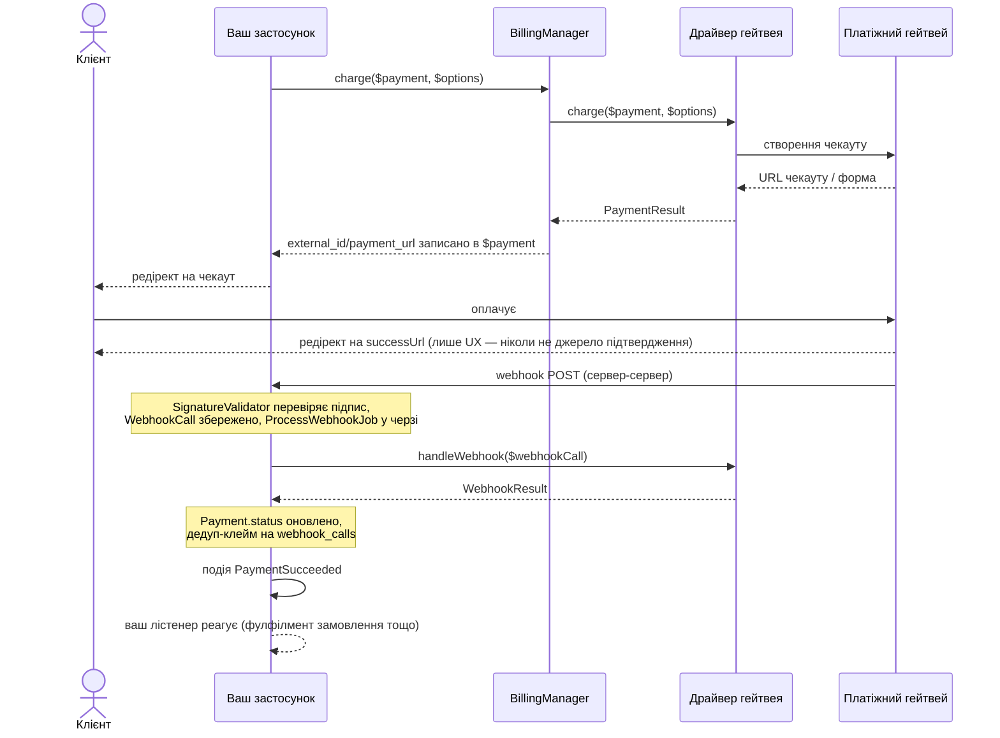

# Laravel Billing

Універсальний пакет білінгу/оплат для Laravel: підключні платіжні гейтвеї, одноразові платежі й підписки з тріалом, тарифікація за фактичним споживанням, обробка вебхуків.

[English documentation](README.md)

Вбудовані гейтвеї: **LiqPay**, **WayForPay**, **Monobank Acquiring**, **Stripe**, **Hutko**. Додати власний — один виклик `Billing::extend()`, без правок ядра.

## Вимоги

- PHP ^8.3
- Laravel ^12 | ^13

## Встановлення

```bash
composer require fomvasss/laravel-billing
```

Опублікувати власні міграції пакета, групами, щоб отримати лише ті таблиці, які реально потрібні. `billing-migrations-core` (таблиці `payments` і `webhook_calls`) потрібна всім:

```bash
php artisan vendor:publish --tag=billing-migrations-core
php artisan vendor:publish --tag=billing-migrations-subscriptions    # лише якщо є Plan/Price/Subscription
php artisan vendor:publish --tag=billing-migrations-payment-methods  # лише якщо є збережені картки/токени
php artisan migrate
```

Повторний `vendor:publish` — безпечний: файли копіюються під фіксованими іменами, вже опублікована міграція пропускається, не дублюється.

Опублікувати конфіг, якщо потрібно змінити дефолти (return-URL, дебаг-лог, grace-період тощо):

```bash
php artisan vendor:publish --tag=billing-config
```

## Швидкий старт — гейтвей `fake`

Прогнати весь флоу локально без жодного банку. `fake` реєструється автоматично в оточеннях `local`/`testing`:

```php
use Fomvasss\Billing\BillingManager;
use Fomvasss\Billing\Models\Payment;

$payment = Payment::create([
    'status' => 'pending',
    'type' => 'charge',
    'gateway' => 'fake',
    'amount' => 10000, // мінорні одиниці — 100.00
    'currency_code' => 'UAH',
    'payable_type' => Order::class,
    'payable_id' => $order->id,
    'billable_type' => $order->user::class,
    'billable_id' => $order->user->id,
]);

$result = app(BillingManager::class)->charge($payment);

return redirect($result->url); // локальна сторінка з кнопками "Оплачено"/"Відхилено"
```

Натискання кнопки надсилає POST напряму на реальний, зареєстрований webhook-ендпоінт — той самий пайплайн перевірки підпису → `ProcessWebhookJob` → подія, яким пройшов би реальний гейтвей, не скорочений шлях.

## Налаштування реального гейтвея

```php
// config/billing.php
'gateways' => [
    'monobank' => [
        'token' => env('MONOBANK_TOKEN'),
    ],
    'liqpay' => [
        'public_key' => env('LIQPAY_PUBLIC_KEY'),
        'private_key' => env('LIQPAY_PRIVATE_KEY'),
    ],
],
```

Точний перелік полів для кожного гейтвея — самодокументований через `credentialFields()`:

```php
use Fomvasss\Billing\Facades\Billing;

Billing::gateways(); // ['monobank' => ['label' => 'Monobank Acquiring', 'currencies' => [...], 'credential_fields' => [...], 'webhook_url' => '...', 'capabilities' => [...]], ...]
```

`webhook_url` у цьому масиві — точний callback URL для кабінету відповідного гейтвея.

Динамічні креди per-tenant (замість статичного масиву в конфізі) — забіндити власний резолвер:

```php
$this->app->bind(\Fomvasss\Billing\Contracts\CredentialResolverContract::class, MyCredentialResolver::class);
```

## `Payable` і `Billable`

`payable` — за що платять (`Order`, цикл підписки `Subscription`); `billable` — хто платить. Обидва поліморфні — будь-яка Eloquent-модель годиться для `payable`, а `billable`-моделі потрібен метод `tenantId()` (використовується для резолвингу динамічних per-tenant кредів):

```php
use Fomvasss\Billing\Concerns\Billable as BillableConcern;
use Fomvasss\Billing\Contracts\Billable;

class Organization extends Model implements Billable
{
    use BillableConcern; // дефолтний tenantId(): null — перевизначити нижче, якщо потрібна мультитенантність

    public function tenantId(): ?string
    {
        return (string) $this->id;
    }
}
```

## Оплата

```php
$result = app(BillingManager::class)->charge($payment, new ChargeOptions(
    description: 'Order #1042',
    customerEmail: $order->user->email,
    successUrl: route('order.thanks', $order),
));

// $result->url    — редірект-стиль (Monobank, Stripe, Hutko)
// $result->form   — auto-submit форма (LiqPay, WayForPay): ['action' => ..., 'fields' => [...]]
```

`charge()` записує `external_id`/`payment_url`/`payment_url_expires_at` назад у `$payment` — безпечно викликати повторно на тому самому `Payment`, коли посилання спливло (TTL визначає кожен драйвер сам).

### Ручні/офлайн платежі

Для оплати готівкою чи по реквізитам драйвер не потрібен — просто створити рядок напряму:

```php
Payment::create([
    'status' => 'paid',
    'type' => 'charge',
    'gateway' => null, // або вільний рядок на кшталт 'cash' — не зареєстрований через extend()
    'amount' => 10000,
    'currency_code' => 'UAH',
    'payable_type' => Order::class,
    'payable_id' => $order->id,
    'billable_type' => $order->user::class,
    'billable_id' => $order->user->id,
]);
```

`paid_at` виставляється автоматично в момент, коли `status` стає `paid`.

## Схема послідовності



Два незалежні шляхи, навмисно: редірект браузера (верхня половина) — лише UX, вебхук (нижня половина) — єдине, що коли-небудь змінює `Payment.status` — деталі нижче.

## Вебхуки

Один маршрут (`POST /billing/webhooks/{gateway}`) обслуговує всі гейтвеї — резолвиться в момент запиту через власний реєстр `BillingManager`, нічого налаштовувати вручну. Вхідні вебхуки перевіряються на підпис, зберігаються (`billing_webhook_calls`), ставляться в чергу (`ProcessWebhookJob`) і перетворюються на одну з подій:

| Подія | Коли |
|---|---|
| `PaymentSucceeded` / `PaymentFailed` / `PaymentRefunded` | Статус `Payment` дійшов до термінального стану |
| `SubscriptionCreated` / `SubscriptionRenewed` / `SubscriptionPaymentFailed` / `SubscriptionCancelled` / `TrialWillEnd` | Гейтвей-driven зміна стану підписки (лише нативні підписки гейтвея) |
| `SubscriptionPaused` / `SubscriptionResumed` | Лише локально, через `$subscription->pause()`/`resume()` — гейтвей не бере участі |
| `PaymentMethodAttached` / `PaymentMethodDetached` | Збережена картка/токен прив'язана або відв'язана |
| `UsageLimitReached` | `Subscription::reportUsage()` перетнув `price.included_units` |

Слухати звичайним чином:

```php
Event::listen(PaymentSucceeded::class, function (PaymentSucceeded $event) {
    $event->payment->payable; // ваш Order, Subscription тощо
});
```

### Кастомізація webhook-маршруту

І шлях, і стек мідлварів — конфігуровані. `{gateway}` має лишитись десь у шляху (`WebhookController` резолвить драйвер саме з цього сегмента), решта — на ваш розсуд:

```php
// config/billing.php
'webhook' => [
    'path' => 'webhook/billing/{gateway}', // власний префікс замість дефолтного billing/webhooks/{gateway}
    'middleware' => ['throttle:60,1'], // порожньо за замовчуванням — webhook-ендпоінт навмисно поза групою `web` (без CSRF, без сесії)
],
```

Назва маршруту (`billing.webhook`) незмінна — `AbstractGateway::webhookUrl()` і поле `webhook_url` в `Billing::gateways()` і далі резолвляться коректно незалежно від сконфігурованого шляху, нічого більше оновлювати не потрібно.

### Власний гейтвей

Чотири обов'язкові методи (`PaymentGatewayContract`), решта — опційно:

```php
use Fomvasss\Billing\Gateways\AbstractGateway; // опційно — спільний debug-лог + хелпери webhookUrl()/successUrl()/failUrl()
use Fomvasss\Billing\Contracts\RefundsPayments;
use Fomvasss\Billing\Webhooks\BillingWebhookCall;

class MyGateway extends AbstractGateway implements RefundsPayments
{
    public function charge(Payment $payment, ChargeOptions $options = new ChargeOptions()): PaymentResult { /* ... */ }
    public function handleWebhook(BillingWebhookCall $webhookCall): WebhookResult { /* ... */ }
    public static function label(): string { return 'My Gateway'; }
    public static function credentialFields(): array { return [/* ['name' => ..., 'type' => ..., 'secret' => bool, 'help' => ...] */]; }
    public static function supportedCurrencies(): array { return ['UAH']; }

    public function refund(Payment $payment, ?Money $amount = null): PaymentResult { /* ... */ }
}
```

```php
// у власному ServiceProvider::boot() — проєкт-споживач або сателіт-пакет (fomvasss/laravel-billing-mygateway)
use Fomvasss\Billing\Facades\Billing;

Billing::extend('mygateway', MyGateway::class)
    ->registerWebhook('mygateway', MyGatewaySignatureValidator::class);
```

`registerWebhook()` — той самий виклик, що зводить маршрут вхідного вебхука для цього гейтвея: усі гейтвеї діляться одним маршрутом `POST /billing/webhooks/{gateway}`, резолвиться через цей реєстр — окремого конфіг-файлу на гейтвей не потрібно. Третій аргумент — якщо гейтвей вимагає специфічну відповідь-підтвердження замість голого `200` (так робить WayForPay — приклад у `WayForPayWebhookResponder`).

## Підписки

```php
$plan = Plan::create(['code' => 'pro', 'name' => 'Pro']);

$price = $plan->prices()->create([
    'gateway' => 'stripe',
    'currency_code' => 'USD',
    'amount' => 2900, // $29.00
    'pricing_type' => 'flat',
    'interval' => 'month',
    'interval_count' => 1,
    'trial_days' => 14,
]);

$subscription = Subscription::create([
    'status' => 'trialing',
    'gateway' => 'stripe',
    'price_id' => $price->id,
    'billable_type' => $organization::class,
    'billable_id' => $organization->id,
    'trial_ends_at' => now()->addDays(14),
]);
```

### Типи прайсингу

- `flat` — фіксована сума, `qty`/`current_usage` ігноруються.
- `licensed` — `amount × subscription.qty` (місця/ліцензії).
- `metered` — `amount × subscription.current_usage` (pay-as-you-go).

### Використання й квоти

`included_units`/`current_usage` — ортогональні до `pricing_type`: навіть `flat`-ціна може мати квоту (наприклад, "4000 AI-токенів у комплекті на місяць, ціна фіксована в будь-якому разі"):

```php
$subscription->reportUsage(quantity: 1500, idempotencyKey: "ai-run:{$run->id}");
$subscription->remainingUsage(); // null, якщо в ціни взагалі нема квоти
```

`UsageLimitReached` спрацьовує рівно раз, коли кумулятивне використання перетинає `included_units` — реакція повністю на боці консьюмера (заблокувати, сповістити, або списати овербюджет через `TokenizesPaymentMethod::chargePaymentMethod()`).

### Пауза / відновлення / скасування

```php
$subscription->pause();   // лише локально — без виклику гейтвея, без події до банку
$subscription->resume();
$subscription->cancel();               // в кінці періоду (за замовчуванням)
$subscription->cancel(atPeriodEnd: false); // негайно
$subscription->swapPlan($newPrice);
```

### Рекурентні списання, реконсиляція, спливання тріалу

Три artisan-команди, вимкнені за замовчуванням (`billing.schedule.enabled`, бо стосуються грошей і стану підписок):

```php
// config/billing.php
'schedule' => ['enabled' => true],
```

```bash
php artisan billing:process-recurring-charges   # щогодини — списує прострочені підписки збереженим PaymentMethod
php artisan billing:reconcile-pending-payments  # щогодини — fallback на пропущений вебхук чи статус expired
php artisan billing:expire-trials               # щодня — trialing + минув trial_ends_at → ended
```

`process-recurring-charges` лише ІНІЦІЮЄ списання — результат (успіх/невдача) приходить через звичайний webhook pipeline і обробляється автоматично (посування періоду, або dunning-цикл через `grace_ends_at`/`recurring_attempts`/`max_recurring_attempts`, аж до `SubscriptionCancelled`).

### Токенізація / збережені картки

`process-recurring-charges` (і будь-яке власне off-session списання) працює з усіма 5 вбудованими гейтвеями — кожен реалізує `TokenizesPaymentMethod`.

Три механізми, той самий результат — рядок `PaymentMethod`, який можна передати в `chargeWithMethod()`:

| Гейтвей | Механізм | Доставок |
|---|---|---|
| Stripe | синхронний, фронтенд SDK | — |
| Monobank | асинхронний, опція `saveCard: true` | 2 (токен картки — окремою доставкою) |
| LiqPay | асинхронний, опція `saveCard: true` | 1 (разом зі статусом платежу) |
| WayForPay, Hutko | асинхронний, без опції — токен завжди повертається | 1 (разом зі статусом платежу) |

**Stripe** — синхронний токен із фронтенд SDK:

```php
// 1. Створюємо (або перевикористовуємо) Stripe-клієнта, віддаємо його id фронтенду для збору
//    картки через Stripe.js/Elements + SetupIntent — стандартний Stripe-флоу, поза пакетом.
$customerId = Billing::driver('stripe')->createCustomer($user);

// 2. Фронтенд підтверджує SetupIntent, отримує PaymentMethod id (pm_...) — POST на свій ендпоінт,
//    далі прив'язуємо:
$method = Billing::driver('stripe')->attachPaymentMethod($user, ['payment_method_id' => $pmId]);

// 3. Відтепер `billing:process-recurring-charges` (або власний код) може списувати напряму:
Billing::chargeWithMethod($payment, $method);
```

`attachPaymentMethod()`/`detachPaymentMethod()` самі диспатчать `PaymentMethodAttached`/`PaymentMethodDetached`, синхронно — без вебхука для цих двох.

**Monobank** — токен синхронно недоступний узагалі: передаєте `saveCard: true` на *першій* оплаті, і токен картки прилітає пізніше через звичайний webhook pipeline, окремою доставкою (`walletData.status: created`) — `handleWebhook()` ловить її і сам прив'язує `PaymentMethod`, без жодного додаткового виклику:

```php
Billing::charge($payment, new ChargeOptions(saveCard: true));
// ... клієнт платить, приходить вебхук, handleWebhook() сам зберігає PaymentMethod
// і диспатчить PaymentMethodAttached — більше нічого викликати не треба.
```

`Billing::driver('monobank')->attachPaymentMethod($user, ['card_token' => $token])` теж існує — для рідкісного випадку, коли токен уже відомий якимось іншим шляхом (перевіряє його через `GET /wallet` перед збереженням).

**LiqPay, WayForPay, Hutko** — та сама webhook-driven ідея, що в Monobank, але *одна* доставка замість двох: токен картки прилітає в тому самому колбеку, що й статус платежу, не окремим викликом.

```php
// LiqPay: recurringbytoken — явна опція, card_token приходить у тому ж server_url callback.
Billing::charge($payment, new ChargeOptions(saveCard: true));

// WayForPay/Hutko: жодного прапорця не потрібно — токен прилітає автоматично на будь-яку
// успішну карткову оплату. handleWebhook() зберігає його щоразу, коли він присутній.
Billing::charge($payment, new ChargeOptions());
```

`attachPaymentMethod($billable, ['card_token' => $token])` / `['rec_token' => $token]` / `['rectoken' => $token]` існують для всіх трьох — для токена, вже відомого іншим шляхом; жоден із гейтвеїв не має ендпоінта для перевірки токена (на відміну від Monobank-івського `GET /wallet`), тож усі три довіряють виклику. Жоден не має й ендпоінта відкликання токена — `detachPaymentMethod()` для всіх трьох лише локальний (видаляє рядок `PaymentMethod`, на боці гейтвея викликати нічого).

У будь-якому разі `chargePaymentMethod()` лише ІНІЦІЮЄ списання, так само як `charge()`: результат приходить через звичайний webhook pipeline для кожного гейтвея.

## Конвертація валют

Якщо валюта `Price` не приймається обраним гейтвеєм, `BillingManager::resolveChargeAmount()` пробує по черзі: (1) власну валюту ціни, якщо приймається; (2) сіблінг-`Price` того ж `Plan`+гейтвея в прийнятній валюті; (3) забінджений `CurrencyConverterContract`; (4) кидає `BillingException`. Забіндити конвертер (напр. адаптер над [`fomvasss/laravel-currency`](https://github.com/fomvasss/laravel-currency), не жорстка залежність цього пакета):

```php
$this->app->bind(\Fomvasss\Billing\Contracts\CurrencyConverterContract::class, MyCurrencyConverter::class);
```

## Тестування

Використовуйте гейтвей `fake` (див. "Швидкий старт") у feature-тестах власного застосунку — він проганяє точнісінько той самий пайплайн, що й реальний гейтвей, тому нічого специфічного для пакета мокати не потрібно.

## Ліцензія

MIT
