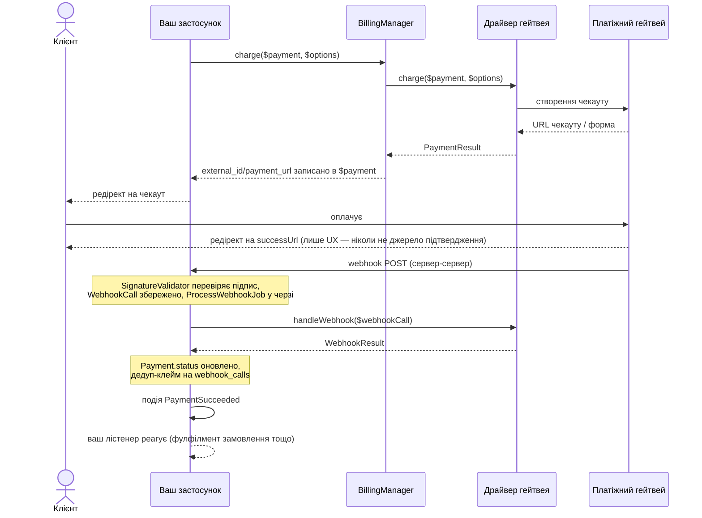

# Laravel Billing

Універсальний пакет білінгу/оплат для Laravel: підключні платіжні гейтвеї, одноразові платежі й підписки з тріалом, метрований прайсинг, обробка вебхуків.

[English documentation](README.md)

Вбудовані гейтвеї: **LiqPay**, **WayForPay**, **Monobank Acquiring**, **Stripe**, **Hutko**. Додати власний — один виклик `Billing::extend()`, без правок ядра.

## Вимоги

- PHP ^8.3
- Laravel ^12 | ^13

## Встановлення

```bash
composer require fomvasss/laravel-billing
```

Міграції запускаються автоматично (`loadMigrationsFrom`, `vendor:publish` для схеми не потрібен). Єдиний виняток — таблиця `webhook_calls` від `spatie/laravel-webhook-client`: опублікувати й прогнати один раз, до міграцій цього пакета:

```bash
php artisan vendor:publish --tag="webhook-client-migrations"
php artisan migrate
```

Опублікувати конфіг, якщо потрібно змінити дефолти (return-URL, дебаг-лог, grace-період тощо):

```bash
php artisan vendor:publish --tag=billing-config
```

## Швидкий старт — гейтвей `fake`

Прогнати весь флоу локально без жодного банку. `fake` реєструється автоматично в оточеннях `local`/`testing`:

```php
use Fomvasss\Billing\BillingManager;
use Fomvasss\Billing\Models\Payment;

$payment = Payment::create([
    'status' => 'pending',
    'type' => 'charge',
    'gateway' => 'fake',
    'amount' => 10000, // мінорні одиниці — 100.00
    'currency_code' => 'UAH',
    'payable_type' => Order::class,
    'payable_id' => $order->id,
    'billable_type' => $order->user::class,
    'billable_id' => $order->user->id,
]);

$result = app(BillingManager::class)->charge($payment);

return redirect($result->url); // локальна сторінка з кнопками "Оплачено"/"Відхилено"
```

Натискання кнопки надсилає POST напряму на реальний, зареєстрований webhook-ендпоінт — той самий пайплайн `spatie/laravel-webhook-client` → `ProcessWebhookJob` → подія, яким пройшов би реальний гейтвей, не скорочений шлях.

## Налаштування реального гейтвея

```php
// config/billing.php
'gateways' => [
    'monobank' => [
        'token' => env('MONOBANK_TOKEN'),
    ],
    'liqpay' => [
        'public_key' => env('LIQPAY_PUBLIC_KEY'),
        'private_key' => env('LIQPAY_PRIVATE_KEY'),
    ],
],
```

Точний перелік полів для кожного гейтвея — самодокументований через `credentialFields()`:

```php
use Fomvasss\Billing\Facades\Billing;

Billing::gateways(); // ['monobank' => ['label' => 'Monobank Acquiring', 'currencies' => [...], 'credential_fields' => [...], 'webhook_url' => '...', 'capabilities' => [...]], ...]
```

`webhook_url` у цьому масиві — точний callback URL для кабінету відповідного гейтвея.

Динамічні креди per-tenant (замість статичного масиву в конфізі) — забіндити власний резолвер:

```php
$this->app->bind(\Fomvasss\Billing\Contracts\CredentialResolverContract::class, MyCredentialResolver::class);
```

## `Payable` і `Billable`

`payable` — за що платять (`Order`, цикл підписки `Subscription`); `billable` — хто платить. Обидва поліморфні — будь-яка Eloquent-модель годиться для `payable`, а `billable`-моделі потрібен метод `tenantId()` (використовується для резолвингу динамічних per-tenant кредів):

```php
use Fomvasss\Billing\Concerns\Billable as BillableConcern;
use Fomvasss\Billing\Contracts\Billable;

class Organization extends Model implements Billable
{
    use BillableConcern; // дефолтний tenantId(): null — перевизначити нижче, якщо потрібна мультитенантність

    public function tenantId(): ?string
    {
        return (string) $this->id;
    }
}
```

## Оплата

```php
$result = app(BillingManager::class)->charge($payment, new ChargeOptions(
    description: 'Order #1042',
    customerEmail: $order->user->email,
    successUrl: route('order.thanks', $order),
));

// $result->url    — редірект-стиль (Monobank, Stripe, Hutko)
// $result->form   — auto-submit форма (LiqPay, WayForPay): ['action' => ..., 'fields' => [...]]
```

`charge()` записує `external_id`/`payment_url`/`payment_url_expires_at` назад у `$payment` — безпечно викликати повторно на тому самому `Payment`, коли посилання спливло (TTL визначає кожен драйвер сам).

### Ручні/офлайн платежі

Для оплати готівкою чи по реквізитам драйвер не потрібен — просто створити рядок напряму:

```php
Payment::create([
    'status' => 'paid',
    'type' => 'charge',
    'gateway' => null, // або вільний рядок на кшталт 'cash' — не зареєстрований через extend()
    'amount' => 10000,
    'currency_code' => 'UAH',
    'payable_type' => Order::class,
    'payable_id' => $order->id,
    'billable_type' => $order->user::class,
    'billable_id' => $order->user->id,
]);
```

`paid_at` виставляється автоматично в момент, коли `status` стає `paid`.

## Схема послідовності



Два незалежні шляхи, навмисно: редірект браузера (верхня половина) — лише UX, вебхук (нижня половина) — єдине, що коли-небудь змінює `Payment.status` — деталі нижче.

## Вебхуки

Кожен вбудований гейтвей сам реєструє свій запис у конфізі `spatie/laravel-webhook-client` і маршрут у `BillingServiceProvider::boot()` — нічого налаштовувати вручну. Вхідні вебхуки зберігаються, перевіряються на підпис, ставляться в чергу (`ProcessWebhookJob`) і перетворюються на одну з подій:

| Подія | Коли |
|---|---|
| `PaymentSucceeded` / `PaymentFailed` / `PaymentRefunded` | Статус `Payment` дійшов до термінального стану |
| `SubscriptionCreated` / `SubscriptionRenewed` / `SubscriptionPaymentFailed` / `SubscriptionCancelled` / `TrialWillEnd` | Гейтвей-driven зміна стану підписки (лише нативні підписки гейтвея) |
| `SubscriptionPaused` / `SubscriptionResumed` | Лише локально, через `$subscription->pause()`/`resume()` — гейтвей не бере участі |
| `PaymentMethodAttached` / `PaymentMethodDetached` | Збережена картка/токен прив'язана або відв'язана |
| `UsageLimitReached` | `Subscription::reportUsage()` перетнув `price.included_units` |

Слухати звичайним чином:

```php
Event::listen(PaymentSucceeded::class, function (PaymentSucceeded $event) {
    $event->payment->payable; // ваш Order, Subscription тощо
});
```

### Власний гейтвей

Чотири обов'язкові методи (`PaymentGatewayContract`), решта — опційно:

```php
use Fomvasss\Billing\Gateways\AbstractGateway; // опційно — спільний debug-лог + хелпери webhookUrl()/successUrl()/failUrl()
use Fomvasss\Billing\Contracts\RefundsPayments;

class MyGateway extends AbstractGateway implements RefundsPayments
{
    public function charge(Payment $payment, ChargeOptions $options = new ChargeOptions()): PaymentResult { /* ... */ }
    public function handleWebhook(\Spatie\WebhookClient\Models\WebhookCall $webhookCall): WebhookResult { /* ... */ }
    public static function label(): string { return 'My Gateway'; }
    public static function credentialFields(): array { return [/* ['name' => ..., 'type' => ..., 'secret' => bool, 'help' => ...] */]; }
    public static function supportedCurrencies(): array { return ['UAH']; }

    public function refund(Payment $payment, ?Money $amount = null): PaymentResult { /* ... */ }
}
```

```php
// у власному ServiceProvider::boot() — проєкт-споживач або сателіт-пакет (fomvasss/laravel-billing-mygateway)
use Fomvasss\Billing\Facades\Billing;
use Fomvasss\Billing\Support\WebhookConfigRegistrar;

Billing::extend('mygateway', MyGateway::class);
WebhookConfigRegistrar::register('mygateway', MyGatewaySignatureValidator::class);
```

`WebhookConfigRegistrar` одразу зводить і запис конфіга `spatie/laravel-webhook-client`, і маршрут — `config/webhook-client.php` руками чіпати не потрібно. Параметр `responder:` — якщо гейтвей вимагає специфічну відповідь-підтвердження замість голого `200` (так робить WayForPay — приклад у `WayForPayWebhookResponder`).

## Підписки

```php
$plan = Plan::create(['code' => 'pro', 'name' => 'Pro']);

$price = $plan->prices()->create([
    'gateway' => 'stripe',
    'currency_code' => 'USD',
    'amount' => 2900, // $29.00
    'pricing_type' => 'flat',
    'interval' => 'month',
    'interval_count' => 1,
    'trial_days' => 14,
]);

$subscription = Subscription::create([
    'status' => 'trialing',
    'gateway' => 'stripe',
    'price_id' => $price->id,
    'billable_type' => $organization::class,
    'billable_id' => $organization->id,
    'trial_ends_at' => now()->addDays(14),
]);
```

### Типи прайсингу

- `flat` — фіксована сума, `qty`/`current_usage` ігноруються.
- `licensed` — `amount × subscription.qty` (місця/ліцензії).
- `metered` — `amount × subscription.current_usage` (pay-as-you-go).

### Використання й квоти

`included_units`/`current_usage` — ортогональні до `pricing_type`: навіть `flat`-ціна може мати квоту (наприклад, "4000 AI-токенів у комплекті на місяць, ціна фіксована в будь-якому разі"):

```php
$subscription->reportUsage(quantity: 1500, idempotencyKey: "ai-run:{$run->id}");
$subscription->remainingUsage(); // null, якщо в ціни взагалі нема квоти
```

`UsageLimitReached` спрацьовує рівно раз, коли кумулятивне використання перетинає `included_units` — реакція повністю на боці консьюмера (заблокувати, сповістити, або списати овербюджет через `TokenizesPaymentMethod::chargePaymentMethod()`).

### Пауза / відновлення / скасування

```php
$subscription->pause();   // лише локально — без виклику гейтвея, без події до банку
$subscription->resume();
$subscription->cancel();               // в кінці періоду (за замовчуванням)
$subscription->cancel(atPeriodEnd: false); // негайно
$subscription->swapPlan($newPrice);
```

### Рекурентні списання, реконсиляція, спливання тріалу

Три artisan-команди, вимкнені за замовчуванням (`billing.schedule.enabled`, бо стосуються грошей і стану підписок):

```php
// config/billing.php
'schedule' => ['enabled' => true],
```

```bash
php artisan billing:process-recurring-charges   # щогодини — списує прострочені підписки збереженим PaymentMethod
php artisan billing:reconcile-pending-payments  # щогодини — fallback на пропущений вебхук чи статус expired
php artisan billing:expire-trials               # щодня — trialing + минув trial_ends_at → ended
```

`process-recurring-charges` лише ІНІЦІЮЄ списання — результат (успіх/невдача) приходить через звичайний webhook pipeline і обробляється автоматично (посування періоду, або dunning-цикл через `grace_ends_at`/`recurring_attempts`/`max_recurring_attempts`, аж до `SubscriptionCancelled`).

## Конвертація валют

Якщо валюта `Price` не приймається обраним гейтвеєм, `BillingManager::resolveChargeAmount()` пробує по черзі: (1) власну валюту ціни, якщо приймається; (2) сіблінг-`Price` того ж `Plan`+гейтвея в прийнятній валюті; (3) забінджений `CurrencyConverterContract`; (4) кидає `BillingException`. Забіндити конвертер (напр. адаптер над [`fomvasss/laravel-currency`](https://github.com/fomvasss/laravel-currency), не жорстка залежність цього пакета):

```php
$this->app->bind(\Fomvasss\Billing\Contracts\CurrencyConverterContract::class, MyCurrencyConverter::class);
```

## Тестування

Використовуйте гейтвей `fake` (див. "Швидкий старт") у feature-тестах власного застосунку — він проганяє точнісінько той самий пайплайн, що й реальний гейтвей, тому нічого специфічного для пакета мокати не потрібно.

## Ліцензія

MIT
