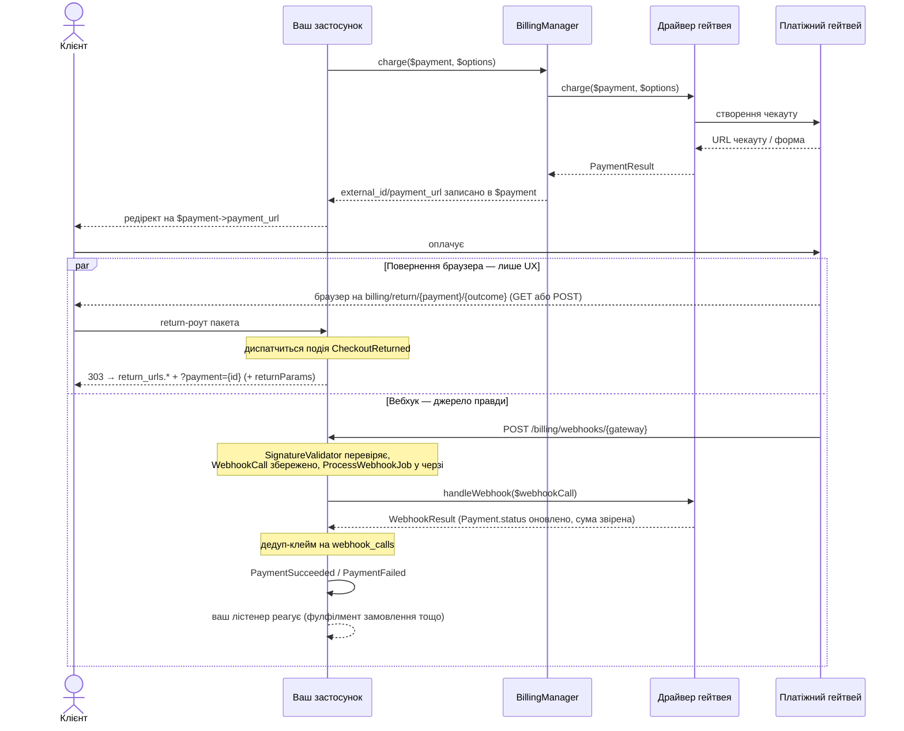
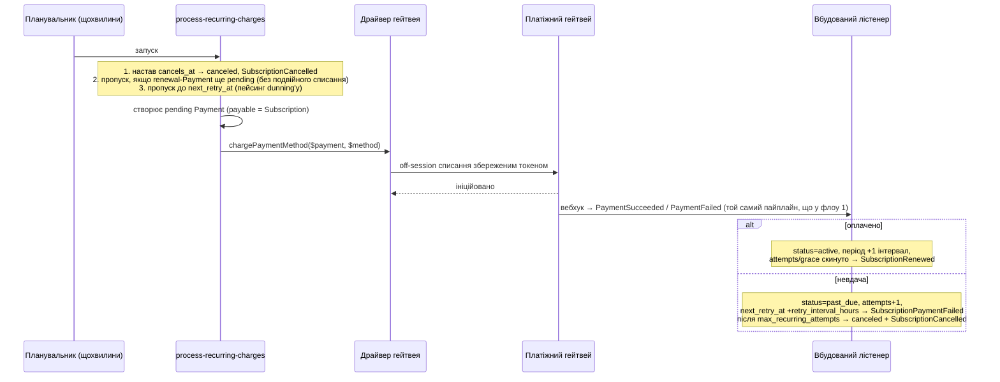
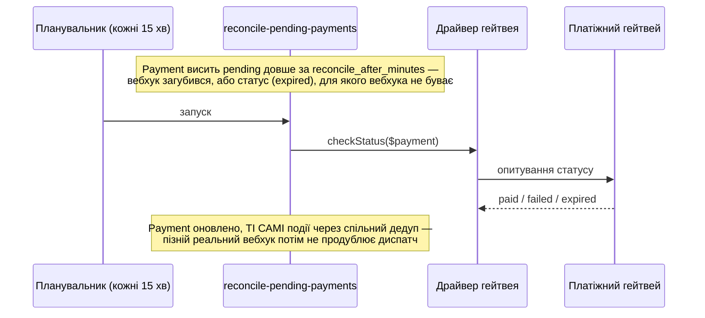
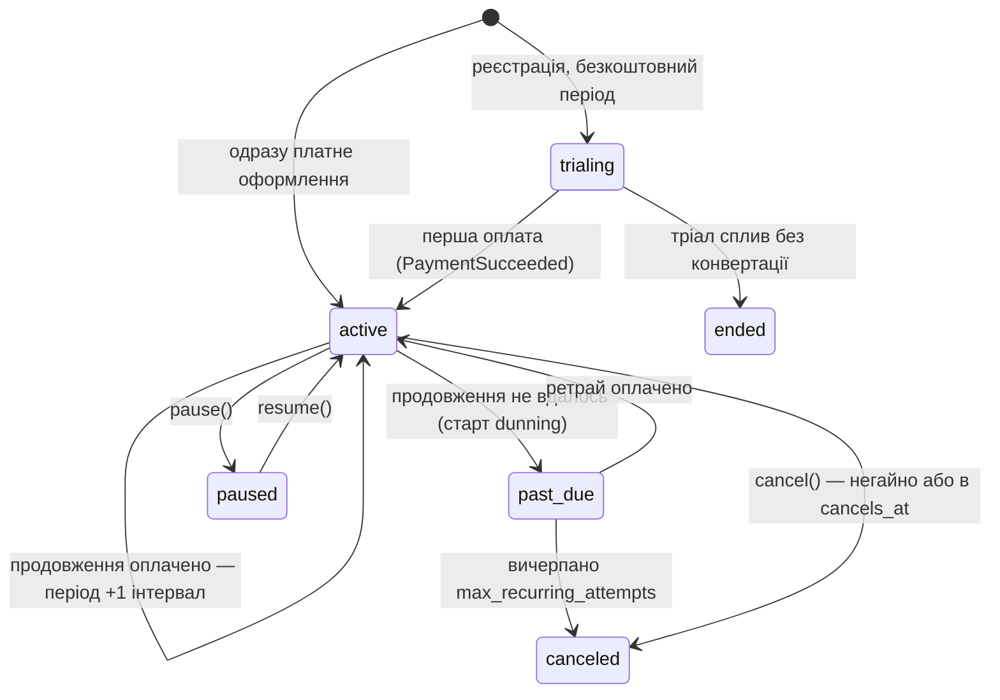

# Laravel Billing

Універсальний пакет білінгу/оплат для Laravel: підключні платіжні гейтвеї, одноразові платежі й підписки з тріалом, тарифікація за фактичним споживанням, обробка вебхуків.

[English documentation](README.md)

Вбудовані гейтвеї: **LiqPay**, **WayForPay**, **Monobank Acquiring**, **Stripe**, **Hutko**. Додати власний — один виклик `Billing::extend()`, без правок ядра.

## Вимоги

- PHP ^8.3
- Laravel ^12 | ^13

## Встановлення

```bash
composer require fomvasss/laravel-billing
```

Опублікувати власні міграції пакета, групами, щоб отримати лише ті таблиці, які реально потрібні. `billing-migrations-core` (таблиці `payments` і `webhook_calls`) потрібна всім:

```bash
php artisan vendor:publish --tag=billing-migrations-core
php artisan vendor:publish --tag=billing-migrations-subscriptions    # лише якщо є Plan/Price/Subscription
php artisan vendor:publish --tag=billing-migrations-payment-methods  # лише якщо є збережені картки/токени
php artisan migrate
```

Повторний `vendor:publish` — безпечний: файли копіюються під фіксованими іменами, вже опублікована міграція пропускається, не дублюється.

Опублікувати конфіг, якщо потрібно змінити дефолти (return-URL, дебаг-лог, grace-період тощо):

```bash
php artisan vendor:publish --tag=billing-config
```

## Швидкий старт — гейтвей `fake`

Прогнати весь флоу локально без жодного банку. `fake` реєструється автоматично в оточеннях `local`/`testing`:

```php
use Fomvasss\Billing\BillingManager;
use Fomvasss\Billing\Enums\{PaymentStatus, PaymentType};
use Fomvasss\Billing\Models\Payment;

$payment = Payment::create([
    'status' => PaymentStatus::Pending,
    'type' => PaymentType::Charge,
    'gateway' => 'fake',
    'amount' => 10000, // мінорні одиниці — 100.00
    'currency' => 'UAH',
    'payable_type' => Order::class,
    'payable_id' => $order->id,
    'billable_type' => $order->user::class,
    'billable_id' => $order->user->id,
]);

$result = app(BillingManager::class)->charge($payment);

return redirect($result->url); // локальна сторінка з кнопками "Оплачено"/"Відхилено"
```

Натискання кнопки надсилає POST напряму на реальний, зареєстрований webhook-ендпоінт — той самий пайплайн перевірки підпису → `ProcessWebhookJob` → подія, яким пройшов би реальний гейтвей, не скорочений шлях.

## Налаштування реального гейтвея

Опублікований конфіг уже містить заготовки всіх п'яти вбудованих гейтвеїв — лишається заповнити `.env` для тих, якими користуєтесь:

```dotenv
MONOBANK_TOKEN=

LIQPAY_PUBLIC_KEY=
LIQPAY_PRIVATE_KEY=

WAYFORPAY_MERCHANT_ACCOUNT=
WAYFORPAY_MERCHANT_DOMAIN=
WAYFORPAY_SECRET_KEY=

STRIPE_SECRET_KEY=
STRIPE_WEBHOOK_SECRET=

HUTKO_MERCHANT_ID=
HUTKO_SECRET_KEY=
```

Решту не чіпайте — незаповнений гейтвей просто лишається неналаштованим і впаде лише тоді, коли ним реально спробують провести оплату.

Той самий перелік у рантаймі, якщо будуєте UI налаштувань, а не читаєте файл — у кожного драйвера є статичний `credentialFields()`, викликається прямо на класі, без інстанції/кредів:

```php
use Fomvasss\Billing\Gateways\Monobank\MonobankGateway;

MonobankGateway::credentialFields();
// [
//     ['name' => 'token', 'type' => 'text', 'secret' => true, 'help' => 'X-Token з кабінету мерчанта...'],
//     ['name' => 'link_ttl_minutes', 'type' => 'number', 'secret' => false, 'help' => 'TTL посилання на оплату, хв...'],
// ]
```

`name` — ключ у конфізі (`config('billing.gateways.monobank.token')`), `secret` — позначає чутливе поле (ховати в UI налаштувань як пароль), `help` — звідки взяти значення. Ті самі дані для всіх зареєстрованих гейтвеїв одразу, без імпорту кожного класу драйвера окремо:

```php
use Fomvasss\Billing\Facades\Billing;

Billing::gateways(); // ['monobank' => ['label' => 'Monobank Acquiring', 'currencies' => [...], 'credential_fields' => [...], 'webhook_url' => '...', 'webhook_requires_dashboard_setup' => false, 'capabilities' => [...]], ...]
Billing::gateway('monobank'); // лише запис цього гейтвея, або null, якщо не зареєстрований
```

`webhook_url` — точний callback URL цього гейтвея, а `webhook_requires_dashboard_setup` каже UI налаштувань, чи показувати його з підказкою "вкажіть у кабінеті гейтвея" — більшості гейтвеїв ручне налаштування не потрібне взагалі (див. "Налаштування вебхуків" нижче).

**Перевірка підключення** — живий проб без сайд-ефектів: креди валідні + API досяжний; для кнопки "перевірити з'єднання" в адмінці або моніторинг-крону (ненульовий exit, якщо щось лежить):

```php
Billing::health('monobank'); // GatewayHealth { ok: true, message: 'My Shop LLC', latencyMs: 179.2 }
```
```bash
php artisan billing:health            # таблиця по всіх health-capable гейтвеях, exit 1 якщо хтось лежить
php artisan billing:health monobank   # один конкретний
```

Підтримують усі вбудовані гейтвеї (`capabilities.health` у `gateways()`). Це перевірка *кредів і досяжності прямо зараз* — ніколи не гарантія наступного списання.

Динамічні креди per-tenant (замість статичного масиву в конфізі) — забіндити власний резолвер:

```php
$this->app->bind(\Fomvasss\Billing\Contracts\CredentialResolverContract::class, MyCredentialResolver::class);
```

## `Payable` і `Billable`

`payable` — за що платять (`Order`, цикл підписки `Subscription`); `billable` — хто платить. Обидва поліморфні — будь-яка Eloquent-модель годиться для `payable`, а `billable`-моделі потрібен метод `tenantId()` (використовується для резолвингу динамічних per-tenant кредів):

```php
use Fomvasss\Billing\Concerns\Billable as BillableConcern;
use Fomvasss\Billing\Contracts\Billable;

class Organization extends Model implements Billable
{
    use BillableConcern; // дефолтний tenantId(): null — перевизначити нижче, якщо потрібна мультитенантність

    public function tenantId(): ?string
    {
        return (string) $this->id;
    }
}
```

Трейт також дає моделі акцесори з боку консьюмера — скоупи `forBillable()` на моделях пакета напряму майже не знадобляться:

```php
$organization->payments;                     // morphMany — скоупи ланцюжком: ->payments()->paid()
$organization->subscriptions;
$organization->paymentMethods;

$organization->defaultPaymentMethod;         // збережена картка, з якої йдуть продовження (per gateway — нижче)
$organization->defaultPaymentMethodFor('monobank');

$organization->activeSubscription();         // те саме визначення "активна", що isActive()
$organization->activeSubscription('pro');    // звужено кодом Plan
$organization->hasActiveSubscription('pro'); // one-liner для gate/middleware
```

Нюанс: `is_default` ведеться окремо на кожен гейтвей, тож клієнт із картками на двох гейтвеях має два дефолти — `defaultPaymentMethod` (властивість) поверне один із них, `defaultPaymentMethodFor()` — точний вибір.

## Оплата

```php
$result = app(BillingManager::class)->charge($payment, new ChargeOptions(
    description: 'Order #1042',
    customerEmail: $order->user->email,
    successUrl: route('order.thanks', $order),
));

return redirect($payment->payment_url);
```

`charge()` записує `external_id`/`payment_url`/`payment_url_expires_at` назад у `$payment` — безпечно викликати повторно на тому самому `Payment`, коли посилання спливло (TTL визначає кожен драйвер сам). `payment_url` — завжди плоске, редіректабельне посилання, незалежно від гейтвея: навіть LiqPay, чия платіжна сторінка приймає лише клієнтський POST-форми, отримує таке — форма кешується й віддається через власну сторінку пакета, яка сама її сабмітить.

Якщо потрібен сирий результат драйвера напряму (власна API-відповідь для SPA, наприклад): `$result->url` заповнений для будь-якого гейтвея, крім LiqPay, де замість нього `$result->form` (`['action' => ..., 'fields' => [...]]`) — ці поля треба самим відправити POST-ом на вказаний `action`.

### Сторінки повернення

Куди потрапляє браузер клієнта після каси. Фінальні сторінки конфігуруються один раз — звичайні роути застосунку або frontend/SPA-URL на іншому домені:

```php
// config/billing.php
'return_urls' => [
    'success' => 'https://app.example.com/checkout/success',
    'failed' => 'https://app.example.com/checkout/failed',
],
```

Сам гейтвей отримує власний return-роут пакета, який далі робить 303-редірект на твою сторінку з дописаним `?payment={id}` — сторінка знає, який платіж показувати. Проміжний хоп існує з двох практичних причин: WayForPay і Hutko повертають клієнта авто-сабмітним **POST**-ом (пакетний роут приймає його без жодних CSRF-виключень на твоєму боці, а 303 перетворює на звичайний GET до твоєї сторінки), і SPA-фронтенд взагалі не може бути POST-ціллю.

Потрібно на фінальному URL щось понад id платежу — наприклад, номер замовлення? `ChargeOptions::$returnParams` проїжджає через хоп і приземляється на твоїй сторінці GET-параметрами:

```php
Billing::charge($payment, new ChargeOptions(
    returnParams: ['order' => $order->number],
));
// → https://app.example.com/checkout/success?order=1042&payment={id}
```

Лише підказки для відображення — як і все на цій сторінці, ніколи не довіряй їм як стану оплати.

Він також диспатчить `CheckoutReturned($payment, $outcome, $data)` — хук лише для аналітики/UX. Повернення браузера нічого не доводить (і може взагалі не статись): стан платежу читай з БД (`$payment->isPaid()`), показуй "обробляється", поки вебхук не долетів, і ніколи не виконуй замовлення з цієї події.

Ще одна причина, чому success-сторінка мусить дивитись у БД: `success`/`failed` називають **слот** повернення, а не вердикт — і два слоти реально є лише у Stripe (`success_url`/`cancel_url`). У Monobank, LiqPay, WayForPay і Hutko return-URL один, тож їхні клієнти повертаються через `success`-слот **що б не сталося** — відхилена картка теж приземлиться на твою success-сторінку. Показуй там реальний стан (`isPaid()`/`isFailed()`/pending), інакше клієнт із декрайном прочитає "дякуємо за покупку".

Per-charge `ChargeOptions(successUrl: ..., failUrl: ...)` обходить весь механізм — URL (з будь-якими власними GET-параметрами, наприклад номером замовлення) йде гейтвею як є. Якщо робиш так з WayForPay/Hutko — їхнє POST-повернення тепер твоя турбота.

### Постійне посилання на оплату

`route('billing.pay', $payment)` — URL, який безпечно класти в лист чи рахунок: на відміну від `payment_url`, він ніколи не протухає:

- pending із живим лінком каси → редірект одразу на гейтвей;
- спливлий, `failed` чи `canceled` → на льоту випускається **свіжа** каса через `charge()`, редірект на неї (старий інвойс на боці гейтвея просто сам спливе);
- уже `paid` → приземлення на твою `return_urls.success`-сторінку з `?payment={id}`.

Кожен візит диспатчить `PaymentLinkOpened($payment)` — сигнал для аналітики/продажів ("відкривав рахунок двічі, не оплатив"), не більше. Перевипуск іде з дефолтними `ChargeOptions` (позиції чека все одно автозаповняться з `HasReceiptItems`-payable); per-charge опції оригінального виклику (`saveCard`, `raw`, ...) не запам'ятовуються.

### Ручні/офлайн платежі

Для оплати готівкою чи по реквізитам драйвер не потрібен — просто створити рядок напряму:

```php
Payment::create([
    'status' => PaymentStatus::Paid,
    'type' => PaymentType::Charge,
    'gateway' => null, // або вільний рядок на кшталт 'cash' — не зареєстрований через extend()
    'amount' => 10000,
    'currency' => 'UAH',
    'payable_type' => Order::class,
    'payable_id' => $order->id,
    'billable_type' => $order->user::class,
    'billable_id' => $order->user->id,
]);
```

`paid_at` виставляється автоматично в момент, коли `status` стає `paid`.

### Повернення коштів

`Billing::refund()` — єдина точка входу: робить виклик до гейтвея *і* фіксує результат — дочірній рядок `Payment` (`type=refund`, зв'язок через `parent_payment_id`) плюс подія `PaymentRefunded` з цим рядком. За замовчуванням — повне повернення, часткове — через `Money`; сумарні повернення ніколи не перевищать оригінальне списання:

```php
use Fomvasss\Billing\Support\Money;

$refund = Billing::refund($payment);                          // неповернутий залишок, повністю
$refund = Billing::refund($payment, new Money(2500, 'UAH'));  // часткове

$payment->refundedAmount(); // мінорні одиниці, сума всіх оплачених рядків повернення
```

Підтримується там, де в гейтвея є refund-API: Monobank, LiqPay, Stripe (`RefundsPayments` — перевіряйте `Billing::gateways()[$name]['capabilities']['refunds']`). Повернення WayForPay/Hutko робляться в кабінеті банку; якщо потрібні у вашому обліку — створіть рядок повернення вручну.

## Схеми флоу

Три флоу покривають усе, що пакет робить із грошима. (Механіка під ними — реєстри, точний порядок webhook-пайплайна, dedup, хто пише в які колонки — у **[docs/architecture.md](docs/architecture.md)**, англійською.) Скрізь діє одне правило: **лише вебхук (або його polling-фолбек) змінює `Payment.status`** — усе, що робить браузер, це UX.

### 1. Разова оплата (клієнт присутній, редірект)



Дві половини `par`-блоку незалежні й неупорядковані — вебхук часто прилітає раніше, ніж браузер клієнта повернувся. Сторінка повернення має читати стан платежу з БД і показувати "обробляється", поки вебхук не прийшов.

### 2. Рекурентне списання (клієнта немає, збережена картка)

Що робить `billing:process-recurring-charges` щохвилини — і рівно те саме відбувається при твоєму власному виклику `chargeWithMethod()` (овербюджет, конвертація тріалу зі збереженою карткою):



### 3. Загублений вебхук (реконсиляція)



Гейтвеї без ендпоінта статусу пропускають опитування: pending-платіж зі спливлим TTL помічається `canceled` як мертвий чекаут.

## Вебхуки

Один маршрут (`POST /billing/webhooks/{gateway}`) обслуговує всі гейтвеї — резолвиться в момент запиту через власний реєстр `BillingManager`, нічого налаштовувати вручну. Вхідні вебхуки перевіряються на підпис, зберігаються (`billing_webhook_calls`), ставляться в чергу (`ProcessWebhookJob`) і перетворюються на одну з подій:

| Подія | Коли |
|---|---|
| `PaymentSucceeded` / `PaymentFailed` | Статус `Payment` дійшов до термінального стану |
| `PaymentRefunded` | `Billing::refund()` створив рядок повернення (див. "Повернення коштів") |
| `SubscriptionRenewed` / `SubscriptionPaymentFailed` / `SubscriptionCancelled` | Результат рекурентного списання, оброблений власним лістенером пакета (період посунуто / dunning / скасовано після `max_recurring_attempts` або в момент `cancels_at`) |
| `SubscriptionCreated` | Лише гейтвеї з нативними підписками — жоден вбудований драйвер поки її не диспатчить |
| `TrialWillEnd` | З `billing:expire-trials`, на кожному інтервалі `trial_ending_notices` до `trial_ends_at` (дефолт `['3 days']`; напр. `['7 days', '3 days', '1 day']` для річних, `['1 hour', '15 minutes']` для погодинної оренди) — раз на підписку на кожне нагадування, `$event->notice` каже, яке саме спрацювало |
| `SubscriptionPaused` / `SubscriptionResumed` | Лише локально, через `$subscription->pause()`/`resume()` — гейтвей не бере участі |
| `CheckoutReturned` | Браузер клієнта повернувся з каси (див. "Сторінки повернення") — лише UX/аналітика, ніколи не доказ оплати |
| `PaymentLinkOpened` | Хтось відкрив постійне посилання на оплату (`billing.pay`, див. "Постійне посилання") — лише аналітика |
| `PaymentMethodAttached` / `PaymentMethodDetached` | Збережена картка/токен прив'язана або відв'язана |
| `UsageLimitReached` | `Subscription::reportUsage()` перетнув `price.included_units` |

Слухати звичайним чином:

```php
Event::listen(PaymentSucceeded::class, function (PaymentSucceeded $event) {
    $event->payment->payable; // ваш Order, Subscription тощо
});
```

### Налаштування вебхуків у кабінетах гейтвеїв

Callback URL кожного гейтвея — `https://твій-домен/billing/webhooks/{gateway}`, готове значення лежить у `Billing::gateways()[$name]['webhook_url']`. Фішка в тому, що **для більшості гейтвеїв налаштовувати нічого** — драйвер передає URL у кожному запиті на оплату. Та сама відповідь у рантаймі, по кожному гейтвею — поле `webhook_requires_dashboard_setup` у `Billing::gateways()`:

| Гейтвей | Як отримує URL | Налаштування в кабінеті |
|---|---|---|
| Monobank | `webHookUrl` у кожному invoice-запиті | не потрібне |
| LiqPay | `server_url` у кожному платежі | не потрібне |
| WayForPay | `serviceUrl` у кожному Purchase/Charge | не потрібне |
| Hutko | `server_callback_url` у кожному запиті | не потрібне |
| **Stripe** | Лише попередньо зареєстровані ендпоінти (Dashboard **або** один API-виклик) | **обов'язкове** |

Stripe — пакет може зареєструвати ендпоінт за тебе:

```bash
php artisan billing:stripe-register-webhook          # створює ендпоінт, друкує STRIPE_WEBHOOK_SECRET
php artisan billing:stripe-register-webhook --fresh  # змінився домен/тунель — видалити і створити заново (новий секрет)
```

Секрет показується **лише при створенні** (Stripe ніколи не повертає його повторно) — одразу вставляй у `.env`. Рівнозначні ручні способи, якщо зручніше:

- **Dashboard**: Developers → Webhooks → Add endpoint з `https://твій-домен/billing/webhooks/stripe`, підписка на події `checkout.session.completed`, `checkout.session.expired`, `payment_intent.succeeded`, `payment_intent.payment_failed`, скопіюй **Signing secret** (`whsec_...`).
- **Один API-виклик** — без відкриття Dashboard узагалі, signing secret приходить у відповіді:

```bash
curl https://api.stripe.com/v1/webhook_endpoints -u "sk_test_...:" \
  -d url="https://твій-домен/billing/webhooks/stripe" \
  -d "enabled_events[]=checkout.session.completed" -d "enabled_events[]=checkout.session.expired" \
  -d "enabled_events[]=payment_intent.succeeded" -d "enabled_events[]=payment_intent.payment_failed"
# → у відповіді є "secret": "whsec_..."
```

У будь-якому разі секрет іде в `STRIPE_WEBHOOK_SECRET` — без нього валідатор відхиляє все (fail-closed). Зареєстрований URL фіксується на боці Stripe: зміна домену/тунеля означає перестворення ендпоінта.

Стосується всіх: `APP_URL` має бути реальним публічним URL (`route()` будує callback з нього), шлях має бути доступний по HTTPS без basic auth/IP-блоків (CSRF уже не заважає — роут поза групою `web`), а до локальної машини банк не достукається — тунель (ngrok/expose) або просто `fake`-гейтвей, який ганяє той самий пайплайн. Кожен прийнятий вебхук лишає рядок у `billing_webhook_calls`; 403 у логах = проблема з підписом/секретом.

### Що гарантує пайплайн

- **Валідатори підписів fail closed.** Усі п'ять webhook-маршрутів існують навіть для гейтвеїв, яких ви не налаштовували — маршрут гейтвея без секрету відповідає 403 на все, а не "перевіряє" проти порожнього ключа.
- **"Оплачений" колбек має збігтися із сумою й валютою платежу.** Підписаний колбек з іншою сумою (класика: стара checkout-лінка, оплачена після зміни суми замовлення й повторного `charge()`) *не* помічає платіж оплаченим — пишеться warning у лог, рядок лишається `pending` для реконсиляції/ручного розбору.
- **Події дедуплікуються за результатом, не за референсом.** Повторно доставлений "оплачено" ніколи не викличе `PaymentSucceeded` двічі — але "відхилено, потім клієнт повторив оплату того ж чекауту і заплатив" диспатчить і `PaymentFailed`, і `PaymentSucceeded`, навіть на гейтвеях, що використовують один референс на всі спроби. Команда реконсиляції ділить той самий дедуп, тож гонка "poll проти пізнього вебхука" теж не подвоїть подію.
- **Колбек про платіж, якого пакет не знає** (інша інтеграція на тому ж мерчант-акаунті, рядки до встановлення пакета), ігнорується — без failed jobs.
- **Збережені webhook-виклики чистяться** через `config('billing.webhook.prune_after_days')` (дефолт 30) щоденним `model:prune`, зареєстрованим разом з іншими команди розкладу.

### Horizon / Черга

Вхідні вебхуки обробляє один queued job (`ProcessWebhookJob`). За замовчуванням він іде на дефолтні connection/чергу застосунку; виділи йому окрему чергу, щоб завантажена дефолтна черга не відкладала помітку платежів оплаченими:

```env
BILLING_QUEUE_CONNECTION=redis
BILLING_QUEUE=billing
```

Приклад Horizon-supervisor — job швидкий (без HTTP-викликів усередині; робота з API гейтвея відбулась до постановки в чергу), тож кількох процесів з коротким timeout достатньо:

```php
'supervisor-billing' => [
    'connection' => 'redis',
    'queue' => ['billing'],
    'balance' => 'simple',
    'minProcesses' => 1,
    'maxProcesses' => 4,
    'tries' => 3,
    'timeout' => 60,
],
```

Якщо задаєш `BILLING_QUEUE` — переконайся, що *якийсь* воркер/supervisor реально споживає цю чергу, інакше вебхуки зберігатимуться, але ніколи не оброблятимуться.

### Кастомізація webhook-маршруту

І шлях, і стек мідлварів — конфігуровані. `{gateway}` має лишитись десь у шляху (`WebhookController` резолвить драйвер саме з цього сегмента), решта — на ваш розсуд:

```php
// config/billing.php
'webhook' => [
    'path' => 'webhook/billing/{gateway}', // власний префікс замість дефолтного billing/webhooks/{gateway}
    'middleware' => ['throttle:60,1'], // порожньо за замовчуванням — webhook-ендпоінт навмисно поза групою `web` (без CSRF, без сесії)
],
```

Назва маршруту (`billing.webhook`) незмінна — `AbstractGateway::webhookUrl()` і поле `webhook_url` в `Billing::gateways()` і далі резолвляться коректно незалежно від сконфігурованого шляху, нічого більше оновлювати не потрібно.

### Власний гейтвей

Чотири обов'язкові методи (`PaymentGatewayContract`), решта — опційно, і один виклик для реєстрації:

```php
// у власному ServiceProvider::boot() — проєкт-споживач або сателіт-пакет (fomvasss/laravel-billing-mygateway)
use Fomvasss\Billing\Facades\Billing;

Billing::extend('mygateway', MyGateway::class)
    ->registerWebhook('mygateway', MyGatewaySignatureValidator::class);
```

Ні маршруту оголошувати, ні конфіг-файлу чіпати — усі гейтвеї діляться одним маршрутом `POST /billing/webhooks/{gateway}`, який резолвиться через цей реєстр у момент запиту.

**→ [Повний гайд: як написати гейтвей](docs/writing-a-gateway.md)** (англійською) — контракт метод за методом, перевірка підпису, три форми токенізації, кастомні відповіді-підтвердження, тестування без реальних кредів і пастки звірки, що коштували нам реальних багів.

## Підписки

```php
$plan = Plan::create(['code' => 'pro', 'name' => 'Pro']);

$price = $plan->prices()->create([
    'gateway' => 'stripe',
    'currency' => 'USD',
    'amount' => 2900, // $29.00
    'pricing_type' => PricingType::Flat,
    'interval' => Interval::Month,
    'interval_count' => 1,
    'trial_days' => 14,
]);

$subscription = Subscription::create([
    'status' => SubscriptionStatus::Trialing,
    'gateway' => 'stripe',
    'price_id' => $price->id,
    'billable_type' => $organization::class,
    'billable_id' => $organization->id,
    'trial_ends_at' => now()->addDays(14),
]);
```

### Типи прайсингу

- `flat` — фіксована сума, `qty`/`current_usage` ігноруються.
- `licensed` — `amount × subscription.qty` (місця/ліцензії).
- `metered` — `amount × subscription.current_usage` (pay-as-you-go).

### Використання й квоти

`included_units`/`current_usage` — ортогональні до `pricing_type`: навіть `flat`-ціна може мати квоту (наприклад, "4000 AI-токенів у комплекті на місяць, ціна фіксована в будь-якому разі"):

```php
$subscription->reportUsage(quantity: 1500, idempotencyKey: "ai-run:{$run->id}");
$subscription->remainingUsage(); // null, якщо в ціни взагалі нема квоти
```

`UsageLimitReached` спрацьовує рівно раз, коли кумулятивне використання перетинає `included_units` — реакція повністю на боці консьюмера (заблокувати, сповістити, або списати овербюджет через `TokenizesPaymentMethod::chargePaymentMethod()`).

При успішному продовженні `current_usage` скидається в 0, якщо ціна має квоту (`included_units` задано) або вона `metered` — свіжий оплачений період означає свіжий ліміт, нічого скидати самому. Використання на `flat`/`licensed` без квоти не чіпається: там це просто лічильник, яким володіє твій застосунок.

### Пауза / відновлення / скасування

```php
$subscription->pause();   // лише локально — без виклику гейтвея, без події до банку
$subscription->resume();
$subscription->cancel();               // в кінці періоду (за замовчуванням)
$subscription->cancel(atPeriodEnd: false); // негайно
$subscription->swapPlan($newPrice);
```

`cancel()` на кінець періоду лише проставляє `cancels_at` — фактична зміна статусу (і гарантія, що клієнта *не* спишуть за наступний період) відбувається в `billing:process-recurring-charges`, коли цей момент настає. Тобто скасування на кінець періоду потребує увімкненого розкладу — так само, як і саме автопродовження.

### Рекурентні списання, реконсиляція, спливання тріалу

Три artisan-команди, вимкнені за замовчуванням (`billing.schedule.enabled`, бо стосуються грошей і стану підписок):

```php
// config/billing.php
'schedule' => ['enabled' => true],
```

| Команда | Запускається | Що робить |
|---|---|---|
| `billing:process-recurring-charges` | щохвилини | Спершу фіналізує підписки, чий `cancels_at` настав (статус → `canceled`, диспатчиться `SubscriptionCancelled`) — скасування на кінець періоду ніколи не буде списане ще раз. Далі знаходить підписки з `current_period_ends_at <= now()` і списує зі збереженого `PaymentMethod` через `chargePaymentMethod()` — крім випадку, коли попередній renewal-`Payment` ще `pending` (вебхук не дійшов): це блокує друге списання за той самий період. Лише ІНІЦІЮЄ списання — результат приходить пізніше через звичайний webhook pipeline, обробляється автоматично: період посувається при `PaymentSucceeded`; при `PaymentFailed` підписка стає `past_due` і ретраїться кожні `retry_interval_hours` (дефолт 24 — з інтервалом, а *не* кожен запуск планувальника) до вичерпання `max_recurring_attempts`, далі `SubscriptionCancelled`. З дефолтами це 3 спроби з добовим інтервалом упродовж 3-денного grace-вікна. |
| `billing:reconcile-pending-payments` | кожні 15 хв | Fallback для `Payment`, що завис `pending` через загублений вебхук, або статус `expired` гейтвея, для якого власного вебхука не буває. Бере лише платежі старші за `config('billing.reconcile_after_minutes')` (дефолт 60 хв) — цей cutoff уже сам по собі відкладає, коли платіж кваліфікується як "завис", тому ця команда запускається частіше за інші дві, не щогодини. Помилка на одному платежі репортиться й пропускається, ніколи не блокує решту. |
| `billing:expire-trials` | щодня | Диспатчить `TrialWillEnd` на кожному сконфігурованому інтервалі `trial_ending_notices` (раз на підписку на нагадування; якщо кілька стали due одночасно — фаєриться лише найближче), потім переводить `trialing`-підписки з простроченим `trial_ends_at` у `ended`. Конвертація trial у платну підписку — звичайний виклик `chargeWithMethod()`, той самий, що й будь-яке продовження (див. "Безкоштовний період" у Практичних прикладах). |
| `model:prune` (BillingWebhookCall) | щодня | Видаляє збережені webhook-виклики, старші за `webhook.prune_after_days` (дефолт 30). |

Ніщо з цього не запускається саме собою — `Schedule::command()`/`->hourly()` тощо лише реєструються у власному Laravel-планувальнику застосунку, якому все одно потрібен стандартний системний cron-запис `php artisan schedule:run` щохвилини (звичайна вимога деплою Laravel, не специфіка пакета).

**Потрібна інша частота?** Вбудований розклад — лише розумний дефолт: вимкни його і зареєструй команди сам із будь-якою частотою; вони ідемпотентні за побудовою (guard від подвійного renewal, `next_retry_at`, спільний із вебхуками дедуп), а вбудовані записи вже мають `withoutOverlapping()`:

```php
// config/billing.php: 'schedule' => ['enabled' => false]

// напр. сповільнити списання до нічного батчу, а реконсиляцію пришвидшити:
Schedule::command('billing:process-recurring-charges')->dailyAt('03:00')->withoutOverlapping();
Schedule::command('billing:reconcile-pending-payments')->everyFiveMinutes()->withoutOverlapping();
Schedule::command('billing:expire-trials')->daily();
```

`withoutOverlapping()` на грошових командах — обов'язково, а якщо планувальник крутиться на кількох серверах — додай ще `onOneServer()`.

### Статуси та історія

`Subscription` — **один рядок на все життя**: перша оплата переводить `trialing` в `active`, продовження посувають `current_period_ends_at`, dunning проводить через `past_due` і назад; новий рядок з'являється лише якщо клієнт оформлюється заново після `canceled`/`ended`.



| Статус | Значення |
|---|---|
| `trialing` | Безкоштовний період, картка не потрібна — для перевірок доступу рахується активною |
| `active` | Оплачена й актуальна |
| `past_due` | Продовження не вдалось; ретраїться кожні `retry_interval_hours` у межах grace-вікна — `isActive()` лишається true до `grace_ends_at` |
| `paused` | Локальна пауза через `pause()`/`resume()` — гейтвей не бере участі |
| `canceled` | Скасована (негайно, в кінці періоду, або dunning'ом після `max_recurring_attempts`) |
| `ended` | Тріал сплив без конвертації |

**Продовження чи оформлення заново** — пакет це не вирішує, вирішує те, *на який рядок вказує платіж*. `Payment` з `payable` = існуючий рядок підписки — це продовження/реанімація: вбудований лістенер переводить будь-який знайдений статус (`trialing`, `past_due`, навіть `canceled`) в `active` і посуває період. Рядки `canceled`/`ended` ніколи не чіпаються автоматично — жодних автосписань по них — тож "повернення" завжди ініціює твій код, і правило таке: в межах grace-вікна (`past_due`) — оплата по **тому самому рядку**; після `canceled`/`ended` — створюй **новий рядок**. Дві причини: історія чистіша (старий рядок лишається завершеним епізодом), і пастка з якорем періоду — лістенер посуває період від `current_period_ends_at`, який у давно мертвого рядка на місяці в минулому, тож оплата по ньому дасть "новий" період, що вже закінчився (лікується обнуленням `current_period_ends_at`, але свіжий рядок просто не має цієї проблеми).

Що фіксується з коробки: кожне списання — незмінний рядок `Payment` (повна фінансова історія, назавжди), сирі вебхуки — у `billing_webhook_calls` (чистяться через `prune_after_days`), а сам рядок підписки тримає ключові мітки (`trial_ends_at`, `cancels_at`, `grace_ends_at`, `recurring_attempts`). Що **не** фіксується: журнал переходів статусу — `status` перезаписується на місці.

Якщо потрібна саме хронологія — кожен перехід уже супроводжується подією, і журнал збирається одним лістенером у твоєму проєкті (`SubscriptionLog` нижче — твоя власна модель; або направ той самий лістенер у `spatie/laravel-activitylog`):

```php
use Fomvasss\Billing\Events\{SubscriptionRenewed, SubscriptionPaymentFailed,
    SubscriptionCancelled, SubscriptionPaused, SubscriptionResumed, TrialWillEnd};

class LogSubscriptionTransition
{
    public function handle(SubscriptionRenewed|SubscriptionPaymentFailed|SubscriptionCancelled|SubscriptionPaused|SubscriptionResumed|TrialWillEnd $event): void
    {
        SubscriptionLog::create([
            'subscription_id' => $event->subscription->id,
            'status' => $event->subscription->status->value,
            'event' => class_basename($event), // SubscriptionRenewed, TrialWillEnd, ...
        ]);
    }
}

// AppServiceProvider::boot()
Event::listen([
    SubscriptionRenewed::class,
    SubscriptionPaymentFailed::class,
    SubscriptionCancelled::class,
    SubscriptionPaused::class,
    SubscriptionResumed::class,
    TrialWillEnd::class,
], LogSubscriptionTransition::class);
```

### Токенізація / збережені картки

Усі 5 вбудованих гейтвеїв реалізують `TokenizesPaymentMethod` — прив'язуєте картку один раз, далі `chargeWithMethod()` будь-коли (продовження підписки, овербюджет, апгрейд, ...).

**Основний шлях — будь-який гейтвей, без жодного фронтенд-коду:** картка зберігається побічним ефектом першої реальної оплати, `PaymentMethod` просто з'являється, щойно клієнт оплатив:

```php
// Monobank/LiqPay/Hutko/Stripe потребують прапорця; лише WayForPay зберігає картку і без нього
Billing::charge($payment, new ChargeOptions(saveCard: true));
// ... клієнт платить, PaymentMethod прив'язується сам, диспатчиться PaymentMethodAttached — більше нічого викликати не треба
```

На Stripe це працює через hosted Checkout (`setup_future_usage`, per-billable Stripe-customer створюється/перевикористовується автоматично) — без Stripe.js.

**Stripe-бонус: збереження картки *без* списання** (єдине, чого не вміють укр. гейтвеї) — SetupIntent, керований фронтендом:

```php
$customerId = Billing::driver('stripe')->createCustomer($user);

// фронтенд збирає картку через Stripe.js/Elements проти цього customer id, підтверджує
// SetupIntent, отримує PaymentMethod id (pm_...) — POST на свій ендпоінт
$method = Billing::driver('stripe')->attachPaymentMethod($user, ['payment_method_id' => $pmId]);

Billing::chargeWithMethod($payment, $method);
```

Уже маєте токен звідкись іншим шляхом? `attachPaymentMethod($billable, [...])` бере його напряму — ключ масиву різний для кожного гейтвея: `payment_method_id` (Stripe), `card_token` (Monobank/LiqPay), `rec_token` (WayForPay), `rectoken` (Hutko). `detachPaymentMethod($method)` видаляє збережену картку — лише Monobank реально відкликає її й на боці банку, решта три просто перестають нею користуватись локально.

У будь-якому разі `chargeWithMethod()`/`chargePaymentMethod()` лише ІНІЦІЮЮТЬ списання — результат завжди приходить через звичайний webhook pipeline, так само як `charge()`.

## Практичні приклади

Усе вище — будівельні блоки; ось як вони складаються в кілька реальних сценаріїв. Ширші, наскрізні дизайни систем (SaaS з токен-гаманцем, магазин із витратами, погодинна оренда, вітрина тарифів) — у **[docs/use-cases.md](docs/use-cases.md)** (англійською).

### 1. Оплата замовлення в магазині з фіскальним чеком

`Order` реалізує `HasReceiptItems` — `charge()` підхоплює це автоматично, не треба самим передавати `receiptItems`:

```php
class Order extends Model implements Payable, HasReceiptItems
{
    public function receiptItems(): array
    {
        return $this->items->map(fn (OrderItem $item) => [
            'name' => $item->product->name,
            'qty' => $item->qty,
            'unitAmount' => $item->unit_price, // мінорні одиниці
            'sku' => $item->product->sku,
        ])->all();
    }
}
```

Що саме гейтвей із цим робить — різне: **Monobank** (`basketOrder`), **WayForPay** (`productName[]`/`productPrice[]`/`productCount[]`), **Stripe** (`line_items`) і **Hutko** (`reservation_data` — фіскальний кошик програмного РРО) беруть це як є. Виняток — **LiqPay**: позиції його `rro_info` посилаються на товари, зареєстровані у вашому кабінеті LiqPay, за їхнім каталожним id — значення, під яке в цій нейтральній структурі поля немає, тож саме його передавайте явно через `ChargeOptions::$raw` (нижче).

```php
$payment = Payment::create([
    'status' => PaymentStatus::Pending,
    'type' => PaymentType::Charge,
    'gateway' => 'monobank',
    'amount' => $order->total, // мінорні одиниці
    'currency' => 'UAH',
    'payable_type' => Order::class,
    'payable_id' => $order->id,
    'billable_type' => $order->user::class,
    'billable_id' => $order->user->id,
]);

Billing::charge($payment, new ChargeOptions(
    description: "Замовлення #{$order->number}",
    customerEmail: $order->user->email,
));

return redirect($payment->payment_url);
```

```php
Event::listen(PaymentSucceeded::class, function (PaymentSucceeded $event) {
    if ($event->payment->payable instanceof Order) {
        $event->payment->payable->markAsPaid();
    }
});
```

Усе, що гейтвей підтримує, але для чого немає нейтрального еквівалента, йде через `ChargeOptions::$raw` — вливається в запит як є, читається лише тим драйвером, яким платите, рештою ігнорується:

```php
Billing::charge($payment, new ChargeOptions(
    description: "Замовлення #{$order->number}",
    raw: [
        // Фіскалізація LiqPay — id беруться з вашого кабінету LiqPay (SCR → Каса → Товари)
        'rro_info' => [
            'items' => $order->items->map(fn ($item) => [
                'id' => $item->product->liqpay_goods_id,
                'amount' => $item->qty,
                'price' => $item->unit_price / 100,
                'cost' => $item->total / 100,
            ])->all(),
            'delivery_emails' => [$order->user->email],
        ],
    ],
));
```

`$raw` вливається *під* власні поля драйвера, тож може додати те, чого драйвер не встановлює, але ніколи не перевизначить суму чи merchant reference, за яким матчиться вебхук.

### 2. Оформлення підписки на 15 ГБ — і як насправді працює автопродовження

```php
$plan = Plan::create(['code' => 'storage-15gb', 'name' => '15 ГБ сховища']);

$price = $plan->prices()->create([
    'gateway' => 'stripe',
    'currency' => 'USD',
    'amount' => 500, // $5.00/міс
    'pricing_type' => PricingType::Flat,
    'interval' => Interval::Month,
    'interval_count' => 1,
]);

$subscription = Subscription::create([
    'status' => SubscriptionStatus::Active,
    'gateway' => 'stripe',
    'price_id' => $price->id,
    'billable_type' => $organization::class,
    'billable_id' => $organization->id,
    'current_period_ends_at' => now()->addMonth(),
]);
```

Перша оплата токенізує картку (`saveCard: true`, див. "Токенізація" вище). Саме автопродовження — це `billing:process-recurring-charges`, вимкнена за замовчуванням, тож треба увімкнути розклад (`config('billing.schedule.enabled', true)`, що саме вона робить і коли запускається — таблиця вище); усе решта (посування періоду, dunning при невдачі) уже підключено, більше нічого писати не треба.

Крок 3 самим писати не треба — уже підключено. Потрібні лише крок 1 і збережений `PaymentMethod`.

### 3. Докупка 5 ГБ окремо (поза циклом підписки)

Не рядок підписки — у пакеті свідомо немає концепції "гаманця"/балансу на аддони (див. нижче), тому це звичайний одноразовий `Payment`. Сам `Payment` каже лише хто заплатив і скільки, не за що — два різні аддони можуть коштувати однаково. Два способи це вирішити, оберіть залежно від того, скільки різних типів одноразових покупок буде на того самого клієнта:

**`Payment::$meta`** — звичайна `json`-колонка, пакету байдужа (та сама ідея, що `Plan::$meta`), найпростіший варіант, якщо тип одноразової покупки лише один:

```php
$payment = Payment::create([
    'status' => PaymentStatus::Pending,
    'type' => PaymentType::Charge,
    'gateway' => 'stripe',
    'amount' => 200, // $2.00 за 5 ГБ
    'currency' => 'USD',
    'payable_type' => $organization::class,
    'payable_id' => $organization->id,
    'billable_type' => $organization::class,
    'billable_id' => $organization->id,
    'meta' => ['product' => 'storage_addon', 'gb' => 5],
]);

Billing::chargeWithMethod($payment, $organization->defaultPaymentMethod); // або Billing::charge() для редіректного чекауту
```

```php
Event::listen(PaymentSucceeded::class, function (PaymentSucceeded $event) {
    if (($event->payment->meta['product'] ?? null) === 'storage_addon') {
        $event->payment->payable->increment('extra_storage_gb', $event->payment->meta['gb']);
    }
});
```

**Окремий `payable`** — має сенс, коли типів одноразових покупок на того самого клієнта кілька (аддони на сховище, докупка місць, ...) і хочеться `instanceof` замість рядкових ключів у `meta`. Та сама ідея, що `Order` у рецепті №1:

```php
class StorageAddonPurchase extends Model implements Payable
{
    protected $fillable = ['organization_id', 'gb'];

    public function organization(): BelongsTo
    {
        return $this->belongsTo(Organization::class);
    }
}
```

```php
$addon = StorageAddonPurchase::create(['organization_id' => $organization->id, 'gb' => 5]);

Payment::create([
    // ... ті самі поля, що вище, окрім:
    'payable_type' => StorageAddonPurchase::class,
    'payable_id' => $addon->id,
]);
```

```php
Event::listen(PaymentSucceeded::class, function (PaymentSucceeded $event) {
    if ($event->payment->payable instanceof StorageAddonPurchase) {
        $event->payment->payable->organization->increment('extra_storage_gb', $event->payment->payable->gb);
    }
});
```

У будь-якому разі: продаватимете пізніше ще й 10 ГБ чи 20 ГБ за іншою ціною — той самий лістенер, без нової гілки: кількість лежить на `meta`/моделі `payable`, а не вгадується із суми платежу.

### 4. Безкоштовний період (trial)

Без жодного виклику гейтвея, без `PaymentMethod` — просто рядок `Subscription`:

```php
$subscription = Subscription::create([
    'status' => SubscriptionStatus::Trialing,
    'gateway' => null, // ще ніхто не знає, чим платитимуть — перша успішна оплата проставить свій гейтвей сюди автоматично
    'price_id' => $price->id,
    'billable_type' => $organization::class,
    'billable_id' => $organization->id,
    'trial_ends_at' => now()->addDays(14),
]);
```

`TrialWillEnd` спрацьовує на кожному інтервалі `trial_ending_notices` до `trial_ends_at` (дефолт `['3 days']`; для річного плану став `['7 days', '3 days', '1 day']`, для погодинної оренди — `['1 hour', '15 minutes']` і ганяй `billing:expire-trials` частіше за щодня) — із запуску `billing:expire-trials`, тож потребує увімкненого розкладу. `$event->notice` каже лістенеру, яке нагадування формулювати. `Price` може мати і власний `trial_ending_notices` (json-колонка): `null` = глобальний список, `[]` = без нагадувань для цієї ціни, власний масив = власна каденція — річний план і погодинна оренда співіснують в одному проєкті. Це твій хук **запропонувати клієнту оформити підписку** (лист/пуш із посиланням на твою сторінку оплати). Якщо ніхто не конвертувався — та сама команда переводить `trialing`-підписки з простроченим `trial_ends_at` у `ended`.

Конвертація — це просто оплата по цій підписці, окремого методу "конвертувати trial" немає. Створюєш `Payment` з `payable = $subscription` і відправляєш клієнта на касу; `PaymentSucceeded` одразу переводить рядок в `active` (лістенеру байдуже, що він починався як `trialing`):

```php
// порада для конвертації посеред trial: заякори платний період на кінці тріалу,
// щоб залишок безкоштовних днів не згорів — лістенер посуває період від current_period_ends_at, якщо той заданий
$subscription->update(['current_period_ends_at' => $subscription->trial_ends_at]);

Billing::charge($payment, new ChargeOptions(saveCard: true));
return redirect($payment->payment_url);
```

**Звідки береться збережена картка.** На будь-якому гейтвеї картка зберігається побічним ефектом цієї першої реальної оплати (`saveCard: true`; лише WayForPay зберігає і без прапорця; Stripe робить це через свій hosted Checkout, без фронтенд-коду) — і саме це робить усі наступні продовження автоматичними. Лише **Stripe** додатково вміє зібрати картку під час trial *без* списання (SetupIntent на фронтенді + `attachPaymentMethod()`, див. "Токенізація") — але й тоді списання при конвертації робиш ти сам через `chargeWithMethod()`: `billing:expire-trials` свідомо ніколи не бере гроші, він лише закриває неконвертовані тріали.

Відхилена картка *під час* trial нічого не скасовує — dunning стосується лише реальних продовжень, trial живе далі до конвертації або спливання.

### 5. Кілька незалежних підписок на одного клієнта одночасно

`Subscription::$billable_id` не унікальний — одна `Organization` може мати скільки завгодно одночасних, незалежно оплачуваних підписок (базовий план, AI-аддон, аддон на канал, ...), кожна зі своїм гейтвеєм/статусом/циклом продовження:

```php
foreach (['base' => 'stripe', 'ai-addon' => 'stripe', 'channel-viber' => 'wayforpay'] as $planCode => $gateway) {
    Subscription::create([
        'status' => SubscriptionStatus::Active,
        'gateway' => $gateway,
        'price_id' => Plan::where('code', $planCode)->firstOrFail()->prices()->firstOrFail()->id,
        'billable_type' => $organization::class,
        'billable_id' => $organization->id,
        'current_period_ends_at' => now()->addMonth(),
    ]);
}
```

Скасування чи спливання однієї не зачіпає решту — кожен рядок має власний незалежний життєвий цикл.

### 6. У клієнта змінилась / перестала працювати картка

Коли чергове списання падає, нічого спеціального робити не треба — для цього і є dunning: підписка стає `past_due`, але `isActive()` лишається true упродовж grace-вікна, диспатчиться `SubscriptionPaymentFailed` (твій сигнал надіслати "не вдалось списати — онови картку" з посиланням на оплату), а ретраї йдуть кожні `retry_interval_hours`. Перевипущена тим самим банком картка інколи "оживає" сама (оновлення мережевих токенів) — тоді ретрай просто проходить. Після `max_recurring_attempts` підписка стає `canceled`.

Оновлення картки — той самий рух, що й збереження першої: реальна оплата з `saveCard`:

```php
// свіжий Payment по тій самій підписці + редірект-каса
$payment = Payment::create([
    'status' => PaymentStatus::Pending, 'type' => PaymentType::Charge,
    'gateway' => $subscription->gateway,
    'amount' => $subscription->price->amount,
    'currency' => $subscription->price->currency,
    'payable_type' => $subscription->getMorphClass(), 'payable_id' => $subscription->id,
    'billable_type' => $subscription->billable_type, 'billable_id' => $subscription->billable_id,
]);

Billing::charge($payment, new ChargeOptions(saveCard: true));
return redirect($payment->payment_url);
```

Клієнт платить новою карткою → `PaymentSucceeded` реактивує підписку (період посунуто, лічильники dunning скинуто), а новий `PaymentMethod` **автоматично стає дефолтним** — `is_default` зі старої картки знімається, тож усі наступні продовження списуються з нової. Стару за бажання прибери: `Billing::driver($gateway)->detachPaymentMethod($old)` (Monobank ще й відкличе токен у банку; решта забувають локально). На Stripe картку можна замінити взагалі без списання — `attachPaymentMethod()` з новим `pm_...` так само стає дефолтом.

Проактивно, до того як зламалось: `PaymentMethod::$expires_at` заповнюється там, де гейтвей віддає термін дії картки (Stripe віддає; колбеки українських гейтвеїв — ні), тож щомісячний скан `paymentMethods()->where('expires_at', '<', now()->addMonth())` працює для Stripe. Для решти перша невдала спроба продовження — *і є* сигнал, а grace тримає доступ клієнта живим, поки він розбирається.

## Гроші

Будь-яка сума в цьому пакеті — `payments.amount`, `prices.amount`, `Money`, позиції чека — це **ціле число в мінорних одиницях** валюти (копійки/центи): `10000` це 100.00. Та сама конвенція, що у Stripe, Monobank і більшості PSP, і вона за побудовою не лишає місця для помилок округлення.

Якщо у вашому проєкті ціни лежать у `decimal(10,2)` — це цілком сумісно, конвертуєте на межі, і `Money` має для цього метод, щоб не доводилось пам'ятати про пастку:

```php
use Fomvasss\Billing\Support\Money;

$amount = Money::fromDecimal($product->price, 'UAH'); // '19.99' або 19.99 → 1999 (статична фабрика)
$amount->toDecimal();                                  // назад у '19.99' для рахунку/UI (метод інстанса, завжди рядок)

Payment::create([
    'amount' => $amount->amount,
    'currency' => $amount->currency,
    // ...
]);

// зворотний напрямок — показати існуючий рядок Payment/Price:
(new Money($payment->amount, $payment->currency))->toDecimal(); // '100.00'
```

Пастка, заради якої це існує: `(int) (19.99 * 100)` дає **1998**, не 1999 — у `19.99` немає точного двійкового представлення, тож добуток це `1998.9999999999998`, а каст обрізає. `Money::fromDecimal()` округляє. Eloquent-каст `decimal:2` повертає *рядок*, що саме по собі обходить проблему на вході — але лише доти, доки щось не приведе його до float, тож проганяйте через `fromDecimal()` у будь-якому разі.

`toDecimal()` завжди повертає рівно два знаки після коми (`'5.00'`, ніколи `'5'`), роздільник — крапка, без групування тисяч — далі форматуй для відображення як завгодно.

Відоме обмеження: весь пакет розрахований на **валюти з 2 десятковими знаками** (`fromDecimal()` множить на 100, `toDecimal()` ділить на 100, драйвери роблять те саме на дроті). Валюти з 0 знаків (JPY) і 3 знаками (BHD) не підтримуються; усі валюти в `supportedCurrencies()` вбудованих гейтвеїв — 2-знакові навмисно.

Гейтвеї, які хочуть десяткові одиниці в запиті (LiqPay, WayForPay), конвертують усередині свого драйвера — вас це не стосується.

### У чому зберігати у власних таблицях

- **Усе, що живить білінг напряму** — власні таблиці тарифів/планів, баланси, журнали транзакцій — теж **ціле число в мінорних одиницях**. Кожна конвертація, якої немає — це `fromDecimal()`, який ніхто не може забути. (`billing_prices.amount` уже такий — там вибору немає.) Адмін-форма — не привід зберігати decimal: показуй/приймай у формі `299.00`, зберігай `Money::fromDecimal($request->input('price'), 'UAH')->amount`.
- **Каталожні ціни, які редагує людина і які не йдуть у білінг напряму** (товари магазину, ціни для відображення) — `decimal(12,2)` ок; MySQL `DECIMAL` — точний тип, не float. Конвертація — в єдиній точці, де сума замовлення стає `Payment`.
- **Ніколи** — колонки `float`/`double` і float-арифметика над грошима в PHP: саме звідти береться `1998.9999...`. Суми рахуй у цілих копійках (або bcmath для відсотків), і завжди зберігай `currency` поруч із сумою — навіть у "суто гривневому" проєкті, до першої USD-ціни.

## Хелпери моделей

Те, що інакше довелось би писати самим у кожному проєкті:

```php
// Subscription
$subscription->isActive();     // має право користуватись сервісом прямо зараз — trialing, active,
                               // або past_due, але ще в межах grace-вікна dunning'у
$subscription->onTrial();      // trialing і trial_ends_at ще не минув
$subscription->onGracePeriod();// продовження не вдалось, але ретраї ще тривають
$subscription->isCanceled();
$subscription->isCancelling(); // викликали cancel() на кінець періоду — до того ще працює

Subscription::active()->get();               // те саме визначення, що isActive(): trialing + active
                                             // + past_due, що ще в межах grace-вікна
Subscription::forBillable($organization)->get();
```

```php
// Payment
$payment->isPaid();
$payment->isPending();
$payment->isFailed();
$payment->isRefund();               // цей рядок — рефанд (type=refund), не списання
$payment->refundedAmount();         // сумарно повернуто за цим списанням, мінорні одиниці
$payment->hasActivePaymentUrl();    // посилання на оплату ще живе — не треба знову charge()

Payment::paid()->get();
Payment::pending()->get();
Payment::forBillable($organization)->latest()->get();
```

`isActive()` — саме те, що варто використовувати в gate/middleware: він навмисно лишає доступ увімкненим на час grace-вікна, щоб клієнта не відрізало посеред ретраїв через картку, яка один раз не пройшла.

## Enum'и

Кожна колонка статусу/типу має string-enum у `Fomvasss\Billing\Enums`, закастований на моделі:

| Enum | Колонка | Значення |
|---|---|---|
| `PaymentStatus` | `payments.status` | `pending`, `paid`, `failed`, `canceled` |
| `PaymentType` | `payments.type` | `charge`, `refund` |
| `SubscriptionStatus` | `subscriptions.status` | `trialing`, `active`, `paused`, `past_due`, `canceled`, `ended` |
| `PricingType` | `prices.pricing_type` | `flat`, `licensed`, `metered` |
| `Interval` | `prices.interval` | `minute`, `hour`, `day`, `week`, `month`, `year` (nullable — `null` = разова/lifetime-ціна без циклу) |

Приклади в цьому README використовують enum-кейси — і реальний код має теж: одруківка стає помилкою, а не мовчазно-кривим рядком у БД, і порівняння читаються краще. (Касти приймають і рядкові значення, напр. `'status' => 'pending'` — зручно для сидерів/фікстур.)

```php
use Fomvasss\Billing\Enums\{PaymentStatus, PaymentType, Interval, SubscriptionStatus};

Payment::create(['status' => PaymentStatus::Pending, 'type' => PaymentType::Charge, ...]);
$plan->prices()->create(['interval' => Interval::Month, ...]);

if ($subscription->status === SubscriptionStatus::PastDue) { ... } // читання закастованої колонки дає enum-інстанс
```

У кожного enum'а є `label()` для UI (`'Past due'`) і звичайний `cases()` для побудови селектів. `Interval::Minute`/`Hour` придатні і для реального короткоциклового білінгу (погодинна оренда паркомісця/обладнання, не лише тестування) — щохвилинний дефолтний розклад покриває їх з коробки; лише переглянь дефолти dunning'у — 24-годинний інтервал ретраю і 3-денний grace безглузді проти годинного періоду (напр. `BILLING_MAX_RECURRING_ATTEMPTS=1`).

## Конвертація валют

Які валюти приймає гейтвей:

```php
Billing::supportedCurrencies('stripe'); // ['AED', ..., 'UAH', 'USD', ...]
Billing::gateways()['stripe']['currencies']; // той самий список у payload для UI налаштувань
```

Вбудований список драйвера — **наближення**: жоден гейтвей не має API "перелічи мої валюти", а фактична доступність залежить від країни й налаштувань твого мерчант-акаунта. Перевизнач його per-gateway у конфізі, без правки драйвера — звузь до того, що реально ввімкнено на акаунті, або розшир, якщо список драйвера відстав:

```php
// config/billing.php
'gateways' => [
    'stripe' => [
        // ...креди...
        'currencies' => ['UAH', 'USD', 'EUR'], // повністю замінює дефолтний список драйвера
    ],
],
```

Override живить усе, що звіряється зі списком: `supportedCurrencies()`, payload `gateways()` і `resolveChargeAmount()` нижче.

Якщо валюта `Price` не приймається обраним гейтвеєм, `BillingManager::resolveChargeAmount()` пробує по черзі: (1) власну валюту ціни, якщо приймається; (2) сіблінг-`Price` того ж `Plan` у прийнятній валюті — спершу прив'язаний до цього гейтвея, потім generic (`gateway = null`); (3) забінджений `CurrencyConverterContract`; (4) кидає `BillingException`. Забіндити конвертер (напр. адаптер над [`fomvasss/laravel-currency`](https://github.com/fomvasss/laravel-currency), не жорстка залежність цього пакета):

```php
$this->app->bind(\Fomvasss\Billing\Contracts\CurrencyConverterContract::class, MyCurrencyConverter::class);
```

## Тестування

Використовуйте гейтвей `fake` (див. "Швидкий старт") у feature-тестах власного застосунку — він проганяє точнісінько той самий пайплайн, що й реальний гейтвей, тому нічого специфічного для пакета мокати не потрібно.

### Ручні тести вебхуків

Ручна перевірка — реплей колбеків гейтвеїв із Postman/curl (з рецептами підписів по кожному гейтвею) і прийом реальних вебхуків локально через ngrok-тунель — винесена в окремий гайд: **[docs/webhook-testing.md](docs/webhook-testing.md)** (англійською).


## Ліцензія

MIT
