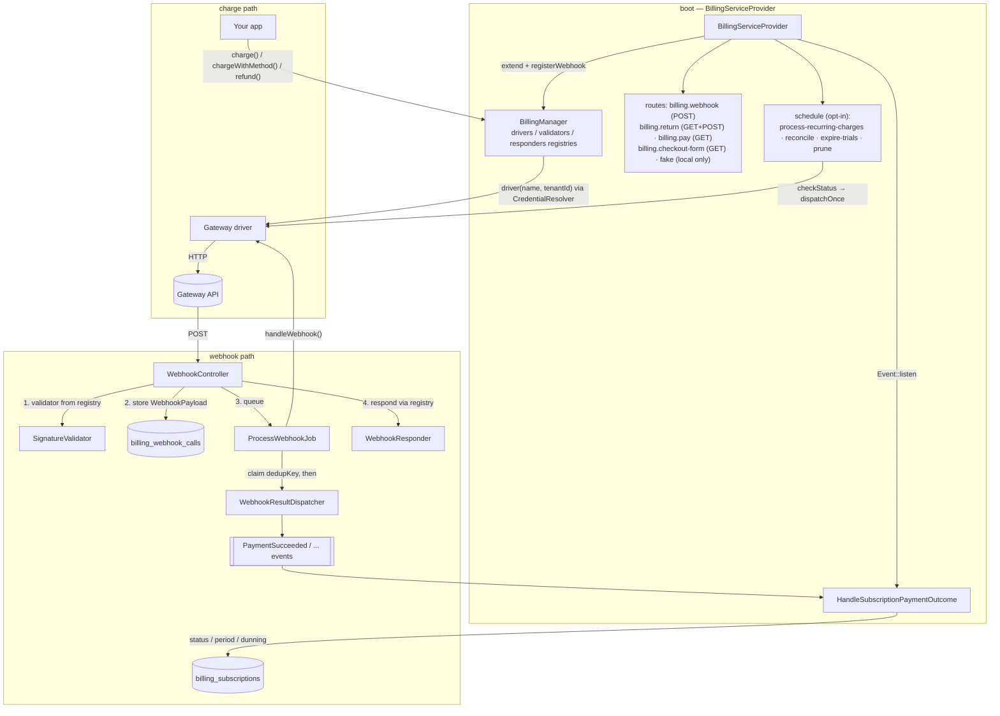

# Architecture — how the package works inside

The README shows the flows an integrator sees; this document shows the machinery behind them — who resolves what, in which order the webhook pipeline runs, where exactly deduplication happens, and which component is allowed to write which columns. Read it when debugging, reviewing, or extending the package itself. (Driver authors: [writing-a-gateway.md](writing-a-gateway.md) is your entry point; this is background.)

## Component map

## Registries, not config

`BillingManager` keeps three name-keyed registries filled at boot: driver FQCNs (`extend()`), signature-validator FQCNs and responder FQCNs (`registerWebhook()`). Everything downstream — the wildcard webhook route, `gateways()` metadata, `driver()` instantiation — resolves through them at call time. Two consequences worth knowing:

- **Class names, not closures/instances**, so static metadata (`label()`, `credentialFields()`, `supportedCurrencies()`, `requiresDashboardWebhook()`) is readable without instantiating a driver — no credentials needed just to list gateways in a settings UI.
- **Last registration wins** — re-calling `extend('monobank', ...)`/`registerWebhook('monobank', ...)` from an app provider replaces the built-in driver or validator. That's the extension point for swapping a validator (e.g. IP-allowlist-only gateways), not a config flag.

`driver($name, $tenantId)` resolves credentials through `CredentialResolverContract` (default: the `billing.gateways.{name}` config block) and `makeWith()`s the driver with `credentials` + `gatewayName`. Signature validators resolve the same way but always with `tenantId: null` — the incoming webhook carries nothing to identify a tenant by *before* it's verified.

## The webhook pipeline, step by step

Order matters here; several audit-era guarantees live in the ordering itself:

1. **Signature validation** — synchronous, in `WebhookController`, *before anything is stored*. Fail-closed: a missing secret rejects. An invalid webhook therefore leaves no trace except the gateway's own retry.
2. **Storage** — `BillingWebhookCall::storeWebhook()` persists url/headers/payload. The payload goes through `Support\WebhookPayload::fromRequest()`: raw-body JSON sniffing (WayForPay posts JSON under a form content type) and *no query-string merging* (query extras are routing hints; merging them broke Hutko's payload-wide signature).
3. **Queueing** — `ProcessWebhookJob` (connection/queue from `billing.queue.*`). From here on there is no live `Request`.
4. **Driver work** — `handleWebhook($webhookCall)` finds the `Payment` (`find()`, unknown → `Ignored`), verifies amount/currency on paid outcomes (`paidAmountMismatch()`), updates the row, and returns a `WebhookResult`.
5. **Dedup claim** — the job stamps `WebhookResult::dedupKey()` (`{type}:{status}:{externalId}`) onto its own webhook-call row; the `unique(name, external_id)` index arbitrates. Claim lost → stop, no events. The key includes the *outcome* so "declined, then retried and paid" on a reused gateway reference dispatches both, while a re-delivery of the same outcome dispatches once.
6. **Event dispatch** — `WebhookResultDispatcher::dispatch()` maps type+status to the core events.
7. The controller meanwhile already answered via the gateway's `WebhookResponder` (default bare 200; WayForPay needs a signed accept body).

**The one exception to "events go through the dispatcher": webhook-side card attaches.** When the token rides along with the payment status (LiqPay/WayForPay/Hutko, and Stripe's checkout-session attach), that call's `WebhookResult` is already occupied by the Payment outcome — so the driver dispatches `PaymentMethodAttached` directly, *before* the step-5 claim, guarded by `$method->wasRecentlyCreated` as its own dedup. Monobank is the clean case: its token arrives in a separate delivery, so `handleWebhook()` returns a `PaymentMethod`-typed result and the dispatcher fires the event normally.

## Reconciliation shares the same dedup

`billing:reconcile-pending-payments` polls `ChecksPaymentStatus` drivers for stale pending payments and pushes the result through `WebhookResultDispatcher::dispatchOnce()` — which claims the same dedup key by **INSERTing a synthetic webhook-call row** (`url: 'reconcile'`). The unique index then arbitrates between the poll and a late real webhook, whichever lands second is dropped. That's why a race can't double-advance a subscription period or double-fulfil an order.

## charge() orchestration

`BillingManager::charge()` does what a bare driver call can't: resolves the driver with the billable's tenant, auto-fills `receiptItems` from a `HasReceiptItems` payable, calls the driver, then writes `external_id` / `payment_url` / `payment_url_expires_at` back. For form-only gateways (LiqPay) the form is cached (TTL = `payment_url_expires_at`, from the driver's `linkTtlMinutes()`) and `payment_url` points at `billing.checkout-form`, which renders it as a self-submitting page — the "payment_url is always a plain link" guarantee lives here, not in drivers.

The browser-facing routes on top of it:

- `billing.return/{payment}/{outcome}` — the default success/fail target drivers hand gateways; fires `CheckoutReturned`, 303s to `return_urls.*` + `?payment=` (+ forwarded `returnParams`). GET+POST because WayForPay/Hutko return the customer via POST.
- `billing.pay/{payment}` — the permanent link: live checkout → redirect; stale/failed → fresh `charge()` first; paid → success page. Fires `PaymentLinkOpened`.

## Who writes what

The fastest debugging question is "who could have changed this column":

| Column(s) | Written by |
|---|---|
| `payments.status`, `paid_at` (auto), `external_id` | drivers only — `handleWebhook()` / `checkStatus()` (plus your own code for manual payments) |
| `payments.payment_url`, `payment_url_expires_at` | `BillingManager::charge()`/`chargeWithMethod()` |
| `payments` refund rows (`type=refund`, `parent_payment_id`) | `BillingManager::refund()` only — drivers just make the API call |
| `subscriptions.status`, `current_period_ends_at`, `recurring_attempts`, `grace_ends_at`, `next_retry_at`, `gateway` (stamp on first payment), `current_usage` reset | `HandleSubscriptionPaymentOutcome` |
| `subscriptions.status` → canceled at `cancels_at`; renewal `Payment` rows | `billing:process-recurring-charges` |
| `subscriptions.status` → ended, `trial_notices_sent` | `billing:expire-trials` |
| `payment_methods` rows, `is_default` demotion | `AbstractGateway::persistPaymentMethod()` (called from drivers' attach paths) |
| `billing_webhook_calls.external_id` (dedup claims) | `ProcessWebhookJob` (UPDATE) and `dispatchOnce()` (synthetic INSERT) |

## Scheduled commands, internally

- **`process-recurring-charges`** (every minute, `withoutOverlapping`): pass 1 finalizes due `cancels_at`; pass 2 charges due subscriptions unless a renewal `Payment` is still pending (double-charge guard) or `next_retry_at` is in the future (dunning pacing). Per-subscription try/catch — one broken gateway doesn't strand the batch. It only *initiates*; outcomes come back through the webhook pipeline.
- **`reconcile-pending-payments`** (15 min, `withoutOverlapping`): the fallback path described above; per-payment try/catch; gateways without `ChecksPaymentStatus` get their stale pendings marked `canceled` as dead checkouts.
- **`expire-trials`** (daily): trial notices (per-price `trial_ending_notices` override → global config; closest-only when several are due; `trial_notices_sent` marker) then expiry to `ended`. Never touches money.
- **`model:prune`** (daily): webhook calls older than `prune_after_days` — which also drops their dedup claims, so the window deliberately exceeds every gateway's retry horizon.
