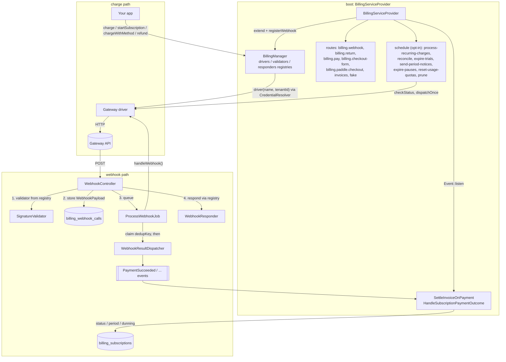

# Architecture

The usage pages show the flows an integrator sees; this page shows the machinery behind them — who resolves what, the order of the webhook pipeline, where deduplication happens, and which component may write which columns. Read it when debugging, reviewing, or extending the package. (Driver authors: [Writing a gateway](writing-a-gateway.md) is the entry point; this is background.)

## Component map

## Registries, not config

`BillingManager` keeps three name-keyed registries filled at boot: driver class names (`extend()`), signature-validator class names and responder class names (`registerWebhook()`). The wildcard webhook route, `gateways()` metadata and `driver()` all resolve through them at call time.

- **Class names, not closures or instances**, so static metadata (`label()`, `credentialFields()`, `supportedCurrencies()`, `requiresDashboardWebhook()`) is readable without credentials.
- **Last registration wins** — re-calling `extend('monobank', ...)` or `registerWebhook('monobank', ...)` from an app provider replaces the built-in driver or validator.
- **No per-request state.** `driver($name, $tenantId)` resolves credentials through `CredentialResolverContract` and builds a fresh instance with `credentials` and `gatewayName` on every call; nothing is memoized on the singleton or in statics. Caching goes through the cache store (Monobank public key, LiqPay forms, Paddle checkout settings). That is what keeps per-tenant credentials from leaking between requests under Octane.

Signature validators resolve credentials the same way, under the gateway name from the route and the tenant from the `?tenant=` query hint (`WebhookTenant::fromRequest()`); the queued job reads the same hint back from the stored URL.

## The webhook pipeline, step by step

Several guarantees live in the ordering itself:

1. **Signature validation** — synchronous, in `WebhookController`, *before anything is stored*. Unknown gateway → 404; invalid → 403. Fail-closed: a missing secret rejects. An invalid webhook leaves no trace except the gateway's own retry.
2. **Storage** — `BillingWebhookCall::storeWebhook()` persists the URL, headers (credential headers redacted) and payload. The payload comes from `Support\WebhookPayload::fromRequest()`: raw-body JSON sniffing (WayForPay posts JSON under a form content type) and *no query-string merging* (query extras are routing hints; merging them broke Hutko's payload-wide signature).
3. **Queueing** — `ProcessWebhookJob` (connection/queue from `billing.queue.*`, 3 tries). From here on there is no live `Request`.
4. **Driver work** — `handleWebhook($webhookCall)` finds the `Payment` (`findPaymentByReference()`: a non-UUID or unknown reference → `Ignored`), verifies amount/currency on paid outcomes (`paidAmountMismatch()`), updates the row through `transitionTo()`, and returns a `WebhookResult`. Stripe and Paddle may call their API here.
5. **Dedup claim** — inside a transaction, the job stamps `WebhookResult::dedupKey()` (`{type}:{status}:{externalId}`) onto its own webhook-call row; the `unique(name, external_id)` index arbitrates. Claim lost → no events. The key includes the *outcome*, so "declined, then paid" on a reused reference dispatches both, while a re-delivery of the same outcome dispatches once.
6. **Event dispatch** — `WebhookResultDispatcher::dispatch()` maps type+status to events (or applies a provider subscription snapshot), in the same transaction as the claim: a listener that throws rolls back the claim and the retry re-runs cleanly.
7. The controller already answered through the gateway's `WebhookResponder` (default `{"message":"ok"}`; WayForPay needs a signed `accept` body).

**The exception to "events go through the dispatcher": webhook-side card attaches.** The card token rides along with the payment outcome (Monobank's later delivery, LiqPay, WayForPay, Hutko, Stripe's checkout session), and that delivery's `WebhookResult` already reports the payment — so the driver persists the method as a side effect and dispatches `PaymentMethodAttached` directly, *before* the step-5 claim, guarded by `$method->wasRecentlyCreated` as its own dedup.

**Refunds recorded from webhooks** use the refund row's own id as `externalId`, and `Billing::refund()` claims the same key for the rows it writes — so the gateway's echo of a refund you issued is dropped.

## Reconciliation shares the same dedup

`billing:reconcile-pending-payments` polls `ChecksPaymentStatus` drivers for stale pending payments and pushes the result through `WebhookResultDispatcher::dispatchOnce()`, which claims the dedup key by **inserting a synthetic webhook-call row** (`url: 'reconcile'`). The unique index then arbitrates between the poll and a late real webhook — whichever lands second is dropped. A race can't double-advance a subscription or double-fulfil an order.

## charge() orchestration

`BillingManager::charge()` (and `startSubscription()`, the same code path) does what a bare driver call can't: resolves the driver with the billable's tenant, auto-fills `receiptItems` from a `HasReceiptItems` payable and checks them against the amount, adds the `?tenant=` hint to the callback URL, calls the driver, then writes `external_id`, `payment_url`, `payment_url_expires_at`, `initiation`, `raw_response` back and resets a non-paid row to `pending`. For a form-only gateway (LiqPay) the form is cached (TTL = `payment_url_expires_at`) and `payment_url` points at `billing.checkout-form` — the "payment_url is always a plain link" guarantee lives here, not in drivers.

`chargeWithMethod()` runs the same auto-fill, check and tenant hint, after verifying the method belongs to the payment's gateway and billable. The one payable it never auto-fills from is the package's own `Subscription`; a renewal's options come from `RenewalChargeOptionsContract`.

Browser-facing routes on top of it:

- `billing.return/{payment}/{outcome}` — the default success/fail target; fires `CheckoutReturned`, 303 to `return_urls.*` + `?payment=` (+ forwarded query). GET+POST because WayForPay/Hutko return the customer via POST.
- `billing.pay/{payment}` — the permanent link: live checkout → redirect; stale/failed/canceled → fresh `charge()` under a cache lock first; paid → success page. Fires `PaymentLinkOpened`.

## Who writes what

| Column(s) | Written by |
|---|---|
| `payments.status`, `paid_at` (auto), `external_id`, `fee` | Drivers — `handleWebhook()` / `checkStatus()`; `charge()` resets status to `pending` on a re-issue; reconciliation and `process-recurring-charges` write off dead attempts; your code for manual payments or a fee policy |
| `payments.payment_url`, `payment_url_expires_at`, `initiation`, `raw_response` | `BillingManager::charge()` / `startSubscription()` / `chargeWithMethod()` |
| Refund rows (`type=refund`, `parent_payment_id`) | `BillingManager::refund()` and drivers' external-refund paths (`recordExternalRefund()` / `recordExternalReversal()`) |
| Renewal `Payment` rows | `process-recurring-charges` (package-managed); Stripe/Paddle drivers (provider-managed) |
| `subscriptions.status`, `current_period_ends_at`, `recurring_attempts`, `grace_ends_at`, `next_retry_at`, `gateway` (stamp), usage reset | `HandleSubscriptionPaymentOutcome` via `recordRenewalSuccess()` / `recordRenewalFailure()`; also `process-recurring-charges` (zero-amount and no-card renewals) |
| `subscriptions.status` → `canceled` at `cancels_at` | `process-recurring-charges` (`markCanceled()`) |
| `subscriptions.status` → `ended`, `trial_notices_sent` | `billing:expire-trials` |
| `subscriptions.status` `paused` ↔ `active`, `pause_ends_at` | `pause()` / `resume()`, `billing:expire-pauses` |
| `period_notices_sent` | `billing:send-period-notices` (cleared on renewal) |
| `current_usage`, `quota_period_ends_at` | `reportUsage()`, renewals, `billing:reset-usage-quotas` |
| `payment_methods` rows, `is_default` | `AbstractGateway::persistPaymentMethod()` (drivers' attach paths) |
| `subscriptions.external_id`, `provider_synced_at`, provider state | `Subscription::applyProviderSnapshot()` only — non-null `external_id` means provider-managed |
| `billing_webhook_calls.external_id` (dedup claims) | `ProcessWebhookJob` (UPDATE) and `dispatchOnce()` (synthetic INSERT) |
| `billing_invoices`, `billing_document_sequences` | `issueInvoice()` / `issueReceipt()` / `voidInvoice()`, `SettleInvoiceOnPayment` |

## Listener order

`SettleInvoiceOnPayment` is registered before `HandleSubscriptionPaymentOutcome` on purpose: an `auto_invoice` reads the subscription's current period end before the renewal moves it, so the invoice names the period just paid for.

## Scheduled commands, internally

- **`process-recurring-charges`** (every minute, `withoutOverlapping`): pass 1 finalizes due `cancels_at`; pass 2 charges due subscriptions under a row lock, unless a renewal `Payment` is still pending (double-charge guard) or `next_retry_at` is in the future. Per-subscription try/catch. It only initiates; outcomes return through the webhook pipeline. `ChargeOptions` come from `RenewalChargeOptionsContract`, resolved inside the same try, so a throwing resolver writes the payment off as failed instead of stranding it pending.
- **`reconcile-pending-payments`** (15 min, `withoutOverlapping`): per-payment try/catch; gateways without `ChecksPaymentStatus` get stale pendings written off as `canceled`, and so do renewal charges whose initiation never returned a reference.
- **`expire-trials`**, **`send-period-notices`**, **`expire-pauses`**, **`reset-usage-quotas`** (hourly): never touch money; access never depends on them.
- **`model:prune`** (daily): webhook calls older than `prune_after_days` — which also drops their dedup claims, so the window must exceed every gateway's retry horizon.
