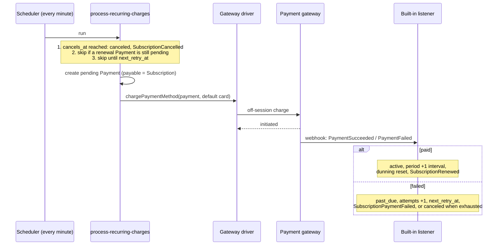

# Renewals and dunning

Package-managed subscriptions renew through `billing:process-recurring-charges`, which runs every minute when `billing.schedule.enabled` is on. Provider-managed ones (Stripe Billing, Paddle) are renewed by the provider and skipped here — see [Provider-managed subscriptions](provider-managed.md).

## The renewal flow



Per run, the command:

1. **Finalizes due cancellations** — `active`/`past_due` rows whose `cancels_at` has passed become `canceled` (`SubscriptionCancelled`), so a period-end cancellation is never billed again.
2. **Picks due subscriptions**: status `active` or `past_due`, a gateway set, not provider-managed, `current_period_ends_at <= now()`, and `next_retry_at` empty or due.
3. For each, under a row lock:
   - a renewal `Payment` of this subscription still `pending` → skip (no double charge until it resolves);
   - the amount is resolved — the price's currency or a sibling price, or a conversion ([Money and currencies](money.md#currency-resolution)) — and scaled by the pricing type;
   - **amount zero** (metered with no usage, zero seats) → the period advances without a gateway call;
   - **no default card** for this billable and gateway, or it has expired → treated as a declined renewal (dunning), no gateway call;
   - otherwise a pending `Payment` (payable = the subscription) is created and charged with `chargeWithMethod()`, with options from `RenewalChargeOptionsContract` ([Fiscal receipt items](fiscal-receipts.md#renewals)).
4. If the charge **can't even be initiated** (timeout, gateway 5xx, a resolver exception) the payment is written off as `failed` and `PaymentFailed` fires — dunning starts. A pending row left behind would block the subscription's renewals for good. If the bank did debit after all, its webhook flips the row to `paid` before the next retry.

The command only initiates; outcomes come back through the webhook pipeline and the built-in listener (`HandleSubscriptionPaymentOutcome`).

> [!WARNING]
> A gateway whose driver can't charge off-session (Paddle, or a custom driver without `TokenizesPaymentMethod`) is silently skipped. A package-managed subscription on such a gateway is never renewed, stays `active` and keeps access — use the provider-managed mode there.

## On success

`PaymentSucceeded` for a payment whose payable is a running package-managed subscription (`incomplete`, `trialing`, `active`, `past_due`):

- status `active`, gateway stamped if it was null;
- `current_period_ends_at` advanced by one interval **from its previous value** (from now if null). Month and year steps don't overflow (Jan 31 + 1 month = Feb 28, and the anchor stays clamped);
- `recurring_attempts`, `grace_ends_at`, `next_retry_at` cleared; `period_notices_sent` cleared;
- usage reset (metered price, or a price with `included_units`);
- `SubscriptionRenewed($subscription, $previousStatus)`.

`previousStatus` tells the three moments apart:

```php
Event::listen(function (SubscriptionRenewed $event) {
    $organization = $event->subscription->billable;

    match ($event->previousStatus) {
        SubscriptionStatus::Incomplete, SubscriptionStatus::Trialing => $organization->notify(new Welcome),
        SubscriptionStatus::PastDue => $organization->notify(new AccessRestored),
        default => $organization->notify(new RenewalReceipt),
    };
});
```

`previousStatus` is `null` only for provider-managed renewals where the package didn't see the transition. A row your own code created as `active` and then charged reads as `Active` — send the welcome from where you created it.

Because the period advances from the scheduled end, days spent in `past_due` are never billed and never compensated: a period due January 1 that recovers on January 4 still renews February 1. Credit days by hand if you want to: `$subscription->update(['current_period_ends_at' => $subscription->current_period_ends_at->addDays(3)])`.

## On failure: dunning

`PaymentFailed` or `PaymentCanceled` for a renewal of an `active`/`past_due` subscription records a failure (`Subscription::recordRenewalFailure()`):

- `recurring_attempts` + 1;
- when attempts reach `max_recurring_attempts`, or the retry list is empty → `canceled` (`SubscriptionCancelled`);
- otherwise `past_due`, `next_retry_at` = now + the retry interval for this attempt, `grace_ends_at` = `next_retry_at` + `grace_period_days`, and `SubscriptionPaymentFailed` fires.

With the defaults (`max_recurring_attempts` 4, `retry_intervals` `['6 hours', '24 hours', '48 hours']`): the renewal, then retries after 6 h, 24 h and 48 h, then cancelled. Per price: `prices.retry_intervals`.

Not dunned:

- a failure on an `incomplete` or `trialing` row — a failed checkout, not a failed renewal;
- `canceled`, `ended`, `paused` rows (logged);
- a subscription with `gateway` null (paid by hand) — cancelled right away, there is no card to retry;
- provider-managed rows.

### Grace access

`grace_ends_at` is always past the next retry, so with `grace_access` on (default) access never lapses between two attempts.

```php
// config/billing.php
'grace_access' => env('BILLING_GRACE_ACCESS', true),

// per price
$plan->prices()->create([/* ... */ 'grace_access' => false]); // cut access on the first failed renewal
```

`grace_access` only gates `isActive()`/`active()`; attempts, retries and cancellation run identically either way. With it off, `SubscriptionAccessSuspended` fires once — on entering `past_due` — your cue for an "access suspended" notice, distinct from `SubscriptionPaymentFailed`, which fires on every failed attempt.

### Updating the card

Nothing special is required when a card fails — `SubscriptionPaymentFailed` is your cue to email a payment link. To take a new card, charge the subscription again with `saveCard`:

```php
$payment = Payment::create([
    'gateway' => $subscription->gateway,
    'amount' => $subscription->price->amount,
    'currency' => $subscription->price->currency,
    'payable_type' => $subscription->getMorphClass(),
    'payable_id' => $subscription->id,
    'billable_type' => $subscription->billable_type,
    'billable_id' => $subscription->billable_id,
]);

Billing::charge($payment, new ChargeOptions(saveCard: true));
```

The payment reactivates the subscription and the new card becomes the default. Remove the old one with `detachPaymentMethod()` if you like.

> [!NOTE]
> A `failed` or `canceled` payment against an `active` subscription whose period hasn't ended yet is ignored — renewals are only charged after `current_period_ends_at`, so it is some other payment: an abandoned "update card" or upgrade checkout, a declined early payment. Against a `past_due` subscription every failure still counts as a renewal attempt. Before 0.12.4 any failure moved an `active` subscription to `past_due`, and a subscription without a gateway was canceled.

> [!NOTE]
> While a renewal payment is `pending`, the scheduler won't charge again. A checkout like the one above is also a pending renewal payment — an unpaid one blocks scheduled retries until it resolves (or `billing:reconcile-pending-payments` writes it off).

## Advance notice: `SubscriptionPeriodEnding`

`billing:send-period-notices` (hourly) fires `SubscriptionPeriodEnding($subscription, $notice, $willRenew)` at each `period_ending_notices` interval before `current_period_ends_at`. Off by default:

```php
'period_ending_notices' => ['3 days'], // per price: prices.period_ending_notices
```

- Only `active`, package-managed subscriptions are scanned.
- Once per notice per period; several due at once → the closest fires; a successful renewal clears the markers.
- `$willRenew` is `cancels_at === null` — "we'll charge your card on the 14th" vs "your access ends on the 14th". It states the package's intent: the bank can still decline, and a subscription without a card renews only if someone pays.

## Short-cycle billing

`minute` and `hour` intervals work out of the box — the renewal runs within a minute of the period end. Rethink the dunning defaults though: a 6 h / 24 h / 48 h ladder and a 3-day grace make no sense for an hourly rental (`'retry_intervals' => ['5 minutes']`, `BILLING_MAX_RECURRING_ATTEMPTS=1` to end the rental on the first failure). See [Use cases → Short-cycle billing](../guides/use-cases.md#3-short-cycle-billing-hourly-parking--scooter-rental).
