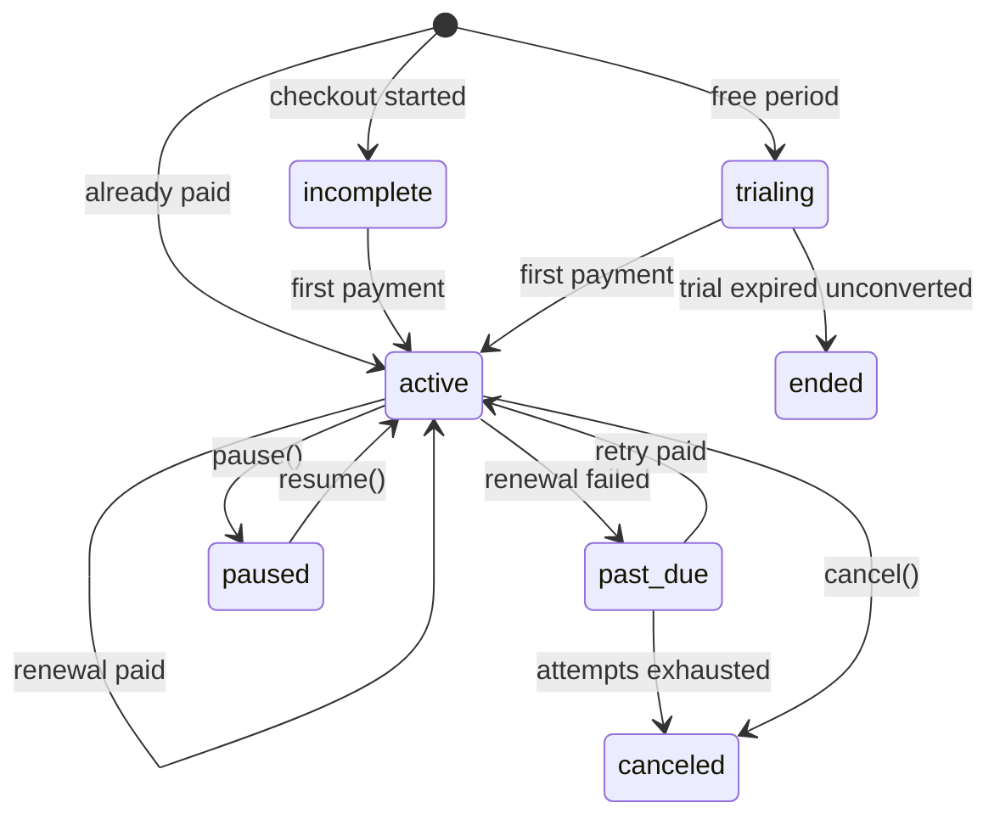

# Subscriptions

Needs the `billing-migrations-subscriptions` group (and `billing-migrations-payment-methods` for renewals from a saved card).

Three models:

- **`Plan`** — what you sell: `code` (unique), `name`, `meta`
- **`Price`** — one concrete offer of a plan: gateway, currency, amount, interval, pricing type, trial, quota and per-price policy overrides
- **`Subscription`** — one billable on one price, for its whole life

## Plans and prices

```php
use Fomvasss\Billing\Enums\Interval;
use Fomvasss\Billing\Enums\PricingType;
use Fomvasss\Billing\Models\Plan;

$plan = Plan::create(['code' => 'pro', 'name' => 'Pro']);

$price = $plan->prices()->create([
    'gateway' => 'monobank',   // null = usable with any gateway
    'currency' => 'UAH',
    'amount' => 29900,          // minor units, per unit for licensed/metered
    'pricing_type' => PricingType::Flat,
    'interval' => Interval::Month,
    'interval_count' => 1,
    'trial_days' => 14,
]);
```

| Price column | Default | Meaning |
|---|---|---|
| `gateway` | `null` | Gateway this price is for; `null` = generic |
| `currency`, `amount` | — | Minor units |
| `pricing_type` | `flat` | See below |
| `interval` | `null` | `minute`, `hour`, `day`, `week`, `month`, `year`; `null` = one-off/lifetime (a renewal never advances it) |
| `interval_count` | `1` | Every N intervals |
| `trial_days` | `0` | Fills `trial_ends_at` of a subscription created as `trialing` |
| `trial_ending_notices` | `null` | Override of `billing.trial_ending_notices` |
| `period_ending_notices` | `null` | Override of `billing.period_ending_notices` |
| `retry_intervals` | `null` | Override of `billing.retry_intervals` |
| `grace_access` | `null` | Override of `billing.grace_access` |
| `included_units` | `null` | Quota per period, see [Usage and quotas](usage-quotas.md) |
| `quota_interval`, `quota_interval_count` | `null`, `1` | A quota cycle of its own |
| `unit_label` | `null` | Yours — e.g. `minute`, `seat` |
| `external_price_id` | `null` | Yours — the package never reads it |
| `is_active` | `true` | Yours — hide retired prices from new signups; existing subscriptions keep renewing on it |
| `meta` | `null` | Yours; the package reads only `meta.receipt_name` and `meta.receipt_sku` for [renewal receipts](fiscal-receipts.md#renewals) |

For the per-price overrides `null` means "the global config", `[]` (for lists) means "none for this price".

### Pricing types

| `PricingType` | A renewal charges |
|---|---|
| `flat` | `amount` |
| `licensed` | `amount × subscriptions.qty` (seats) |
| `metered` | `amount × subscriptions.current_usage` (pay-as-you-go) |

A renewal that comes out at zero — a metered period with no usage, zero seats — advances the period without calling the gateway.

## Creating a subscription

```php
use Fomvasss\Billing\Enums\SubscriptionStatus;
use Fomvasss\Billing\Models\Subscription;

$subscription = Subscription::create([
    'status' => SubscriptionStatus::Trialing,
    'gateway' => null,      // the first successful payment stamps its gateway
    'price_id' => $price->id,
    'billable_type' => $organization->getMorphClass(),
    'billable_id' => $organization->id,
    // trial_ends_at comes from the price's trial_days; pass it to override
]);
```

Which status to start with depends on the money:

| Start as | When |
|---|---|
| `incomplete` | A checkout: the payment needs a payable before the customer reaches the gateway. No access until the first payment |
| `trialing` | A free period, no card needed. See [Trials](trials.md) |
| `active` + `current_period_ends_at` | Already paid for — an invoice settled out of band, a granted plan |

The usual checkout flow:

```php
$subscription = Subscription::create([
    'status' => SubscriptionStatus::Incomplete,
    'price_id' => $price->id,
    'billable_type' => $organization->getMorphClass(),
    'billable_id' => $organization->id,
]);

$payment = Payment::create([
    'gateway' => 'monobank',
    'amount' => $price->amount,
    'currency' => $price->currency,
    'payable_type' => $subscription->getMorphClass(),
    'payable_id' => $subscription->id,
    'billable_type' => $organization->getMorphClass(),
    'billable_id' => $organization->id,
]);

Billing::charge($payment, new ChargeOptions(saveCard: true));

return redirect($payment->payment_url);
```

`PaymentSucceeded` then flips the row to `active`, stamps the gateway and the first period, and fires `SubscriptionRenewed` with `previousStatus` `Incomplete`. A declined card leaves it `incomplete` — a failed checkout is not a failed renewal, no dunning, and the customer can try again against the same row. The saved card makes every later renewal automatic, see [Renewals and dunning](renewals.md).

> [!WARNING]
> Don't model "waiting for the first payment" as a `trialing` row with a past `trial_ends_at`: `billing:expire-trials` moves it to `ended` within the hour, and the payment that arrives afterwards is refused — money taken, no access.

This is a **package-managed** subscription: the package charges the saved card, paces the retries, expires the trial. On Stripe and Paddle you can instead let the provider run it — see [Provider-managed subscriptions](provider-managed.md). Paddle supports only that mode.

## Statuses

A subscription is **one row for its whole life**: renewals move `current_period_ends_at` forward, dunning takes it through `past_due` and back.



| Status | Meaning |
|---|---|
| `incomplete` | Created for a checkout, nothing paid yet. No access; every scheduled command ignores it |
| `trialing` | Free period |
| `active` | Paid and current |
| `past_due` | A renewal failed and is being retried |
| `paused` | Paused via `pause()` |
| `canceled` | Cancelled — by `cancel()`, at `cancels_at`, or by dunning |
| `ended` | Trial expired without converting |

`status` is overwritten in place — there is no transition log. Every transition fires an event, so one listener writes your own journal:

```php
Event::listen([
    SubscriptionRenewed::class,
    SubscriptionPaymentFailed::class,
    SubscriptionCancelled::class,
    SubscriptionPaused::class,
    SubscriptionResumed::class,
    TrialWillEnd::class,
    TrialEnded::class,
], function (object $event) {
    SubscriptionLog::create([ // your model
        'subscription_id' => $event->subscription->id,
        'status' => $event->subscription->status->value,
        'event' => class_basename($event),
    ]);
});
```

## Access: `isActive()`

`isActive()` answers "is the customer entitled right now" — not the same as `status === Active`:

| Status | `isActive()` |
|---|---|
| `trialing` | `trial_ends_at` is null or in the future |
| `active` | yes |
| `past_due` | `hasGraceAccess()` and `grace_ends_at` in the future |
| `paused` | only once `pause_ends_at` has passed (a scheduled resume is due) |
| `incomplete`, `canceled`, `ended` | no |

And on any status: a `cancels_at` in the past means no access. Provider-managed rows soften two of these, see [Provider-managed subscriptions](provider-managed.md#access).

Entitlement comes from the row's own dates, never from when a scheduled command last ran: a trial ending at 15:30, a cancellation scheduled for 15:30 and a pause resuming at 15:30 all change the answer at 15:30. The commands only write the status down and fire events — **turn the schedule off and access control stays correct.**

The one deliberately soft boundary is the end of a paid period: the renewal charge resolves through a webhook, so cutting access at `current_period_ends_at` would blink every customer offline on every renewal. That boundary belongs to dunning (`past_due` + grace).

```php
Subscription::active()->get();                      // the same predicate in SQL, kept identical by a parity test
$organization->hasActiveSubscription('pro');        // via the Billable trait
Gate::define('use-app', fn (User $user) => $user->organization->hasActiveSubscription());
```

Other helpers: `onTrial()`, `onGracePeriod()`, `isCanceled()`, `isCancelling()` (cancel scheduled, still running), `hasGraceAccess()`, `isProviderManaged()`, `nextPeriodEnd()`, scope `forBillable($model)`.

## Pause, resume, cancel, swap

For a package-managed subscription these change only the local row — no gateway call:

```php
$subscription->pause();                    // indefinite, only resume() ends it
$subscription->pause(now()->addWeek());    // auto-resumes via billing:expire-pauses
$subscription->resume();
$subscription->cancel();                   // at period end: stamps cancels_at
$subscription->cancel(atPeriodEnd: false); // now: canceled + SubscriptionCancelled
$subscription->swapPlan($newPrice);        // new price_id, no proration, applies from the next renewal
```

- `pause()` fires `SubscriptionPaused`, `resume()` `SubscriptionResumed`. Both are no-ops on a row already in that state.
- A pause doesn't move `current_period_ends_at`. If the period ran out during the pause, `resume()` sets it to now: the next `process-recurring-charges` run charges once and the new period starts from the resume. The unused rest of the period paid before the pause is not carried over. Before 0.12.7 the renewal advanced from the old end, which stayed in the past, so every run charged again until it caught up.
- `cancel()` at period end only stamps `cancels_at = current_period_ends_at`; `billing:process-recurring-charges` finalizes it when the moment passes (status `canceled`, `SubscriptionCancelled`). Access ends at `cancels_at` regardless.
- `cancel()` on a trial stamps `cancels_at = trial_ends_at`: the trial runs to its end, then `billing:expire-trials` ends it. Paying for it before then clears `cancels_at`. An `incomplete` row (nothing paid, no period) cancels immediately even with `atPeriodEnd: true`.
- `markCanceled()` is the single way into `canceled` (clears `next_retry_at`/`grace_ends_at`, keeps `recurring_attempts`).

On a provider-managed subscription the same calls go to the provider, see [Provider-managed subscriptions](provider-managed.md#managing-it).

## Renewing vs re-subscribing

Which row a payment points to decides it. A `Payment` whose payable is a subscription in `incomplete`, `trialing`, `active` or `past_due` renews it. `canceled`, `ended` and `paused` rows are refused (logged, nothing changes) — a late webhook must not revive a finished episode or cut a pause short.

So: within the grace window pay against the **same row**; after `canceled`/`ended` create a **new row**. The listener advances the period from `current_period_ends_at`, which on a long-dead row lies months in the past.

## Several subscriptions per customer

`billable_id` isn't unique — a base plan and add-ons run as independent subscriptions, each with its own gateway, status and cycle:

```php
public function hasFeature(string $feature): bool
{
    return $this->subscriptions()
        ->active()
        ->whereHas('price', fn ($q) => $q->whereJsonContains('meta->features', $feature))
        ->exists();
}
```

Nothing prevents two active subscriptions on the same price for one billable — check `hasActiveSubscription($planCode)` before charging if that is a duplicate in your product.

## Raising a price (grandfathering)

`Subscription::$price_id` points at a `Price`, which is a live foreign key, not a snapshot — editing `amount` reprices everyone on it. Create a new price instead:

```php
$newPrice = $plan->prices()->create([/* ... */ 'amount' => 39900]);
$oldPrice->update(['is_active' => false]); // hidden from your pricing page, renewals continue
```

To move existing subscribers later: `Subscription::where('price_id', $oldPrice->id)->each(fn ($s) => $s->swapPlan($newPrice));` — for package-managed rows that applies from the next renewal. On provider-managed rows `swapPlan()` bills per the provider's proration setting.
