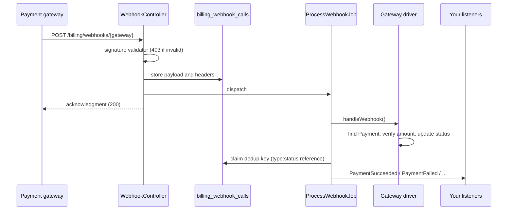

# Webhooks

One route — `POST /billing/webhooks/{gateway}` (`billing.webhook`) — handles every gateway, resolved through the gateway registry at request time. Nothing to declare per gateway.

## The pipeline



1. **Signature check**, synchronous, before anything is stored. An unregistered `{gateway}` answers 404, an invalid signature 403. Validators fail closed: a gateway without its secret configured rejects everything.
2. **Storage** in `billing_webhook_calls` — URL, headers (credential headers like `Authorization`, `Stripe-Signature`, `X-Sign` redacted), parsed payload.
3. **Queued** `ProcessWebhookJob`.
4. **Acknowledgment**: `{"message":"ok"}` by default; WayForPay gets the signed `accept` body it requires.
5. The job calls the driver's `handleWebhook()`, which finds the payment, verifies paid amounts, updates the row and returns a result.
6. Inside one transaction the job claims the result's dedup key on its own webhook-call row and dispatches the events.

The browser's return to your site is a separate, unordered path — the webhook often lands first, sometimes never the browser. Only this pipeline (and its [reconciliation](scheduling.md#billingreconcile-pending-payments) fallback) changes a payment's status.

## Events

| Event | Fires when |
|---|---|
| `PaymentSucceeded` | A payment became `paid` |
| `PaymentFailed` | A payment was refused |
| `PaymentCanceled` | A checkout expired/was voided, or reconciliation wrote it off |
| `PaymentRefunded` | A refund row was recorded (`$payment` is the refund row) |
| `PaymentMethodAttached` / `PaymentMethodDetached` | A card was saved / removed |
| `SubscriptionCreated` | A provider-managed subscription was linked |
| `SubscriptionRenewed` | A paid period was granted (`previousStatus`) |
| `SubscriptionPaymentFailed` | A renewal failed, retries continue (or a provider row entered `past_due`) |
| `SubscriptionAccessSuspended` | A failure cut access immediately (`grace_access` false) |
| `SubscriptionCancelled` | A subscription became `canceled` |
| `SubscriptionPaused` / `SubscriptionResumed` | Paused / resumed — locally or by the provider |
| `TrialWillEnd` / `TrialEnded` | Trial reminder / trial expired |
| `SubscriptionPeriodEnding` | Advance notice before a paid period ends |
| `SubscriptionQuotaReset`, `UsageLimitReached` | Quota events |
| `InvoiceIssued`, `InvoicePaid` | Document events |
| `CheckoutReturned`, `PaymentLinkOpened` | Browser signals — UX/analytics only |

Not all come from webhooks — the full table with properties is in [Events](../reference/events.md).

```php
Event::listen(function (PaymentSucceeded $event) {
    $event->payment->payable; // your Order, a Subscription, ...
});
```

## What the pipeline guarantees

- **Signatures fail closed.** Every built-in gateway's route exists even when unconfigured; without a secret it answers 403 rather than "verifying" against an empty key.
- **A paid callback must match the payment's amount and currency.** A signed callback with a different sum (a stale checkout paid after the amount was edited and re-issued) doesn't mark the payment paid: logged as a warning (`paid webhook amount/currency mismatch`), left `pending` for manual review. Status polling applies the same check.
- **A paid payment is never reverted.** Deliveries are neither ordered nor unique; once `paid`, any callback or poll claiming otherwise is ignored and logged. A `failed`/`canceled` payment can still become `paid`.
- **Events are deduplicated per outcome, not per reference** (`{type}:{status}:{reference}`). A re-delivered "paid" never fires `PaymentSucceeded` twice, but "declined, then paid on the same checkout" fires both. Reconciliation and `Billing::refund()` share the same claims, so a poll racing a late webhook can't double-dispatch.
- **Money-moving calls aren't retried at the transport level** — a timeout doesn't say whether the bank debited the card. Stripe's calls carry idempotency keys instead.
- **Unknown payments are ignored** — a callback for another integration on the same merchant account, or a reference that isn't a UUID, is not a failed job.
- **Stored calls are pruned** after `webhook.prune_after_days` (30) by the daily `model:prune`. Pruning drops dedup claims too — keep the window beyond the longest gateway retry (WayForPay, 4 days).

## Queue

`ProcessWebhookJob` runs on `billing.queue.connection` / `billing.queue.queue` (app defaults when null). A dedicated queue keeps a busy default queue from delaying "paid":

```env
BILLING_QUEUE_CONNECTION=redis
BILLING_QUEUE=billing
```

```php
// config/horizon.php
'supervisor-billing' => [
    'connection' => 'redis',
    'queue' => ['billing'],
    'balance' => 'simple',
    'minProcesses' => 1,
    'maxProcesses' => 4,
    'timeout' => 60,
],
```

> [!WARNING]
> Make sure a worker consumes that queue. Otherwise webhooks are stored and acknowledged, but no payment ever becomes `paid`.

The job is short but not always offline: Stripe and Paddle handlers call the provider's API (the saved card behind a checkout, the subscription's current state, an invoice's PaymentIntent, a transaction's totals).

The job sets `$tries = 3` with backoff 10 s, then 60 s, independent of the worker's `--tries`. What that means for your listeners:

- **The dedup claim and your listeners commit together.** A listener that throws rolls back its own DB writes and the claim, and the retry re-dispatches cleanly.
- **Non-DB side effects don't roll back.** An email sent before the throw is sent again on retry — guard such side effects with your own idempotency key.
- **Queued listeners need `after_commit`** — `'after_commit' => true` on the queue connection, or `ShouldQueue` with `$afterCommit` — or a worker can run the listener before the transaction commits.
- After the last attempt the exception is saved to `billing_webhook_calls.exception` next to the payload.

## Registering the URL with the gateway

The callback URL of every gateway is in `Billing::gateways()[$name]['webhook_url']`; `webhook_requires_dashboard_setup` says whether it must be registered on the gateway's side.

| Gateway | How it gets the URL | Setup |
|---|---|---|
| Monobank | `webHookUrl` in every invoice | none |
| LiqPay | `server_url` in every payment | none |
| WayForPay | `serviceUrl` in every purchase/charge | none |
| Hutko | `server_callback_url` in every request | none |
| Stripe | Pre-registered endpoint | `php artisan billing:stripe-register-webhook` |
| Paddle | Pre-registered notification destination | `php artisan billing:paddle-register-webhook` |

For all of them: `APP_URL` must be your public URL (the callback is built with `route()`), reachable over HTTPS without basic auth or IP blocks. Locally a bank can't reach you — use a tunnel or the `fake` gateway, see [Testing webhooks by hand](../guides/webhook-testing.md). A row in `billing_webhook_calls` means the signature passed; a 403 in the logs means a secret problem.

## Customizing the route

```php
// config/billing.php
'webhook' => [
    'path' => 'webhook/billing/{gateway}',  // must keep {gateway}
    'middleware' => ['throttle:60,1'],      // empty by default; no `web` group, no CSRF
],
```

The route name `billing.webhook` doesn't change, so drivers and `gateways()` follow a new path automatically. The registered Stripe/Paddle endpoints don't — re-run their register commands after changing the path or domain.
